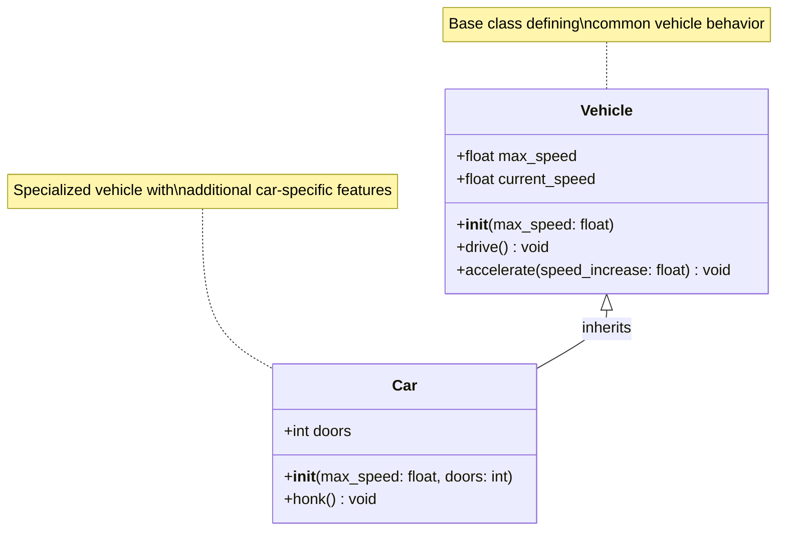
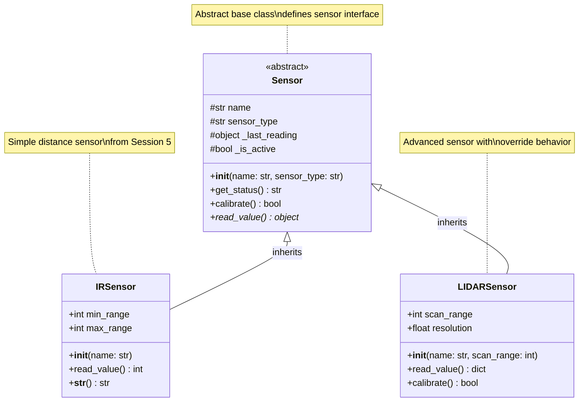
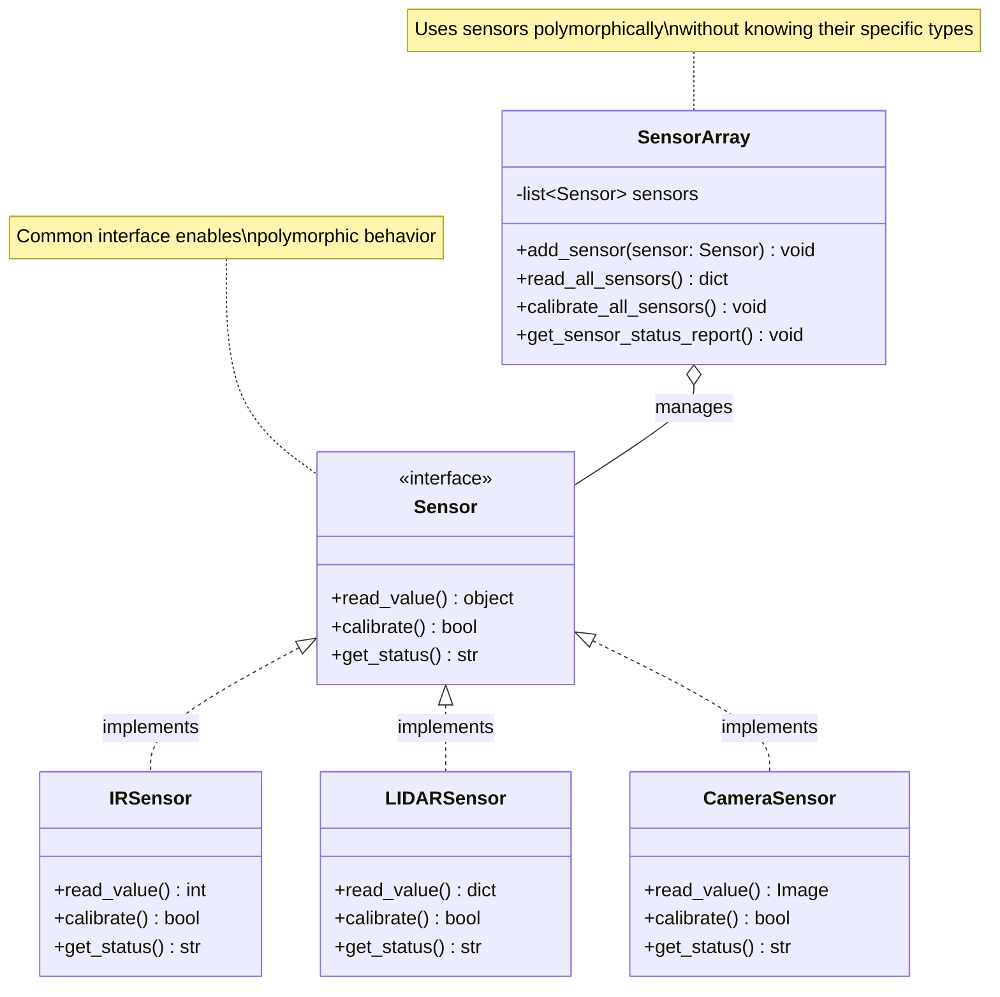
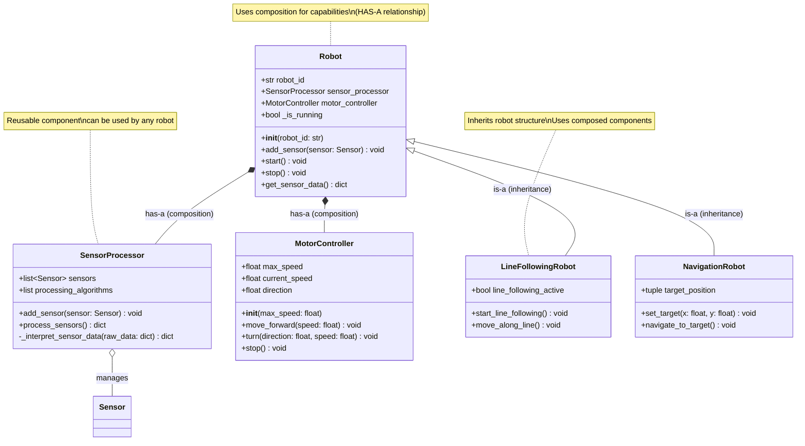
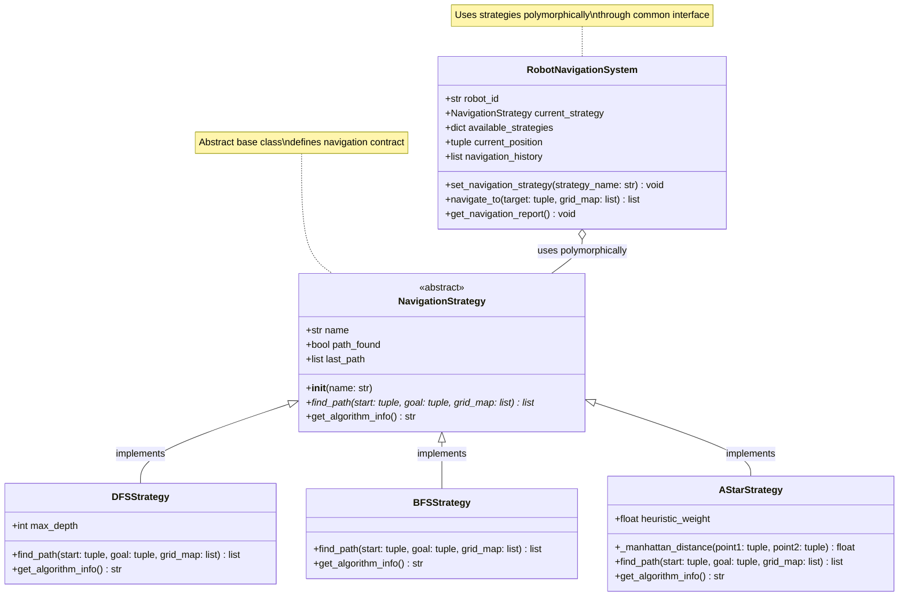

# Session 6: Inheritance & Polymorphism

**Week:** 6  
**Element:** ICTPRG430 Element 2.1  
**Duration:** 4 hours  
**Phase:** Object-Oriented Programming Theory

---

## Session Introduction

In this session, you will deepen your understanding of Object-Oriented Programming (OOP) by exploring two fundamental tenets: **Inheritance and Polymorphism**. This builds on the foundational concepts from Session 4 and advanced class features from Session 5. You will learn how to structure your robot software to maximize code reuse through inheritance, applying the "is-a" relationship for specialized robot types, and how to define flexible interfaces using polymorphism.

Crucially, we will delve into the powerful design principle of favoring **composition over inheritance** (the "has-a" relationship) to create more robust and adaptable robotics systems. The session includes comprehensive theory, practical exercises to design robot hierarchies and polymorphic interfaces, and a live demonstration of advanced navigation algorithms using abstract base classes.

**Important:** Remember to complete the line follower refactoring into OOP using Webots from last week before the end of this session.

## Learning Objectives

By the end of this session, you will be able to:

- **Understand and implement class inheritance hierarchies for different robot types**
- **Apply method overriding and the `super()` function appropriately**
- **Implement polymorphic interfaces for code extensibility and flexible robot behaviors**
- **Analyze and apply the "is-a" vs. "has-a" relationships, favoring composition over inheritance in design**
- **Design and utilize abstract base classes to define clear contracts for robot components**

---

## Session Structure

1. **Theory Session** - Inheritance and Polymorphism Fundamentals
2. **Hands-on Exercise** - Designing Robot Hierarchies and Polymorphic Interfaces
3. **Data Encapsulation Deep-dive** - Refactoring for Composition
4. **Live Demonstration** - Polymorphic Navigation Strategies using ABCs
5. **Extension Activity** - Understanding Multiple Inheritance and MRO

---

## Session Overview

This session builds on the foundational OOP concepts from Session 4 and advanced class features introduced in Session 5, focusing on two core tenets of OOP: **Inheritance and Polymorphism**. You will learn how to structure your robot software for reusability and flexibility by applying "is-a" and "has-a" relationships, with a particular emphasis on composition as a design principle.

## Pre-Session Preparation

!!! info "Required Reading" Review the following materials before class:

```
- Review "Object Model & Class Fundamentals" (Session 4)
- Review "Advanced Class Features & Magic Methods" (Session 5)
- Familiarize yourself with Python's documentation on **class inheritance** and **polymorphism**
- Read up on **Abstract Base Classes (ABCs)**
```

!!! tip "Setup Check" Ensure your Python development environment and Webots simulator are configured and working from **Session 4**.

---

## 1. Introduction to Inheritance: The "Is-A" Relationship

**Inheritance** is a fundamental principle of OOP that allows a class to acquire attributes (methods and instance variables) from another class. This creates a parent-child relationship between classes, or more formally, a superclass/subclass relationship.

The subclass **inherits** from the superclass, meaning it gains access to the superclass's methods and properties, promoting **code reuse** and reducing duplication. Inheritance models the "**is-a**" relationship. For example, a `LineFollowingRobot` **is a** type of `RobotController`.

### Basic Inheritance Syntax

**Python Syntax:** To create a child class, you put the name of the existing parent class in parentheses in the class statement.

```python
class Vehicle:
    def __init__(self, max_speed):
        self.max_speed = max_speed
        self.current_speed = 0.0
    
    def drive(self):
        # Implementation for basic driving
        pass
    
    def accelerate(self, speed_increase):
        # Implementation for acceleration
        pass

class Car(Vehicle):  # Car inherits from Vehicle
    def __init__(self, max_speed, doors):
        super().__init__(max_speed)  # Call parent constructor
        self.doors = doors
    
    def honk(self):
        # Car-specific method
        pass
```

### Basic Inheritance UML Diagram



This diagram illustrates `Car` inheriting from `Vehicle`, representing an "is-a" relationship where Car **is a** specialized type of Vehicle.

---

## 2. Method Overriding and `super()`

Subclasses can **override** inherited methods to provide new or specialized implementations. Python checks the subclass first for a method; if found, it invokes that method instead of the superclass's version.

```python
class Motorcycle(Vehicle):
    def __init__(self, max_speed, engine_type):
        super().__init__(max_speed)
        self.engine_type = engine_type
    
    def drive(self):  # Overrides Vehicle's drive method
        # Specialized motorcycle driving behavior
        pass
    
    def wheelie(self):
        # Motorcycle-specific method
        pass
```

### The `super()` Function

The `super()` function allows you to call methods from the parent (superclass) within the subclass. This is particularly useful in `__init__` methods to ensure the parent class is properly initialized.

```python
class ElectricCar(Car):
    def __init__(self, max_speed, doors, battery_capacity):
        super().__init__(max_speed, doors)  # Calls Car's __init__
        self.battery_capacity = battery_capacity
        self.charge_level = 100.0
    
    def drive(self):
        if self.charge_level > 0:
            super().drive()  # Call parent's drive method
            self.charge_level -= 1
        else:
            # Handle empty battery
            pass
```

### Robotics Example: Enhanced Sensor Hierarchy

Building on Session 5's `IRSensor`, let's create a sensor hierarchy:

```python
from abc import ABC, abstractmethod

class Sensor(ABC):
    """Base sensor class with common functionality."""
    
    def __init__(self, name, sensor_type):
        self.name = name
        self.sensor_type = sensor_type
        self._last_reading = None
        self._is_active = True
    
    def get_status(self):
        """Get common sensor status information."""
        # Return formatted status string
        pass
    
    @abstractmethod
    def read_value(self):
        """Abstract method - must be implemented by subclasses."""
        pass
    
    def calibrate(self):
        """Default calibration routine."""
        # Base calibration implementation
        return True

class IRSensor(Sensor):
    """Infrared distance sensor implementation."""
    
    def __init__(self, name):
        super().__init__(name, "IR Distance")  # Call parent constructor
        self.min_range = 1
        self.max_range = 100
    
    def read_value(self):
        """Read IR distance value."""
        # IR-specific reading implementation
        pass

class LIDARSensor(Sensor):
    """LIDAR sensor implementation with enhanced capabilities."""
    
    def __init__(self, name, scan_range=360):
        super().__init__(name, "LIDAR")
        self.scan_range = scan_range
        self.resolution = 1.0  # degrees per measurement
    
    def read_value(self):
        """Read LIDAR scan data."""
        # LIDAR-specific scanning implementation
        pass
    
    def calibrate(self):
        """Override with LIDAR-specific calibration."""
        super().calibrate()  # Call parent calibration
        # Additional LIDAR-specific calibration
        return True
```

### Sensor Hierarchy UML Diagram



---

## 3. Polymorphism: Responding to a Common Interface

**Polymorphism** (meaning "many forms") is the ability for different objects to respond to the same method call, each in their own way, without the calling code needing to know the specific type of the object.

In Python, polymorphism is often achieved through **duck typing**: "If it walks like a duck and quacks like a duck, it's a duck." This means that as long as objects provide the required methods (interface), they can be used interchangeably.

### Benefits in Robotics

This allows for flexible robot behaviors, where different sensor types (e.g., IR, LIDAR, Camera) can all implement a `read_value()` method, and a `RobotController` can simply call `sensor.read_value()` without knowing the sensor's exact type.

### Polymorphic Example: Sensor Array

```python
class SensorArray:
    """Manages multiple sensors polymorphically."""
    
    def __init__(self):
        self.sensors = []
    
    def add_sensor(self, sensor):
        """Add any type of sensor to the array."""
        if hasattr(sensor, 'read_value'):  # Duck typing check
            self.sensors.append(sensor)
        else:
            raise ValueError("Object must have a read_value method")
    
    def read_all_sensors(self):
        """Read all sensors polymorphically."""
        readings = {}
        for sensor in self.sensors:
            # Polymorphism in action - same method call, different behavior
            readings[sensor.name] = sensor.read_value()
        return readings
    
    def calibrate_all_sensors(self):
        """Calibrate all sensors."""
        for sensor in self.sensors:
            sensor.calibrate()  # Each sensor may calibrate differently
```

### Polymorphism UML Diagram



---

## 4. Composition Over Inheritance: The "Has-A" Relationship

While inheritance (the "is-a" relationship) is powerful, it can lead to rigid designs if overused. The principle of **favoring composition over inheritance (COI)** suggests that using a "has-a" relationship is often more flexible and safer.

**Composition** means that a class includes one or more objects of other classes as attributes, delegating responsibilities to these "component" objects. For example, a `Robot` **has a** `Motor`, **has a** `Sensor`, or **has a** `NavigationSystem`.

### Benefits of Composition

- **Modularity**: Components can be developed and tested independently
- **Flexibility**: Easy to swap components without changing the main class
- **Loose Coupling**: Changes to components don't break the main system
- **Reusability**: Components can be reused in different contexts

### Refactoring Example: Robot Architecture

Let's refactor a robotics system to use composition effectively:

#### Initial Design (Inheritance-Heavy - Less Flexible)

```python
# PROBLEMATIC APPROACH - Too much inheritance
class SensorProcessor:
    def process_sensors(self):
        # Process sensor data
        pass

class LineFollowingRobot(SensorProcessor):  # Robot "is-a" sensor processor?
    def move_along_line(self):
        self.process_sensors()  # Tight coupling

class NavigationRobot(SensorProcessor):  # Robot "is-a" sensor processor?
    def navigate_to_target(self):
        self.process_sensors()  # Duplicated pattern
```

#### Improved Design (Composition - More Flexible)

```python
class SensorProcessor:
    """Handles sensor data processing and interpretation."""
    
    def __init__(self):
        self.sensors = []
        self.processing_algorithms = []
    
    def add_sensor(self, sensor):
        # Add sensor to collection
        pass
    
    def process_sensors(self):
        """Process all sensors and return interpreted data."""
        # Implementation for processing sensor data
        pass

class MotorController:
    """Controls robot movement."""
    
    def __init__(self, max_speed=1.0):
        self.max_speed = max_speed
        self.current_speed = 0.0
        self.direction = 0.0
    
    def move_forward(self, speed=0.5):
        # Implementation for forward movement
        pass
    
    def turn(self, direction, speed=0.3):
        # Implementation for turning
        pass
    
    def stop(self):
        # Implementation to stop motors
        pass

class Robot:
    """Base robot using composition - Robot HAS-A sensor processor and motor controller."""
    
    def __init__(self, robot_id):
        self.robot_id = robot_id
        # Composition: Robot HAS-A sensor processor
        self.sensor_processor = SensorProcessor()
        # Composition: Robot HAS-A motor controller
        self.motor_controller = MotorController()
        self._is_running = False
    
    def add_sensor(self, sensor):
        """Add a sensor to the robot's sensor processor."""
        self.sensor_processor.add_sensor(sensor)
    
    def get_sensor_data(self):
        """Delegate sensor processing to the sensor processor component."""
        return self.sensor_processor.process_sensors()

class LineFollowingRobot(Robot):
    """Specialized robot for line following - inherits from Robot, uses composition for capabilities."""
    
    def __init__(self, robot_id):
        super().__init__(robot_id)
        self.line_following_active = False
        # Add appropriate sensors for line following
        self.add_sensor(IRSensor("Left Line Sensor"))
        self.add_sensor(IRSensor("Center Line Sensor"))
        self.add_sensor(IRSensor("Right Line Sensor"))
    
    def move_along_line(self):
        """Use composition to coordinate line following."""
        if not self.line_following_active:
            return
        
        # Get processed sensor data from the sensor processor component
        sensor_data = self.get_sensor_data()
        
        # Make movement decisions based on processed data
        if sensor_data.get('obstacles_detected'):
            self.motor_controller.stop()
        else:
            # Line following logic using motor controller
            self.motor_controller.move_forward(0.4)
```

### Composition vs Inheritance UML Diagram



!!! success "Key Insight" Notice how both `LineFollowingRobot` and `NavigationRobot` can reuse the same `SensorProcessor` and `MotorController` components, but for different purposes. This is the power of composition - the components are decoupled and reusable!

---

## 5. Abstract Base Classes (ABCs): Defining Contracts

**Abstract classes** are blueprints that cannot be instantiated directly but serve as templates for other classes. They are used to define a common interface (a set of methods that subclasses _must_ implement) without providing a full implementation.

In Python, **Abstract Base Classes (ABCs)** are created using the `abc` module and the `@abc.abstractmethod` decorator for abstract methods.

### Benefits of ABCs

- **Enforce contracts**: Guarantee that subclasses implement required methods
- **Support polymorphism**: Enable different objects to share a common interface
- **Documentation**: Clearly define what methods a class family should provide
- **Early error detection**: Fail fast if required methods are not implemented

### Navigation Strategy Example

A robot navigation system might need different pathfinding algorithms (`DFS`, `BFS`, `A*`). An ABC can define the common interface for these strategies:

```python
```
```

### Navigation Strategy ABC UML Diagram



!!! abstract "ABC Benefits in Action" Notice how the `RobotNavigationSystem` can use any navigation strategy without knowing its specific implementation. This is the power of ABCs combined with polymorphism - the system is **extensible** (you can add new strategies) and **maintainable** (strategies are interchangeable).

---

## Extension Activity: Understanding Multiple Inheritance and MRO

Python supports **multiple inheritance**, where a class can inherit from multiple parent classes. While powerful, this can create complexity, particularly the "diamond problem."

### Multiple Inheritance Example

```python
class Pet:
    def __init__(self, name):
        self.name = name
    
    def play(self):
        # Pet playing behavior
        pass
    
    def show_affection(self):
        # Pet affection behavior
        pass

class Predator:
    def __init__(self, hunting_skill):
        self.hunting_skill = hunting_skill
    
    def hunt(self):
        # Hunting behavior
        pass
    
    def show_aggression(self):
        # Predatory behavior
        pass

class Cat(Pet, Predator):  # Multiple inheritance
    def __init__(self, name, hunting_skill):
        # Need to carefully manage multiple parent constructors
        Pet.__init__(self, name)
        Predator.__init__(self, hunting_skill)
    
    def purr(self):
        # Cat-specific behavior
        pass
```

### Method Resolution Order (MRO)

Python uses the **C3 linearization algorithm** to determine the order in which methods are searched:

```python
# Check the MRO
print("Cat MRO:", [cls.__name__ for cls in Cat.__mro__])
# Output: Cat MRO: ['Cat', 'Pet', 'Predator', 'object']
```

### The Diamond Problem

```python
class Animal:
    def __init__(self, species):
        self.species = species
    
    def move(self):
        # Basic animal movement
        pass

class Mammal(Animal):
    def __init__(self, species, fur_color):
        super().__init__(species)
        self.fur_color = fur_color
    
    def move(self):
        # Mammalian movement
        pass

class Aquatic(Animal):
    def __init__(self, species, water_type):
        super().__init__(species)
        self.water_type = water_type
    
    def move(self):
        # Aquatic movement
        pass

class Whale(Mammal, Aquatic):  # Diamond inheritance
    def __init__(self, species, fur_color, water_type, size):
        # Complex inheritance management required
        pass
```

### Robotics Multiple Inheritance Example

```python
class Movable:
    """Mixin class for objects that can move."""
    def __init__(self, max_speed=1.0, **kwargs):
        self.max_speed = max_speed
        self.current_speed = 0.0
        super().__init__(**kwargs)
    
    def set_speed(self, speed):
        # Speed control implementation
        pass

class Communicable:
    """Mixin class for objects that can communicate."""
    def __init__(self, comm_protocol="WiFi", **kwargs):
        self.comm_protocol = comm_protocol
        self.is_connected = False
        super().__init__(**kwargs)
    
    def connect(self):
        # Communication connection implementation
        pass

class AutonomousRobot(Robot, Movable, Communicable):
    """Robot with movement and communication capabilities."""
    def __init__(self, robot_id, max_speed=2.0, comm_protocol="5G"):
        super().__init__(
            robot_id=robot_id,
            max_speed=max_speed,
            comm_protocol=comm_protocol
        )
        self.autonomy_level = 5  # 1-10 scale
    
    def autonomous_mission(self):
        """Execute autonomous mission using all capabilities."""
        # Use inherited capabilities from all parent classes
        pass
```

!!! warning "Multiple Inheritance Best Practices" - **Use mixins** for shared behavior that doesn't represent "is-a" relationships - **Always use `super()`** for cooperative inheritance - **Pass `**kwargs`** through `__init__` chains to handle parameter forwarding - **Keep the inheritance hierarchy shallow** to avoid complexity - **Consider composition** as an alternative to multiple inheritance

---


## Student Task: Simple Robot Factory System

Create a simple robot factory system that demonstrates fundamental object-oriented programming concepts: inheritance, polymorphism, and basic composition.

### Task Requirements

!!! assignment "Your Challenge" Build a **Robot Factory System** that can create different types of robots and manage their basic operations.

#### What You Need to Create

**Part 1: Basic Robot Classes (Inheritance)**

Create these classes with the exact names and methods shown:

```python
# Base class - you need to implement all methods
class Robot:
    def __init__(self, robot_id, robot_type):
        # Store robot_id and robot_type
        # Set initial position to (0, 0)
        # Set battery_level to 100
        pass
    
    def move(self, distance):
        # Print movement message
        # Reduce battery by distance amount
        pass
    
    def get_info(self):
        # Return string with robot info
        pass
    
    def recharge(self):
        # Set battery back to 100
        pass

# Specialized robot types - inherit from Robot
class CleaningRobot(Robot):
    def __init__(self, robot_id):
        # Call parent constructor with "Cleaning" as robot_type
        # Add cleaning_mode attribute (start with "sweep")
        pass
    
    def move(self, distance):
        # Call parent move method
        # Print additional cleaning message
        pass
    
    def clean(self, area):
        # Print cleaning message for the area
        # Reduce battery by 10
        pass

class DeliveryRobot(Robot):
    def __init__(self, robot_id):
        # Call parent constructor with "Delivery" as robot_type  
        # Add cargo attribute (start empty as None)
        pass
    
    def move(self, distance):
        # Call parent move method
        # If carrying cargo, print cargo transport message
        pass
    
    def load_cargo(self, item):
        # Store item in cargo attribute
        # Print loading message
        pass
    
    def deliver_cargo(self):
        # If cargo exists, print delivery message and clear cargo
        # If no cargo, print "no cargo to deliver"
        pass
```

**Part 2: Robot Factory (Composition & Polymorphism)**

```python
class RobotFactory:
    def __init__(self):
        # Create empty list to store robots
        pass
    
    def create_robot(self, robot_type, robot_id):
        # Create appropriate robot type based on robot_type parameter
        # Add to robots list
        # Return the created robot
        pass
    
    def get_all_robots(self):
        # Return list of all robots
        pass
    
    def move_all_robots(self, distance):
        # Make all robots move the same distance
        # This demonstrates polymorphism - same method, different behavior
        pass
    
    def get_factory_report(self):
        # Return string showing count of each robot type
        pass
```

#### Step-by-Step Instructions

!!! info "Implementation Steps" 1. **Start with the Robot base class** - implement `__init__`, `move`, `get_info`, and `recharge` 2. **Create CleaningRobot class** - inherit from Robot and add cleaning functionality 3. **Create DeliveryRobot class** - inherit from Robot and add delivery functionality  
4. **Build RobotFactory class** - use composition to manage multiple robots 5. **Test your implementation** using the test code provided below

#### Testing Your Code

Use this code to test your implementation:

```python
# Test your classes with this code
def test_robot_system():
    # Create factory
    factory = RobotFactory()
    
    # Create different robots
    cleaner1 = factory.create_robot("cleaning", "Clean-01")
    cleaner2 = factory.create_robot("cleaning", "Clean-02") 
    delivery1 = factory.create_robot("delivery", "Deliver-01")
    
    print("=== INITIAL STATUS ===")
    for robot in factory.get_all_robots():
        print(robot.get_info())
    
    print("\n=== TESTING MOVEMENT (Polymorphism) ===")
    factory.move_all_robots(5)  # All robots move, but differently
    
    print("\n=== TESTING SPECIALIZED METHODS ===")
    cleaner1.clean("Kitchen")
    delivery1.load_cargo("Package A")
    delivery1.move(3)
    delivery1.deliver_cargo()
    
    print("\n=== FINAL STATUS ===")
    for robot in factory.get_all_robots():
        print(robot.get_info())
    
    print(f"\n=== FACTORY REPORT ===")
    print(factory.get_factory_report())

# Run the test
test_robot_system()
```

#### Expected Output

Your program should produce output similar to:

```
=== INITIAL STATUS ===
Robot Clean-01 (Cleaning) at (0, 0), Battery: 100%
Robot Clean-02 (Cleaning) at (0, 0), Battery: 100%
Robot Deliver-01 (Delivery) at (0, 0), Battery: 100%

=== TESTING MOVEMENT (Polymorphism) ===
Robot Clean-01 moved 5 units
Cleaning path as I move
Robot Clean-02 moved 5 units  
Cleaning path as I move
Robot Deliver-01 moved 5 units

=== TESTING SPECIALIZED METHODS ===
Clean-01 cleaning Kitchen area
Deliver-01 loaded: Package A
Robot Deliver-01 moved 3 units
Transporting Package A
Deliver-01 delivered: Package A

=== FINAL STATUS ===
Robot Clean-01 (Cleaning) at (0, 0), Battery: 85%
Robot Clean-02 (Cleaning) at (0, 0), Battery: 95%
Robot Deliver-01 (Delivery) at (0, 0), Battery: 92%

=== FACTORY REPORT ===
Factory contains: 2 Cleaning robots, 1 Delivery robot
```

#### What This Task Demonstrates

- **Inheritance**: `CleaningRobot` and `DeliveryRobot` inherit from `Robot`
- **Polymorphism**: Same `move()` method works differently for each robot type
- **Composition**: `RobotFactory` contains multiple robot objects
- **Method Overriding**: Specialized robots override the base `move()` method

#### Submission Requirements

1. **Python file** with all classes implemented correctly
2. **Test results** showing your code produces the expected output
3. **Brief explanation** (3-4 sentences) of how your code demonstrates inheritance and polymorphism

!!! warning "Important Notes" - Use the **exact class and method names** shown above - Your code will be tested with automated unit tests - Focus on making the basic functionality work correctly - Don't add extra complexity - keep it simple and working

---

## Session Summary

In this comprehensive session, you explored the advanced Object-Oriented Programming concepts that form the backbone of sophisticated robotics software systems.

### Key Concepts Mastered

**Inheritance:**

- Class hierarchies and the "is-a" relationship
- Method overriding and the `super()` function
- Building specialized robot types from base classes

**Polymorphism:**

- Duck typing and common interfaces
- Polymorphic method calls and behavior
- Strategy pattern for flexible algorithms

**Composition over Inheritance:**

- "Has-a" relationships for system modularity
- Component-based architecture design
- Loose coupling and high cohesion

**Abstract Base Classes:**

- Interface definition and enforcement
- Contract specification for subclasses
- Supporting polymorphic behavior

**Multiple Inheritance:**

- Method Resolution Order (MRO)
- The diamond problem and solutions
- Cooperative inheritance with `super()`

### Real-World Applications

These concepts are fundamental to:

- **Robot Operating System (ROS)** architecture
- **Modular robotics platforms** like Boston Dynamics' robots
- **Industrial automation systems** with multiple robot types
- **Autonomous vehicle software** with sensor fusion
- **Swarm robotics** coordination systems

### Next Steps

Building on this session's concepts:

- **Session 7** will explore error handling and debugging strategies

### Additional Resources

!!! resources "Further Learning" - **Python's `abc` module documentation** for advanced ABC usage - **Design Patterns in Python** by Gamma et al. (Gang of Four patterns) - **Effective Python** by Brett Slatkin for advanced Python OOP techniques - **UML modeling tools** like PlantUML or Lucidchart for design visualization


---

**Preparation for Next Session:** Review error handling concepts and debugging strategies. Consider how robust error handling would improve the robot systems you've designed in this session.