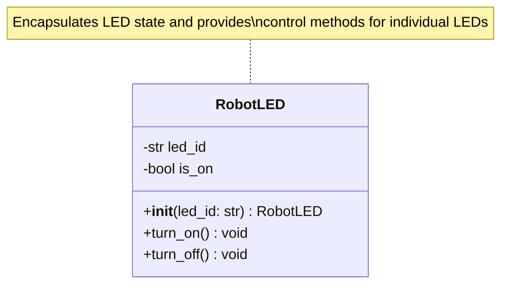
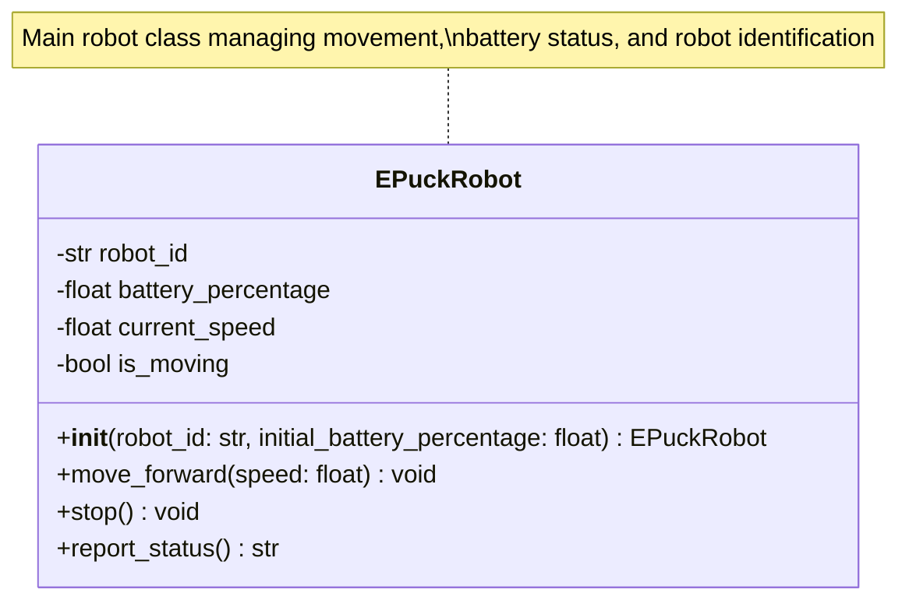
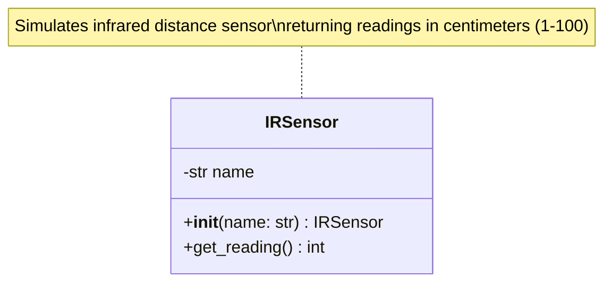
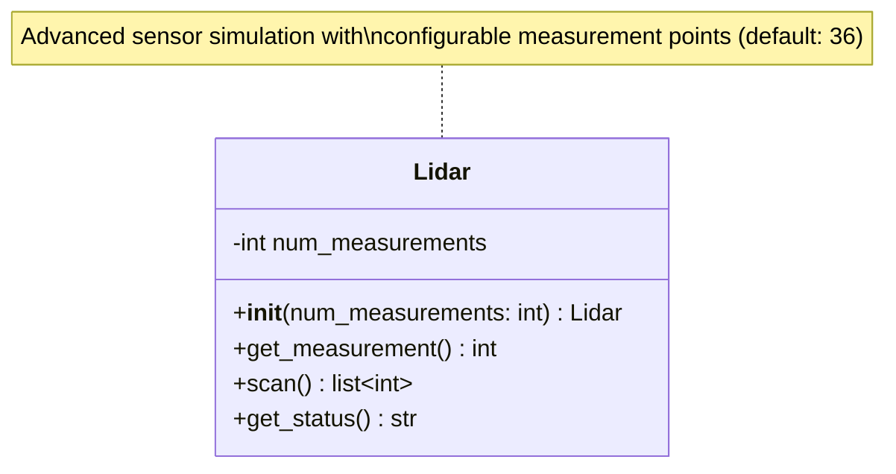
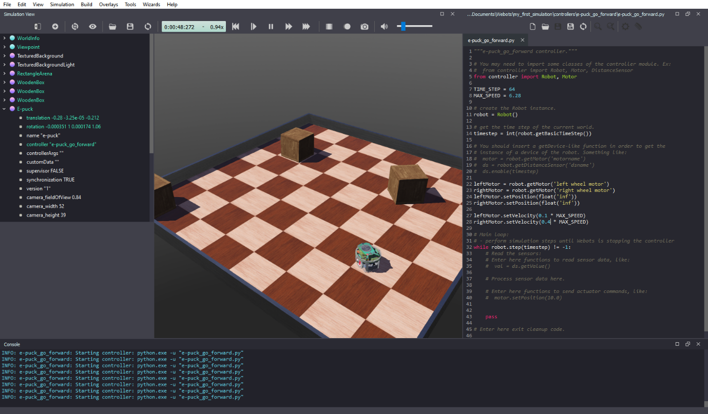
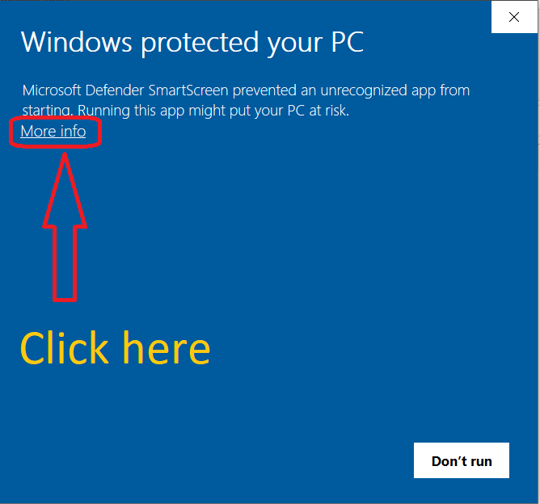
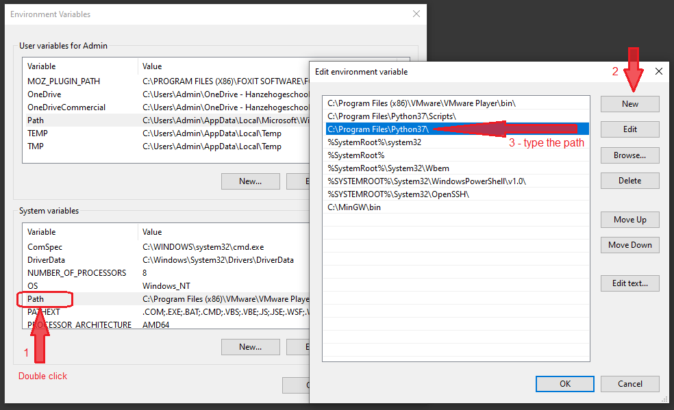
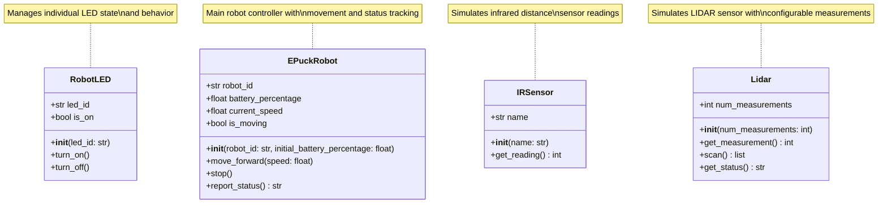
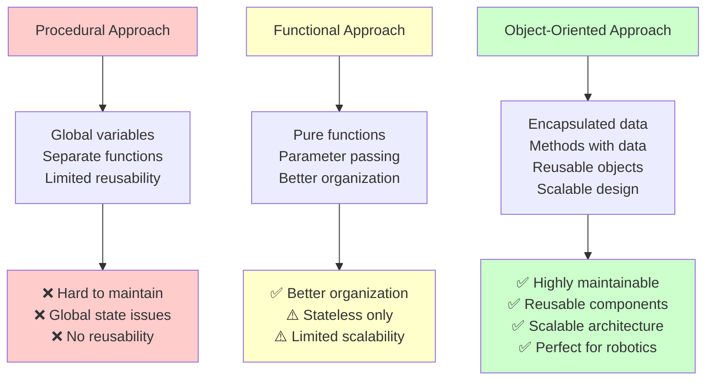

# Session 4: Object Model & Class Fundamentals

**Week:** 4  
**Element:** ICTPRG430 Element 2.1  
**Duration:** 4 hours  
**Phase:** Object-Oriented Programming Theory

---

## Session Introduction

In this session you will explore the foundational concepts of Object-Oriented Programming (OOP) through practical robotics applications. You'll begin with understanding why OOP is essential for robotics development, then dive into hands-on implementation of classes and objects. The session includes a comprehensive theory component, followed by practical exercises where you'll create IR sensor classes, witness a live demonstration of LIDAR implementation across different programming paradigms (procedural, functional, and object-oriented), explore advanced filtering techniques, and conclude with setting up Webots for future simulation work.

## Learning Objectives

By the end of this session, you will be able to:

- Understand fundamental OOP concepts: classes, objects, and object instantiation
- Implement states (using instance variables) and behaviors (using instance methods) for robot systems  
- Explain constructor design and instance variables
- Apply encapsulation principles in robotics contexts
- Create and use multiple sensor objects in a robotics context
- Compare procedural, functional, and object-oriented programming approaches
- Set up Webots robotics simulator for future labs

---

## Session Structure

1. **Theory Session** - Object-Oriented Programming fundamentals
2. **Hands-on Exercise** - Create IR Sensor classes
3. **Live Demonstration** - LIDAR implementation in three programming paradigms
4. **Extension Activity** - Advanced LIDAR data filtering techniques
5. **Lab Setup** - Webots simulator installation and configuration

---

## Session Overview

This session introduces the fundamental concepts of Object-Oriented Programming (OOP) through the lens of robotics applications. You'll learn why OOP is particularly valuable for robotics development and how to implement basic class structures.

## Pre-Session Preparation

!!! info "Required Reading"
    Review the following materials before class:
    
    - OOP programming fundamentals documentation
    - Class design principles guide
    - [Download: Basic Robot Class Starter](../downloads.md#week-4-object-model--class-fundamentals)

!!! tip "Setup Check"
    Ensure your Python development environment is configured:
    
    - Python 3.9+ installed and working
    - VS Code with Python extension
    - pytest framework installed

---

## 1. Why Object-Oriented Programming for Robotics?

Object-Oriented Programming was developed to manage the increasing complexity of large software systems. Robotics deals with highly intricate systems involving numerous sensors, actuators, and algorithms, making OOP an invaluable paradigm for developing robust and maintainable robot software.

### Key Advantages for Robotics

=== "Encapsulation"
    
    **Real-world Example:** E-puck robot motors
    
    You don't need to know the internal wiring or low-level data formats to control motors. OOP's encapsulation hides complexity behind clear interfaces like `set_speed()` methods.
    
    ```python
    # Clean interface - implementation details hidden
    motor = RobotMotor("left_wheel")
    motor.set_speed(0.5)  # Simple, clear method call
    ```

=== "Modularity"
    
    **Real-world Example:** Robot subsystems
    
    Instead of monolithic code, your robot software becomes a collection of interacting components - motors, sensors, navigation modules.
    
    ```python
    # Modular design
    navigation = NavigationSystem()
    sensors = ProximitySensors()
    motors = MotorController()
    ```

=== "Reusability"
    
    **Real-world Example:** Cross-platform compatibility
    
    Once you define a `Motor` class, it can be reused for every motor on your robot or even across different robot platforms.
    
    ```python
    # Reusable across different robots
    left_motor = Motor("left_wheel")
    right_motor = Motor("right_wheel")
    arm_motor = Motor("gripper")
    ```

=== "Flexibility"
    
    **Real-world Example:** Sensor polymorphism
    
    Different sensor types can respond to the same interface, making your code adaptable to hardware changes.
    
    ```python
    # All sensors respond to read_value()
    proximity_sensor.read_value()
    light_sensor.read_value()
    temperature_sensor.read_value()
    ```

---

## 2. Classes and Objects: The Foundation

### Understanding the Relationship

!!! abstract "Key Concepts"
    
    **Class:** A blueprint, template, or mold for creating objects
    
    - Like architectural plans for a building
    - Defines structure and capabilities
    - Uses PascalCase naming (e.g., `RobotLED`, `EPuckMotor`)
    
    **Object (Instance):** Individual "things" created from a class
    
    - Like actual buildings constructed from plans
    - Has unique state and identity  
    - Can have multiple objects from one class

### Practical Example: Robot LED System

#### RobotLED Class UML Structure



Let's compare procedural vs object-oriented approaches:

=== "Procedural Approach"
    
    ```python
    # Global variable - problematic for multiple LEDs
    e_puck_led_is_on = False
    
    def turn_led_on():
        global e_puck_led_is_on
        e_puck_led_is_on = True
        print(f"LED is now ON: {e_puck_led_is_on}")
    
    def turn_led_off():
        global e_puck_led_is_on
        e_puck_led_is_on = False
        print(f"LED is now OFF: {e_puck_led_is_on}")
    ```
    
    **Problems:**
    - Global variables create management issues
    - Difficult to handle multiple LEDs
    - Data and functions are disconnected
    - Limited reusability

=== "Object-Oriented Approach"
    
    ```python
    class RobotLED:
        """Blueprint for robot LED objects."""
        
        def __init__(self, led_id: str):
            """Initialize LED with unique identifier."""
            self.led_id = led_id
            self.is_on = False
            print(f"LED '{self.led_id}' initialized (OFF)")
        
        def turn_on(self):
            """Turn the LED on."""
            self.is_on = True
            print(f"LED '{self.led_id}' is now ON")
        
        def turn_off(self):
            """Turn the LED off."""
            self.is_on = False
            print(f"LED '{self.led_id}' is now OFF")
    
    # Usage - multiple independent LEDs
    front_led = RobotLED("front")
    back_led = RobotLED("back")
    
    front_led.turn_on()   # Only affects front LED
    back_led.turn_off()   # Independent control
    ```

---

## 3. Object Instantiation Process

**Instantiation** creates new objects from a class blueprint. Understanding this process is crucial for effective OOP.

### The Two-Step Process

```python
# When you write this:
robot = EPuckRobot("Alpha_7", 98.5)

# Python internally does:
# 1. __new__() - Allocates memory for the object
# 2. __init__() - Initializes the object's state
```

### Behind the Scenes

1. **Memory Allocation (`__new__`)**: Python allocates memory space for the new object
2. **Initialization (`__init__`)**: Your constructor method sets up the object's initial state

---

## 4. Constructor Design and Instance Variables

The `__init__` method is your constructor - it defines how objects are created and initialized.

### Constructor Best Practices

#### EPuckRobot Class UML Structure



```python
class EPuckRobot:
    """A blueprint for EPuck robot objects."""
    
    def __init__(self, robot_id: str, initial_battery_percentage: float):
        """
        Initialize a new EPuckRobot object.
        
        Args:
            robot_id (str): Unique identifier for the robot
            initial_battery_percentage (float): Battery level (0.0-100.0)
        """
        # Instance variables define object state
        self.robot_id = robot_id
        self.battery_percentage = initial_battery_percentage
        self.current_speed = 0.0
        self.is_moving = False
        
        print(f"EPuckRobot '{self.robot_id}' initialized with {self.battery_percentage}% battery")
```

### Instance Variables (State)

Instance variables store data unique to each object:

```python
# Each robot has its own independent state
robot_alpha = EPuckRobot("Alpha_7", 98.5)
robot_beta = EPuckRobot("Beta_12", 75.0)

# Modifying one doesn't affect the other
robot_alpha.current_speed = 0.5
robot_alpha.is_moving = True

print(f"Alpha speed: {robot_alpha.current_speed}")  # 0.5
print(f"Beta speed: {robot_beta.current_speed}")    # 0.0 (unchanged)
```

---

## 5. Instance Methods (Behavior)

Instance methods define what objects can do - their behaviors.

### Method Definition Rules

```python
class EPuckRobot:
    def __init__(self, robot_id: str, initial_battery_percentage: float):
        self.robot_id = robot_id
        self.battery_percentage = initial_battery_percentage
        self.current_speed = 0.0
        self.is_moving = False
    
    def move_forward(self, speed: float):
        """Start moving the robot forward at specified speed."""
        if 0.0 <= speed <= 1.0:
            self.current_speed = speed
            self.is_moving = True
            print(f"Robot {self.robot_id} moving forward at speed {speed}")
        else:
            print("Speed must be between 0.0 and 1.0")
    
    def stop(self):
        """Stop the robot movement."""
        self.current_speed = 0.0
        self.is_moving = False
        print(f"Robot {self.robot_id} stopped")
    
    def report_status(self):
        """Report current robot status."""
        status = f"Robot {self.robot_id}:\n"
        status += f"  Battery: {self.battery_percentage}%\n"
        status += f"  Speed: {self.current_speed}\n"
        status += f"  Moving: {self.is_moving}"
        return status
```

---

## Hands-on Exercise: Mock IR Sensor Class

In this practical activity, you will write a Python class that simulates infrared (IR) distance sensors commonly found on robots like the e-puck.

### Task: Create and Use a Mock IR Sensor Class

#### IRSensor Class UML Structure



You will create **five separate sensor objects** for different positions on the robot:

- `front_left`
- `front_center`  
- `front_right`
- `back_left`
- `back_right`

### Step-by-Step Instructions

1. Create a class named `IRSensor`
2. The `__init__` method should take one parameter `name` (string) to store the sensor's position
3. Create a method `get_reading()` that returns a simulated reading (integer between 1 and 100 cm)
4. Include a proper docstring for `get_reading()` with **Parameters** and **Returns**
5. In your main code, create 5 separate instances of `IRSensor`, one for each position listed above
6. Call `get_reading()` on each instance and print the results

### Example Implementation Template

```python
import random

class IRSensor:
    """Simulates an infrared distance sensor."""
    
    def __init__(self, name: str):
        """Initialize the IR sensor with a position name."""
        self.name = name
        print(f"IR Sensor '{self.name}' initialized")
    
    def get_reading(self):
        """
        Simulate getting a distance measurement from the IR sensor.
        
        Parameters:
            None
        
        Returns:
            int: Distance measurement in centimeters (1–100).
        """
        reading = random.randint(1, 100)
        print(f"{self.name} sensor reading: {reading} cm")
        return reading

if __name__ == "__main__":
    # Create sensor instances
    front_left = IRSensor("Front Left")
    front_center = IRSensor("Front Center")
    front_right = IRSensor("Front Right")
    back_left = IRSensor("Back Left")
    back_right = IRSensor("Back Right")
    
    # Get readings from each sensor
    print("\n--- Sensor Readings ---")
    front_left.get_reading()
    front_center.get_reading()
    front_right.get_reading()
    back_left.get_reading()
    back_right.get_reading()
```

!!! tip "Extension Challenge"
    In a later lesson, we will discuss **composition** and how to group these sensor objects into a single class that manages multiple sensors.

---

## Live Demonstration: LIDAR Implementation Across Programming Paradigms

The instructor will now demonstrate how to implement a mock LIDAR sensor using three different programming approaches, showing the evolution from simple procedural code to sophisticated object-oriented design.

### 1. Procedural Approach

The simplest implementation using basic Python constructs:

```python
# lidar_procedural.py
import random

# Procedural: all logic inline
measurements = []
for _ in range(36):
    measurement = random.randint(1, 1200)  # cm range
    measurements.append(measurement)

print("LIDAR Scan (Procedural):")
print(measurements)
```

**Characteristics:**
- All code in linear sequence
- No reusability
- Hard to extend or modify
- Good for simple, one-time tasks

### 2. Functional Approach

Using functions to organize and reuse code:

```python
# lidar_functional.py
import random

def get_measurement():
    """Simulates one LIDAR measurement."""
    return random.randint(1, 1200)

def scan_lidar(num_measurements=36):
    """Performs a LIDAR scan and returns a list of measurements."""
    return [get_measurement() for _ in range(num_measurements)]

if __name__ == "__main__":
    readings = scan_lidar()
    print("LIDAR Scan (Functional):")
    print(readings)
```

**Characteristics:**
- Functions provide reusability
- Better organization than procedural
- Easy to test individual functions
- Good for stateless operations

### 3. Object-Oriented Approach

#### Lidar Class UML Structure



Using classes to create reusable, stateful components:

```python
# lidar_oop.py
import random

class Lidar:
    """Simulates a LIDAR sensor with configurable parameters."""
    
    def __init__(self, num_measurements=36):
        """Initialize LIDAR with specified number of measurements."""
        self.num_measurements = num_measurements
        print(f"LIDAR initialized with {self.num_measurements} measurement points")

    def get_measurement(self):
        """Simulates a single LIDAR measurement."""
        return random.randint(1, 1200)  # Distance in cm

    def scan(self):
        """Performs a full scan and returns a list of measurements."""
        readings = []
        for _ in range(self.num_measurements):
            readings.append(self.get_measurement())
        return readings
    
    def get_status(self):
        """Returns the current status of the LIDAR sensor."""
        return f"LIDAR Status: {self.num_measurements} measurement points configured"

if __name__ == "__main__":
    # Create LIDAR instance
    lidar = Lidar()
    print(lidar.get_status())
    
    # Perform scan
    readings = lidar.scan()
    print("LIDAR Scan (OOP):")
    print(f"Collected {len(readings)} measurements")
    print(f"Sample readings: {readings[:5]}...")  # Show first 5 readings
```

**Characteristics:**
- Encapsulation of data and behavior
- Reusable sensor objects
- Easy to extend with new features
- Maintainable and scalable
- Perfect for robotics applications

### Comparison Summary

| Aspect | Procedural | Functional | Object-Oriented |
|--------|------------|------------|----------------|
| **Reusability** | Low | Medium | High |
| **Maintainability** | Low | Medium | High |
| **Scalability** | Poor | Good | Excellent |
| **State Management** | Global vars | Parameters | Instance vars |
| **Best For** | Simple scripts | Stateless operations | Complex systems |

!!! note "Live Coding Session"
    The instructor will demonstrate building each version from scratch, showing:
    - How to refactor from procedural to functional
    - How to convert functional code to object-oriented
    - Benefits and trade-offs of each approach
    - When to use each paradigm in robotics

---

## Extension Activity: Advanced LIDAR Data Filtering

Your LIDAR class currently returns a full 360° scan with 36 measurements. Sometimes you may only want part of the scan — for example, the front arc. Here are three different design approaches to achieve this:

### Approach 1: Add a `scan_filtered()` Method

```python
def scan_filtered(self, start=0, end=36):
    """Return scan results between given indices."""
    full_scan = self.scan()
    return full_scan[start:end]
```

**Pros:**
- ✅ Keeps filtering logic inside the class (good encapsulation)
- ✅ Easy to call: `lidar.scan_filtered(4, 20)`
- ✅ Can be extended later for angle-based filtering

**Cons:**
- ❌ Adds an extra method that mostly wraps existing logic

### Approach 2: Add Optional Parameters to `scan()`

```python
def scan(self, start=0, end=36):
    """Perform scan with optional filtering."""
    full_readings = [self.get_measurement() for _ in range(self.num_measurements)]
    return full_readings[start:end]
```

**Pros:**
- ✅ No new method — extends the original one
- ✅ Introduces default parameters

**Cons:**
- ❌ Mixes two responsibilities: generating data and filtering data

### Approach 3: Process After the Scan

```python
# In your main code
readings = lidar.scan()
front_arc = readings[4:20]  # Extract front arc
```

**Pros:**
- ✅ Keeps `scan()` simple and single-purpose
- ✅ Flexible filtering in client code

**Cons:**
- ❌ Filtering logic is done outside the class
- ❌ More code in the main application

### Design Recommendation

A good design follows the **Single Responsibility Principle**: one method should do one thing well. The recommended approach is:

1. Keep `scan()` for the full 360° scan
2. Filter with list slicing when needed
3. If filtering becomes common, add a dedicated `scan_filtered()` method inside the class

!!! example "Extension Challenge"
    Implement one of these filtering approaches in your LIDAR class and test it with different ranges:
    - Front arc: indices 14-22 (forward-facing sensors)
    - Left side: indices 27-35 
    - Right side: indices 1-9

---

## Out-of-Class Research Activities

To reinforce your understanding of the concepts covered in this session, research the following topics:

### Research Topics

1. **Object-Oriented Programming Principles**
   - Investigate the four main principles of OOP: Encapsulation, Inheritance, Polymorphism, and Abstraction
   - Find real-world examples of how each principle is applied in robotics software
   - Compare OOP with other programming paradigms (procedural, functional)

2. **Class Design Best Practices**
   - Research the Single Responsibility Principle and how it applies to class design
   - Look into naming conventions for classes and methods in Python
   - Study examples of well-designed classes in robotics frameworks

3. **Python Class Features**
   - Explore Python's special methods (`__init__`, `__str__`, `__repr__`)
   - Research property decorators and getters/setters
   - Investigate class methods vs instance methods vs static methods

4. **Robotics Software Architecture**
   - Study how major robotics frameworks (ROS, ROS2) use object-oriented design
   - Research component-based architectures in robotics
   - Look into design patterns commonly used in robotics software

!!! tip "Research Resources"
    - Python official documentation on classes
    - ROS tutorials and documentation
    - Robotics software engineering books and articles
    - Open-source robotics projects on GitHub

---

## Lab 1: Webots Robot Simulator Setup

To complete this session, students will set up the Webots robotics simulator that will be used in future lab exercises.

!!! info "Lab Credits"
    This lab is based on the excellent work by Felipe Martins:
    
    **Original Repository:** [Robotics-Simulation-Labs](https://github.com/felipenmartins/Robotics-Simulation-Labs)  
    **Author:** Felipe Nascimento Martins  
    **License:** Available on GitHub
    
    We acknowledge and appreciate the open-source contribution to robotics education.

### Objectives

The goal of this lab is to guide you to install, configure and familiarize yourself with Webots simulator. At the end of this lab you should be able to run Python code to control your simulated robot.

### About Webots

Webots is an open-source robotics simulator that can simulate several types of robots and sensors. It provides a complete development environment to model, program and simulate robots and the world they are in, including physics simulation. It is widely used in industry, education and research.



### Installation Tasks

To complete this lab you have to follow the steps described below:

#### 1. Download and Install Webots

- Download from [https://cyberbotics.com/](https://cyberbotics.com/)
- You need **Webots R2022a or newer** for the Robotics Simulation Labs
- Available for Windows, macOS and Linux
- The download and installation process can take a while

#### 2. Complete Webots Tutorial 1

- Follow [Webots Tutorial 1](https://cyberbotics.com/doc/guide/tutorial-1-your-first-simulation-in-webots) 
- Complete through **Hands-on #7**
- After that, you'll configure Python (next step)

#### 3. Install Python 3 (if needed)

- You need the **64-bit** version of Python 3
- Download from [python.org](https://www.python.org/downloads/)
- **Windows users**: Select "Add to PATH" during installation
- **Version compatibility**: Not all Python versions work with all Webots versions
  - Webots R2022b works with Python 3.7, 3.8, 3.9 and 3.10
  - Webots R2022a does **not** support Python 3.10

#### 4. Reboot Your System

- **Important**: Reboot after installing Python

#### 5. Test Python Installation

- Open Command Prompt/Terminal
- Type `python`, `python3`, or `python3.x` (depending on your version)
- You should see something like:

```
Python 3.10.5 (tags/v3.10.5:f377153, Jun  6 2022, 16:14:13) [MSC v.1929 64 bit (AMD64)] on win32
Type "help", "copyright", "credits" or "license" for more information.
>>>
```

- Type `exit()` to return to terminal

#### 6. Install Required Libraries

- Follow instructions [here](https://cyberbotics.com/doc/guide/using-python#libraries)
- Install at least **NumPy**
- Optional: **OpenCV** (also installs NumPy)

#### 7. Configure Webots for Python

- In Webots: `Tools > Preferences > Python command`
- Set to `python` or `python3` (whatever worked in step 5)
- **macOS/Windows without PATH**: Use full path to Python installation

#### 8. Complete Tutorial

- Continue from ["Create New Controller"](https://cyberbotics.com/doc/guide/tutorial-1-your-first-simulation-in-webots?tab-language=python#create-a-new-controller)
- Complete through **Hands-on #10**
- **Important**: Select `Python` when viewing code examples

### Troubleshooting Tips

!!! warning "Common Issues"
    
    **64-bit Python Required**: 32-bit versions don't work with Webots
    
    **macOS**: May need full Python path in Webots preferences
    
    **Linux**: Avoid symbolic links in project folders; consider APT version
    
    **Windows PATH**: If Python isn't found, add it to system PATH and reboot
    
    **Hardware Warning**: Intel GPU warning is normal and won't affect our labs

#### Windows Installation Issues

If you see a security warning when installing Webots on Windows, click "More info" then "Run anyway":



#### Python PATH Configuration

If you need to add Python to your Windows PATH manually, the configuration should look like this:



### Performance Optimization

If Webots runs slowly on your hardware:

- Click `WorldInfo > FPS` and reduce to 20
- Increase `basicTimeStep` to 32
- Go to `Tools > Preferences > OpenGL`
- Reduce `Ambient Occlusion` and `Texture Quality`

### Conclusion

After completing these steps, you should have:
- Webots installed and configured for Python
- Understanding of basic Webots concepts
- Ability to write simple Python programs to control simulated robots

!!! success "Lab Complete"
    You're now ready for future robotics simulation exercises using Webots!

---

## Session Summary: Class Relationships Overview

Here's a comprehensive overview of all the classes we've implemented in this session:



### Programming Paradigm Evolution

The evolution from procedural to object-oriented programming can be visualized as:



!!! tip "UML Diagram Benefits"
    These UML diagrams help visualize:
    - **Class structure**: Attributes and methods at a glance
    - **Relationships**: How classes might interact in larger systems
    - **Design patterns**: Common robotics software patterns
    - **Scalability**: How to extend classes for more complex robots

---

## Key Takeaways

!!! success "Session Summary"
    - **OOP Benefits**: Encapsulation, modularity, reusability, and flexibility
    - **Classes vs Objects**: Blueprints vs instances
    - **Instantiation**: Memory allocation + initialization process
    - **Instance Variables**: Store unique object state
    - **Instance Methods**: Define object behaviors
    - **Constructor Design**: Proper `__init__` method implementation

---

## Check Your Knowledge

Test your understanding of the Object-Oriented Programming concepts covered in this session:

!!! question "Question 1: Class vs Object"
    **Question**: What's the difference between a class and an object? Use the robot LED example to explain.
    
    ??? tip "Click to reveal answer"
        **Answer**: 
        
        - **Class**: A blueprint or template (like `RobotLED` class) that defines what all LED objects will have
        - **Object**: An actual LED created from that blueprint (like `front_led` or `back_led`)
        
        Think of it like a cookie cutter (class) and the actual cookies (objects). You use one cookie cutter to make many different cookies, just like you use one `RobotLED` class to create many different LED objects.

!!! question "Question 2: What does `self` mean?"
    **Question**: In the method `def turn_on(self):`, what does the word `self` represent?
    
    ??? tip "Click to reveal answer"
        **Answer**: 
        
        `self` refers to the specific object that the method is being called on. 
        
        When you write `front_led.turn_on()`, inside the `turn_on()` method, `self` refers to the `front_led` object. This is how the method knows which LED to turn on - it's the one that called the method!

!!! question "Question 3: Instance Variables vs Class Variables"
    **Question**: Look at these two pieces of code. What's the difference?
    
    ```
    Code A: self.led_id = "front"
    Code B: led_count = 0
    ```
    
    ??? tip "Click to reveal answer"
        **Answer**: 
        
        - **Code A (`self.led_id`)**: This is an **instance variable**. Each LED object has its own `led_id`. The front LED has `led_id = "front"` and the back LED has `led_id = "back"`.
        
        - **Code B (`led_count`)**: This is a **class variable**. There's only one `led_count` shared by all LED objects. If you wanted to count how many total LEDs exist, you'd use a class variable.
        
        **Key difference**: Instance variables are unique to each object, class variables are shared by all objects.

!!! question "Question 4: Why use OOP for robots?"
		**Question**: Name two main benefits of using object-oriented programming for robotics instead of just writing simple functions.
    
    ??? tip "Click to reveal answer"
        **Answer**: 
        
        1. **Organization**: Each robot component (LED, sensor, motor) can be its own class, making the code much more organized and easier to understand.
        
        2. **Reusability**: Once you write a `RobotLED` class, you can use it for any robot project. You don't have to rewrite LED control code every time.
        
        **Bonus**: **Independence** - Each object manages its own data, so turning on one LED won't accidentally affect another LED.

!!! question "Question 5: Object Instantiation"
    **Question**: When you write `my_led = RobotLED("status")`, what two things happen inside Python?
    
    ??? tip "Click to reveal answer"
        **Answer**: 
        
        1. **Memory allocation**: Python creates space in memory for the new LED object
        2. **Initialization**: Python calls the `__init__` method to set up the object's initial values (like setting `led_id` to "status" and `is_on` to `False`)
        
        After these two steps, you have a fully working LED object stored in the variable `my_led`.

---

## Next Session Preview

**Week 5: Advanced Class Features & Magic Methods**

- Python magic methods (`__str__`, `__repr__`, `__eq__`)
- Property decorators and getters/setters
- Class methods and static methods
- Operator overloading for custom classes

---

## Resources

### Downloads
- [:material-download: Robot class starter code](../files/robot_class_starter.py)
- [:material-download: Complete class implementations](../files/class_implementation_examples.py)
- [:material-download: LIDAR procedural version](../files/lidar_procedural_clean.py)
- [:material-download: LIDAR functional version](../files/lidar_functional_clean.py)
- [:material-download: LIDAR object-oriented version](../files/lidar_oop_clean.py)
- [:material-download: All Week 4 resources](../downloads.md#week-4-object-model--class-fundamentals)

### Further Reading
- Python Classes Documentation
- OOP Design Patterns
- Robotics Software Architecture

---

**Navigation:**  
[← Week 3](session-03.md) | [Learning Plan](../revised-lap.md) | [Week 5 →](session-05.md)