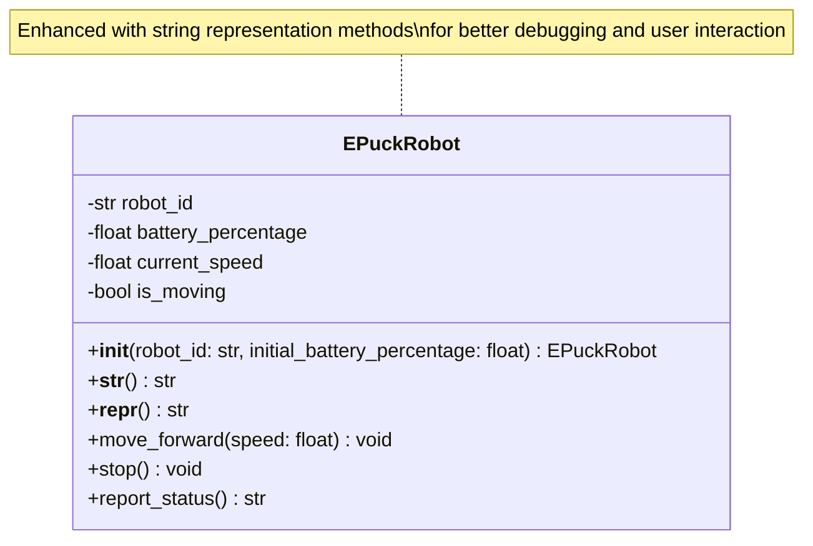
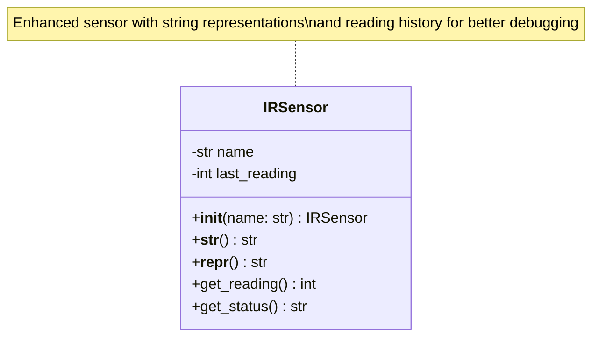
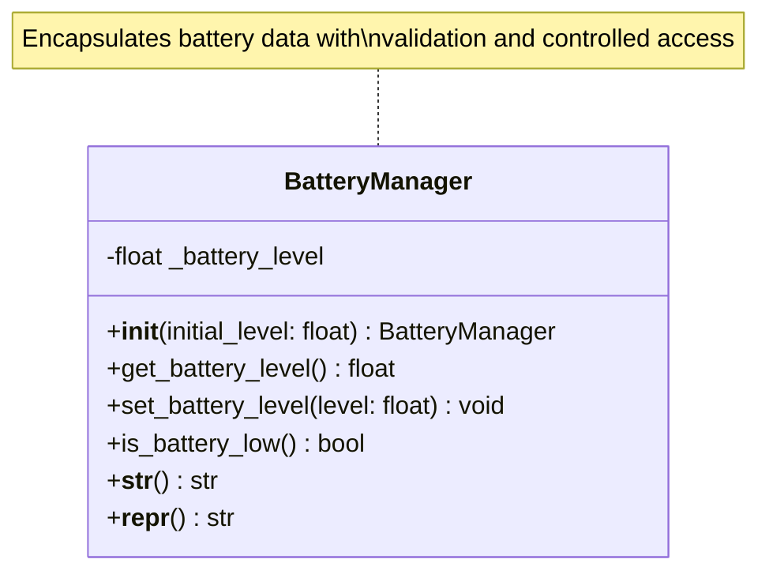
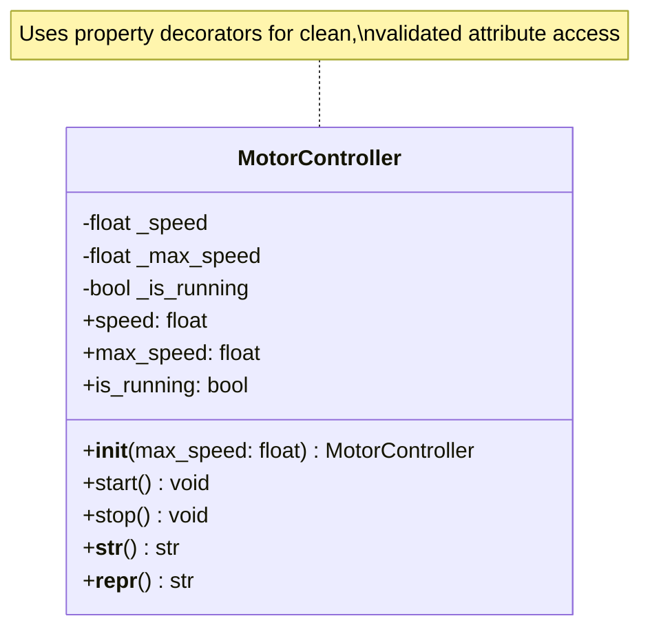
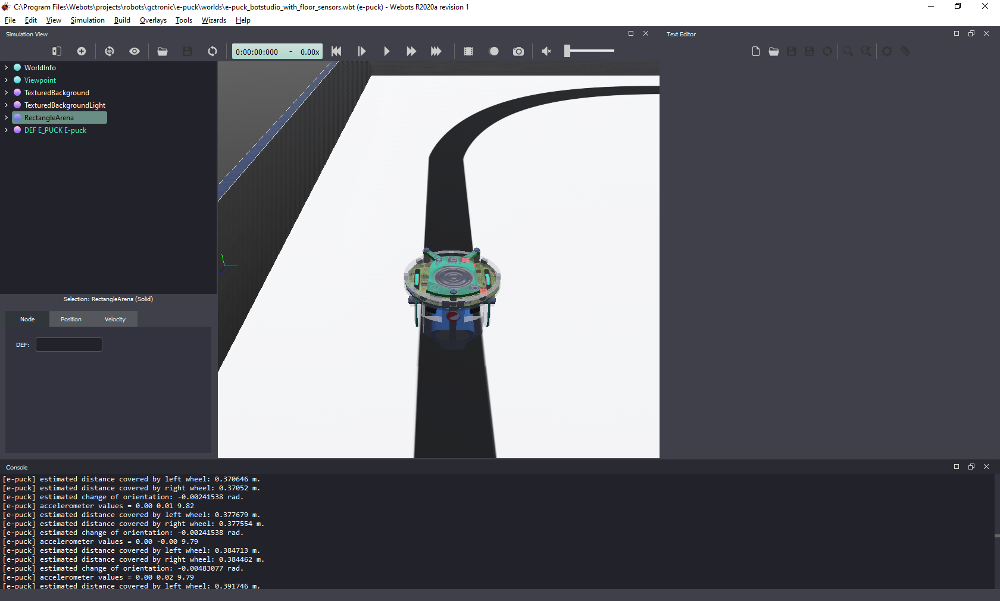
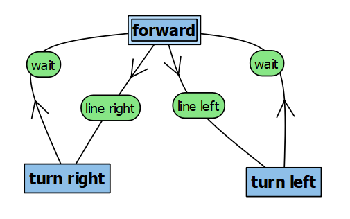
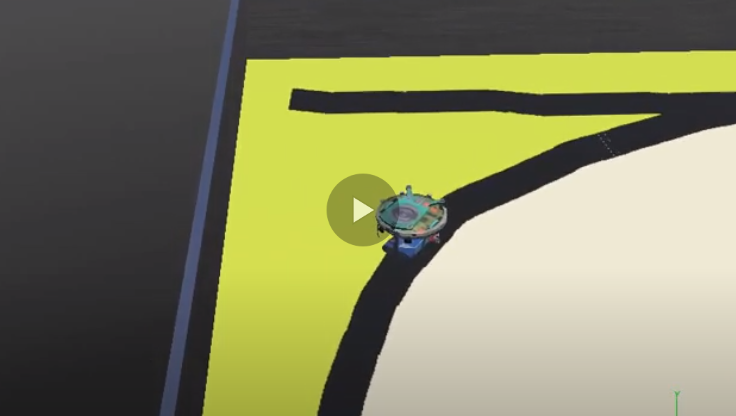
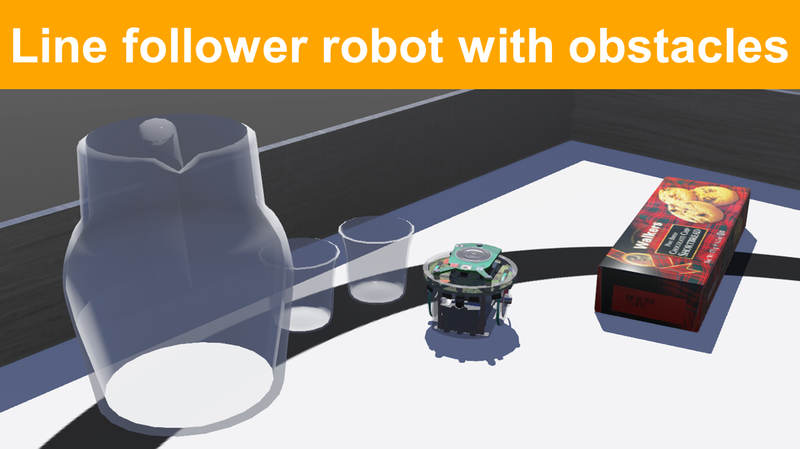
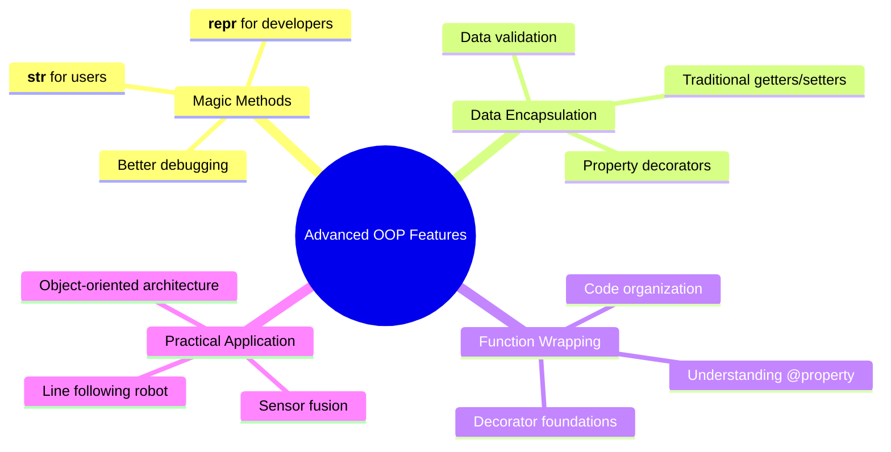

# Session 5: Advanced Class Features & Magic Methods

**Week:** 5  
**Element:** ICTPRG430 Element 2.2  
**Duration:** 4 hours  
**Phase:** Object-Oriented Programming 

---

## Session Introduction

In this session, you'll explore advanced Python class features that make your robotics code more professional and maintainable. You'll learn how to make your robot objects display themselves clearly using magic methods (`__str__` and `__repr__`), understand the fundamentals of data encapsulation through getters and setters (both traditional and decorator approaches), and see how function wrapping works. The session culminates with Lab 2, where you'll implement a line-following robot using object-oriented principles in Webots simulator.

## Learning Objectives

By the end of this session, you will be able to:

- Implement and distinguish between `__str__` and `__repr__` magic methods
- Understand when and why to use each string representation method
- Create getter and setter methods for controlled data access
- Apply the `@property` decorator for Pythonic attribute access
- Understand function wrapping concepts as preparation for decorators
- Design object-oriented solutions for line-following robot behaviors
- Implement sensor fusion and control logic in a robotics context

---

## Session Structure

1. **Theory Session** - Magic methods and string representations
2. **Hands-on Exercise** - Implementing `__str__` and `__repr__` for robot classes
3. **Data Encapsulation** - Traditional getters/setters and property decorators
4. **Function Wrapping** - Understanding decorator foundations
5. **Lab 2** - Line-following robot implementation in Webots

---

## Session Overview

This session builds on the foundational OOP concepts from Session 4, introducing advanced class features that make your robotics code more robust and professional. We'll focus on how objects represent themselves and how to control access to object data.

## Pre-Session Preparation

!!! tip "Setup Check"
    Ensure your development environment is ready:

    
    - Python 3.9+ with Webots integration working
    - VS Code with Python
    - Completed Session 4 robot class exercises
    

---

## 1. Magic Methods: Making Objects Talk

Magic methods (also called "dunder methods" because they have **d**ouble **under**scores) are special Python methods that define how objects behave in specific situations. Today we'll focus on the two most important ones for displaying object information: `__str__` and `__repr__`.

### Why Magic Methods Matter in Robotics

When debugging robot behavior, you need clear, informative output about your objects. Without magic methods, Python gives you useless information:

```python
# Without magic methods - unhelpful output
robot = EPuckRobot("Alpha_7", 98.5)
print(robot)
# Output: <__main__.EPuckRobot object at 0x7f8b8c0a1d30>
```

With proper magic methods, you get meaningful information:

```python
# With magic methods - useful output
robot = EPuckRobot("Alpha_7", 98.5)
print(robot)
# Output: EPuckRobot(robot_id='Alpha_7', battery=98.5%, speed=0.0, moving=False)
```

### Understanding `__str__` vs `__repr__`

!!! abstract 
    "Key Differences"

    
    **`__str__`** : For end users - human-readable, friendly format

    - Called by `print()` and `str()`
    - Should be clear and informative for users
    - Think: "What would a robot operator want to see?"

    **`__repr__`**: For developers - precise, unambiguous format

    - Called by `repr()` and when displaying in lists/debugger
    - Should ideally be valid Python code to recreate the object
    - Think: "What would help a programmer debug this?"
    

---

## 2. Implementing String Representations

Let's enhance our EPuckRobot class from Session 4 with proper string representations.

### EPuckRobot Enhanced Class UML Structure



!!! example "Interactive Code Example"
    
    <div markdown="1">

    Try this interactive example to experiment with the concepts:

    <iframe src="https://www.online-python.com/MpavDRKGf2" width="100%" height="1200" frameborder="0" marginwidth="0" marginheight="0" allowfullscreen></iframe>

    </div>


## Hands-on Exercise: Enhanced IR Sensor with String Representations

Building on Session 4's IR Sensor class, you'll now add professional string representations.

### Task: Enhance IRSensor with Magic Methods

#### Enhanced IRSensor Class UML Structure



### Step-by-Step Instructions

1. **Enhance your IRSensor class** from Session 4 with these additions:
    
    - Add a `last_reading` instance variable to store the most recent reading
    - Implement `__str__()` for user-friendly display
    - Implement `__repr__()` for debugging
    - Add a `get_status()` method that returns detailed sensor information
2. **Requirements for string methods:**
    
    - `__str__()`: Should show sensor name and last reading in a friendly format
    - `__repr__()`: Should show exact constructor call needed to recreate the sensor
    - Handle the case when no reading has been taken yet

### Complete Implementation Template

```python
import random

class IRSensor:
    """Enhanced infrared distance sensor with string representations."""
    
    def __init__(self, name: str):
        """
        Initialize the IR sensor with a position name.
        
        Args:
            name (str): Position identifier for the sensor
        """
        pass
    
    def __str__(self):
        """
        Return user-friendly string representation.
        
        Returns:
            str: Human-readable sensor status
        """
        pass

    
    def __repr__(self):
        """
        Return developer-friendly string representation.
        
        Returns:
            str: Precise representation for debugging
        """
        pass
    
    def get_reading(self):
        """
        Simulate getting a distance measurement from the IR sensor.
        
        Returns:
            int: Distance measurement in centimeters (1-100)
        """
        pass

    def get_status(self):
        """
        Get detailed status information about the sensor.
        
        Returns:
            str: Detailed sensor status
        """
        pass
"

if __name__ == "__main__":
    # Create sensor instances
    sensors = [
        IRSensor("Front Left"),
        IRSensor("Front Center"),
        IRSensor("Front Right"),
        IRSensor("Back Left"),
        IRSensor("Back Right")
    ]
    
    print("\n=== Initial Sensor Status ===")
    for sensor in sensors:
        print(sensor)  # Uses __str__
    
    print("\n=== After Taking Readings ===")
    for sensor in sensors:
        sensor.get_reading()
    
    print("\n=== Updated Sensor Display ===")
    for sensor in sensors:
        print(sensor)  # Shows readings now
    
    print("\n=== Debugging View ===")
    print("Sensor list:", sensors)  # Uses __repr__ for each sensor
    
    print("\n=== Detailed Status ===")
    for sensor in sensors:
        print(sensor.get_status())
```

**Expected Output (values will change for yours):**

```
IR Sensor 'Front Left' initialized
IR Sensor 'Front Center' initialized
IR Sensor 'Front Right' initialized
IR Sensor 'Back Left' initialized
IR Sensor 'Back Right' initialized

=== Initial Sensor Status ===
Front Left Sensor: No readings taken
Front Center Sensor: No readings taken
Front Right Sensor: No readings taken
Back Left Sensor: No readings taken
Back Right Sensor: No readings taken

=== After Taking Readings ===
Front Left sensor reading: 42 cm
Front Center sensor reading: 78 cm
Front Right sensor reading: 15 cm
Back Left sensor reading: 91 cm
Back Right sensor reading: 33 cm

=== Updated Sensor Display ===
Front Left Sensor: 42 cm
Front Center Sensor: 78 cm
Front Right Sensor: 15 cm
Back Left Sensor: 91 cm
Back Right Sensor: 33 cm

=== Debugging View ===
Sensor list: [IRSensor(name='Front Left'), IRSensor(name='Front Center'), IRSensor(name='Front Right'), IRSensor(name='Back Left'), IRSensor(name='Back Right')]

=== Detailed Status ===
Sensor 'Front Left': Active (last reading: 42 cm)
Sensor 'Front Center': Active (last reading: 78 cm)
Sensor 'Front Right': Active (last reading: 15 cm)
Sensor 'Back Left': Active (last reading: 91 cm)
Sensor 'Back Right': Active (last reading: 33 cm)
```

!!! tip "Best Practice Tip" Notice how `__str__` provides information useful to robot operators, while `__repr__` shows exactly how to recreate the object. This distinction helps both users and developers.

---

## 3. Data Encapsulation: Controlling Access to Object Data

Data encapsulation is about controlling how external code accesses and modifies object data. In robotics, this prevents dangerous operations like setting invalid motor speeds or battery levels.

### The Problem with Direct Attribute Access

```python
# Direct access can lead to problems
robot = EPuckRobot("Alpha_7", 98.5)
robot.battery_percentage = 150.0  # Invalid! Batteries can't exceed 100%
robot.current_speed = -0.5        # Invalid! Negative speed doesn't make sense
```

### Traditional Getter and Setter Methods

Before we learn the elegant decorator approach, let's understand the traditional method:

#### Battery Management Class UML Structure



```python
class BatteryManager:
    """Manages robot battery with controlled access."""
    
    def __init__(self, initial_level: float):
        """Initialize battery manager with validation."""
        self._battery_level = 0.0  # Private attribute (by convention)
        self.set_battery_level(initial_level)  # Use setter for validation
    
    def get_battery_level(self):
        """
        Get current battery level.
        
        Returns:
            float: Battery level as percentage (0.0-100.0)
        """
        return self._battery_level
    
    def set_battery_level(self, level: float):
        """
        Set battery level with validation.
        
        Args:
            level (float): Battery level percentage
        
        Raises:
            ValueError: If level is outside valid range
        """
        if not isinstance(level, (int, float)):
            raise TypeError("Battery level must be a number")
        
        if level < 0.0:
            raise ValueError("Battery level cannot be negative")
        
        if level > 100.0:
            raise ValueError("Battery level cannot exceed 100%")
        
        self._battery_level = float(level)
        print(f"Battery level set to {self._battery_level}%")
    
    def is_battery_low(self):
        """
        Check if battery is low.
        
        Returns:
            bool: True if battery is below 20%
        """
        return self._battery_level < 20.0
    
    def __str__(self):
        """User-friendly battery status."""
        status = "LOW" if self.is_battery_low() else "OK"
        return f"Battery: {self._battery_level}% ({status})"
    
    def __repr__(self):
        """Developer representation."""
        return f"BatteryManager(initial_level={self._battery_level})"

# Usage example
if __name__ == "__main__":
    # Create battery manager
    battery = BatteryManager(85.0)
    print(battery)
    
    # Safe access through getters/setters
    print(f"Current level: {battery.get_battery_level()}%")
    
    # Validation prevents invalid values
    try:
        battery.set_battery_level(150.0)  # Will raise ValueError
    except ValueError as e:
        print(f"Error: {e}")
    
    # Check battery status
    battery.set_battery_level(15.0)
    print(battery)
    print(f"Battery low: {battery.is_battery_low()}")
```

---

## 4. Function Wrapping: Understanding Decorator Foundations

Before learning the `@property` decorator, let's understand how function wrapping works. This concept is fundamental to understanding decorators.

### Basic Function Wrapping Example

```python
def validate_positive(func):
    """Wrapper that validates function arguments are positive."""
    def wrapper(value):
        print(f"Validating that {value} is positive...")
        if value < 0:
            raise ValueError("Value must be positive")
        result = func(value)
        print(f"Validation passed, result: {result}")
        return result
    return wrapper

def calculate_square_root(number):
    """Calculate square root of a number."""
    return number ** 0.5

# Wrap the function manually
safe_square_root = validate_positive(calculate_square_root)

# Test the wrapped function
try:
    result = safe_square_root(16.0)  # Works fine
    print(f"√16 = {result}")
    
    result = safe_square_root(-4.0)  # Raises error
except ValueError as e:
    print(f"Error: {e}")
```

### How This Relates to Properties

The `@property` decorator works similarly - it wraps your method to make it behave like an attribute. Understanding this concept helps you grasp how decorators work "under the hood."

---

## 5. Property Decorators: The Pythonic Way

Now that you understand function wrapping, let's see how the `@property` decorator provides a cleaner approach to getters and setters.

### Enhanced Motor Controller Class UML Structure



```python
class MotorController:
    """Motor controller with property-based encapsulation."""
    
    def __init__(self, max_speed: float = 1.0):
        """
        Initialize motor controller.
        
        Args:
            max_speed (float): Maximum allowed speed (0.0-1.0)
        """
        self._speed = 0.0
        self._max_speed = max_speed
        self._is_running = False
        print(f"Motor controller initialized (max speed: {max_speed})")
    
    @property
    def speed(self):
        """
        Get current motor speed.
        
        Returns:
            float: Current speed (0.0-1.0)
        """
        return self._speed
    
    @speed.setter
    def speed(self, value):
        """
        Set motor speed with validation.
        
        Args:
            value (float): Desired speed (0.0-max_speed)
        
        Raises:
            ValueError: If speed is outside valid range
            TypeError: If speed is not a number
        """
        if not isinstance(value, (int, float)):
            raise TypeError("Speed must be a number")
        
        if value < 0.0:
            raise ValueError("Speed cannot be negative")
        
        if value > self._max_speed:
            raise ValueError(f"Speed cannot exceed {self._max_speed}")
        
        self._speed = float(value)
        self._is_running = (self._speed > 0.0)
        print(f"Motor speed set to {self._speed}")
    
    @property
    def max_speed(self):
        """Get maximum allowed speed."""
        return self._max_speed
    
    @property
    def is_running(self):
        """Check if motor is currently running."""
        return self._is_running
    
    def start(self):
        """Start motor at current speed setting."""
        if self._speed > 0.0:
            self._is_running = True
            print(f"Motor started at speed {self._speed}")
        else:
            print("Cannot start motor: speed is 0.0")
    
    def stop(self):
        """Stop motor (sets speed to 0)."""
        self._speed = 0.0
        self._is_running = False
        print("Motor stopped")
    
    def __str__(self):
        """User-friendly motor status."""
        status = "RUNNING" if self._is_running else "STOPPED"
        return f"Motor: {status} at {self._speed}/{self._max_speed} speed"
    
    def __repr__(self):
        """Developer representation."""
        return f"MotorController(max_speed={self._max_speed})"

# Usage demonstrating property access
if __name__ == "__main__":
    # Create motor controller
    motor = MotorController(0.8)  # Max speed of 0.8
    print(motor)
    
    # Property access looks like normal attribute access
    print(f"Current speed: {motor.speed}")
    print(f"Max speed: {motor.max_speed}")
    print(f"Is running: {motor.is_running}")
    
    # Set speed using property (calls the setter)
    motor.speed = 0.5
    print(motor)
    
    # Try invalid values
    try:
        motor.speed = 1.2  # Exceeds max_speed
    except ValueError as e:
        print(f"Error: {e}")
    
    try:
        motor.speed = "fast"  # Wrong type
    except TypeError as e:
        print(f"Error: {e}")
    
    # Properties are read-only where no setter is defined
    try:
        motor.max_speed = 1.0  # This will raise AttributeError
    except AttributeError as e:
        print(f"Error: can't set max_speed - {e}")
```

### Comparing Approaches

|Aspect|Traditional Getters/Setters|Property Decorators|
|---|---|---|
|**Syntax**|`robot.get_speed()` / `robot.set_speed(0.5)`|`robot.speed` / `robot.speed = 0.5`|
|**Readability**|More verbose|Clean, attribute-like access|
|**Validation**|✅ Full control|✅ Full control|
|**Pythonic**|Less Pythonic|✅ Highly Pythonic|
|**Learning Curve**|Easier to understand initially|Requires understanding decorators|

!!! tip "When to Use Each Approach" - **Traditional getters/setters**: When you need complex validation logic or multiple parameters - **Property decorators**: For simple attribute access with validation (recommended for most cases)

---

## Check Your Knowledge

Test your understanding of the advanced OOP concepts covered in this session:

!!! question "Question 1: `__str__` vs `__repr__` Purpose" 
    **Question**: You have a `RobotSensor` object. When would Python call `__str__()` vs `__repr__()`? Give specific examples.


    ??? tip "Click to reveal answer"
        **Answer**: : 
    
        **`__str__()` is called when:**
        - You use `print(sensor)`
        - You use `str(sensor)` 
        - String formatting like `f"Sensor data: {sensor}"`
        
        **`__repr__()` is called when:**
        - You use `repr(sensor)`
        - The object appears in a list: `print([sensor1, sensor2])`
        - In the debugger or interactive shell when you just type the variable name
        - When `__str__()` is not defined, Python falls back to `__repr__()`


!!! question "Question 2: Property Decorator Syntax" 
    **Question**: Look at this code. What's wrong with it?


    ```python
    class Robot:
        def __init__(self):
            self._speed = 0.0
        
        @property
        def speed(self, value):
            self._speed = value
    ```

    ??? tip "Click to reveal answer"
        **Answer**: 
        
        The `@property` decorator is used incorrectly. The method decorated with `@property` should be the **getter** (no parameters except `self`). To set values, you need a separate **setter**:
        
        ```python
        class Robot:
            def __init__(self):
                self._speed = 0.0
            
            @property
            def speed(self):  # Getter - no value parameter
                return self._speed
            
            @speed.setter
            def speed(self, value):  # Setter - has value parameter
                self._speed = value
        ```
    ````

??? question "Question 3: When to Use Properties"
    **Question**: Your robot has a `battery_level` that should never go below 0 or above 100. Should you use a property or just a regular attribute? Why?


    ??? tip "Click to reveal answer"
        **Answer**: 
        
        **Use a property** because you need validation. Here's why:
        
        - **Validation needed**: Battery levels have strict limits (0-100%)
        - **Safety critical**: Invalid battery levels could cause unsafe robot behavior
        - **Clean syntax**: `robot.battery_level = 85` is cleaner than `robot.set_battery_level(85)`
        
        Example implementation:
        ```python
        @property
        def battery_level(self):
            return self._battery_level
        
        @battery_level.setter
        def battery_level(self, value):
            if not 0 <= value <= 100:
                raise ValueError("Battery level must be 0-100%")
            self._battery_level = value
        ```


??? question "Question 4: Understanding `self` in Magic Methods" 
    **Question**: In `def __str__(self):`, what does `self` refer to, and why don't you need to pass it when calling `print(robot)`?


    ??? tip "Click to reveal answer"
        **Answer**: 
        
        - **`self` refers to**: The specific robot object that `__str__()` is being called on
        - **Why you don't pass it**: Python automatically passes `self` when you call methods on objects
        
        When you write `print(robot)`:
        1. Python internally calls `robot.__str__()`
        2. Python automatically passes the `robot` object as the `self` parameter
        3. Your `__str__` method can then access `self.robot_id`, `self.battery_percentage`, etc.
        
        This is the same reason you don't write `robot.move_forward(robot, 0.5)` - Python handles the `self` parameter automatically.


??? question "Question 5: Property vs Method Decision"
    **Question**: For each of these robot operations, should it be a property or a method? Explain your reasoning.


    - `robot.current_speed` (just getting the speed)
    - `robot.turn_left()` (making the robot turn)  
    - `robot.battery_percentage` (getting/setting battery level)
    - `robot.emergency_stop()` (immediate stop command)

    ??? tip "Click to reveal answer"
        **Answer**: 
        
        - **`robot.current_speed`** → **Property**: Getting data, no action performed, feels like an attribute
        - **`robot.turn_left()`** → **Method**: Performs an action, changes robot state, side effects
        - **`robot.battery_percentage`** → **Property**: Data that might need validation, attribute-like access
        - **`robot.emergency_stop()`** → **Method**: Critical action, clear that something important happens
        
        **Rule of thumb**: 
        - **Properties**: For data access (getting/setting values) that feels like attribute access
        - **Methods**: For actions, operations, or anything that "does something" to the object


---

## Lab 2: Line-follower Robot Implementation

In this lab, you will implement a line-following robot using object-oriented programming principles in the Webots simulator. This lab builds on the OOP concepts learned in Sessions 4 and 5, applying them to a real robotics problem.

!!! info "Lab Credits" 
    This lab is adapted from the excellent work by Felipe Martins:

    
    **Original Repository:** [Robotics-Simulation-Labs](https://github.com/felipenmartins/Robotics-Simulation-Labs)  
    **Author:** Felipe Nascimento Martins  
    **License:** Available on GitHub

    We acknowledge and appreciate the open-source contribution to robotics education.
    


### About Line Following

Line following is a fundamental robotics task where a robot uses sensors to detect and follow a path marked on the ground. This requires:

- **Sensor data processing**: Reading and interpreting sensor values
- **Decision making**: Determining robot actions based on sensor data
- **Motor control**: Translating decisions into wheel movements
- **Real-time operation**: Continuously processing sensor data and adjusting behavior

### Lab Setup

Before starting the implementation, ensure you have:

1. **Webots simulator** installed and working (from Session 4)
2. **Python 3.9+** configured with Webots
3. Basic understanding of **OOP concepts** from Sessions 4 and 5


# Lab 2 – Line-follower with State Machine

## Objectives
The goal of this lab is to learn more about controllers in Webots via the implementation of state machine to make the robot follow a line. 

## Pre-requisites
* You must have Webots R2022a (or newer) properly configured to work with Python. 
* You must know how to create a robot controller in Python and how to run a simulation. 

If you are still missing any of those, please go back to [Lab 1](../Lab1/ReadMe.md) and complete the corresponding tasks.

## The e-puck robot
Webots contains a realistic model of e-puck, a small differential-drive mobile robot. The movement of this type of robot is controlled by independently adjusting the speeds of the left and right wheels. 

The e-puck robot has multiple sensors. To detect obstacles, the e-puck contains 8 infrared distance sensors around its body. Optionally, 3 infrared sensors can be mounted under its base, pointing to the floor, allowing the implementation of a line-following behavior. 

An explanation about the e-puck robot and how to use it in Webots is available in Webots Tutorial 4.

## Tasks

1- **Follow [Webots Tutorial 4](https://cyberbotics.com/doc/guide/tutorial-4-more-about-controllers?tab-language=python)** to better understand the e-puck model and learn how to control it in Python.

2- After finishing tutorial 4, **open the line-following sample world**: Click on `File > Open Sample Worlds` and go to `robots > gctronic > e-puck` and select `e-puck_botstudio_with_floor_sensors.wbt`. You should see a world similar to the one shown in Figure 1. _In the next steps you **must** use the e-puck robot that is loaded with this sample world because it has the floor sensors to detect the line._ 


###### Figure 1. Webots screenshot with the world “e-puck_botstudio_with_floor_sensors.wbt”.

3- You will need to make changes to the file, so you have to **save the sample world with a different name** on a folder of your choice. 

4- Write a simple program to **investigate the values returned by the floor sensors** when the robot is over the white floor and over the black line. You can use the print function to show the sensor values in the Webots console. _More information about how to read the ground sensors is given below._

5- **Test the motor speeds** to determine how fast the robot should run and turn in order to follow the line.

6- **Create a new controller in Python and implement a line-following behavior** using what you learned from the steps above. You can use the state machine shown in Figure 2 as reference. 

7- Finally, **add one extra state to stop the robot when no line is detected**.
 

###### Figure 2. A state machine diagram that implements a line-follower behavior.


## Ground sensors
In Tutorial 4 you made use of the distance sensors around the robot. To detect the line on the floor you need to use the ground sensors, instead. The simulator also treats the ground sensors as distance sensors because they are of the same type (infrared sensors). In Python you can access the ground sensors as shown below.

To initialize the ground sensors:
```
gs = []
gsNames = ['gs0', 'gs1', 'gs2']
for i in range(3):
    gs.append(robot.getDevice(gsNames[i]))
    gs[i].enable(timestep)
```

To read the ground sensors inside the main loop:
```
gsValues = []
for i in range(3):
    gsValues.append(gs[i].getValue())
``` 

To read sensor values inside the main loop:
```
line_right = gsValues[0]
line_center = gsValues[1]
line_left = gsValues[2]
```

If you need inspiration, check the [template code available here!](../images/line_following_template.py)

## Solution
Try to implement the state machine yourself before checking the solution! A possible solution (without the stop state) is available [here](../images/line_following_behavior.py).

The video below shows the solution code in action:

[](https://youtu.be/nW06dLEe-AU).

## Challenge: Obstacle Avoidance
Change the state machine to make e-puck **avoid obstacles** placed on its way. You can choose the type of obstacle to add: different formats might require different strategies of obstacle avoidance. Obstacles with round or rectangular shape usually are the less demanding, while obstacles with U-shape require more complex strategies.

An illustration of obstacle avoidance with state machine is given in Figure 3. Note that the obstacle avoidance strategy that was implemented required four extra states, some executing the same action as others. The animation in Figure 3 shows the active state (in red) for each condition during the simulation.


###### Figure 3. Illustration of obstacle avoidance strategy added to the existing line-follower state machine.

Student Wilfred van Reenen made the video below to illustrate the excellent performance of his obstacle avoidance state machine. If you want to go above and beyond, try to get your robot to avoid all those obstacles!

[](https://youtu.be/eELnG58BYzg).

!!! info "OOP Refactoring task" 
    # Lab 2: Object-Oriented Programming Refactoring

    ## Task Overview
    Refactor the provided procedural line-following robot code into an object-oriented design.

    ## Main Task
    1. **Complete the `LineFollowingRobot` class**
    - Fill in all `TODO` methods in the provided framework
    - Move global variables into the class as instance variables
    - Break the main loop into logical methods
    - Test that your robot still follows lines correctly

    ## Learning Objectives
    - Practice **encapsulation** (data and methods together)
    - Learn to organize code into **classes and methods**
    - Understand how OOP improves code structure and readability

    ### Line-Following Robot Architecture

    Our robot will use an **object-oriented architecture** with these main components:


    ## Line-Following Architecture UML Diagram

    ```mermaid
        classDiagram
        class LineFollowingRobot {
            -MAX_SPEED: float
            -COUNTER_MAX: int
            -current_state: str
            -counter: int
            -robot: WebotsRobot
            -timestep: int
            -ground_sensors: list
            -leftMotor: Motor
            -rightMotor: Motor
            +__init__()
            +read_sensors(): tuple
            +move_forward()
            +turn_right()
            +turn_left()
            +update_state(line_left: bool, line_right: bool)
            +run()
        }
    ```
    ## Submission template

    ```
    # Lab 2: Object-Oriented Programming - Line Following Robot


    from controller import Robot as WebotsRobot, DistanceSensor, Motor


    class LineFollowingRobot:
        """A simple robot that follows lines"""
        
        def __init__(self):
            """Set up the robot and its sensors/motors"""
            self.MAX_SPEED = 6.28
            self.COUNTER_MAX = 5
            
            # State variables
            self.current_state = 'forward'
            self.counter = 0
            
            # TODO: Create robot instance
            
            # TODO: Get timestep from robot
            
            # TODO: Initialize ground sensors
            
            # TODO: Initialize motors
            
        
        def read_sensors(self):
            """Read ground sensors and return line detection"""
            # TODO: Read ground sensor values
            
            # TODO: Check if line is detected on left and right
            
            # TODO: Return (line_left, line_right)
            
        
        def move_forward(self):
            """Move robot forward"""
            # TODO: Set motor speeds for forward movement
            
        
        def turn_right(self):
            """Turn robot right"""
            # TODO: Set motor speeds for right turn
            
        
        def turn_left(self):
            """Turn robot left"""  
            # TODO: Set motor speeds for left turn
            
        
        def update_state(self, line_left, line_right):
            """Update robot state based on line detection"""
            # TODO: Implement state machine logic
            
        
        def run(self):
            """Main robot loop"""
            # TODO: Implement main loop
            


        # Run the robot
        if __name__ == "__main__":
            robot = LineFollowingRobot()
            robot.run()
    ```
    ## Deliverables
    - Completed `LineFollowingRobot` class
    - Working robot simulation
    - Brief reflection: How does the OOP version compare to the original procedural code?

    ## Conclusion
    After following this lab you should know more about the e-puck robot model, how to program a controller for it in Python, and how to program a robot behavior based on state machine. 


### Debugging Tips

!!! tip "Common Issues and Solutions"


    **Robot doesn't move**: Check that motors are properly initialized and `timestep` is correct

    **Erratic behavior**: Adjust the `base_speed` and `turn_speed` parameters

    **Line not detected**: Verify the sensor threshold values for your specific world

    **Console spam**: The debug output is limited to ~1 second intervals to keep it readable


### Extension Challenges

Once you have the basic implementation working, try these enhancements:

1. **Add speed control**: Make the robot slow down in tight turns
2. **Implement PID control**: Use proportional, integral, and derivative control for smoother following
3. **Add line-lost recovery**: Handle situations where the robot completely loses the line
4. **Implement different following modes**: Allow switching between fast/slow/precise modes

---

## Session Summary: Advanced OOP Features in Robotics

In this session, you've learned how to make your robotics code more professional and maintainable through advanced OOP features:

### Key Concepts Mastered



### Design Patterns Used

Throughout this session, we've implemented several important design patterns:

- **Encapsulation**: Hiding internal data and providing controlled access
- **Composition**: Building complex objects from simpler components
- **Single Responsibility**: Each class has one clear purpose
- **Property Pattern**: Clean attribute-like access with validation

!!! success "Professional Development" The techniques learned in this session are used in production robotics software. You're now writing code that follows industry best practices!

---

## Out-of-Class Research Activities

To reinforce your understanding and prepare for advanced topics:

### Research Topics

1. **Python Magic Methods Deep Dive**
    
    - Research other useful magic methods (`__eq__`, `__lt__`, `__len__`)
    - Find examples of magic methods in robotics frameworks
    - Study how magic methods enable operator overloading
2. **Property Decorators Advanced Usage**
    
    - Investigate read-only properties and computed properties
    - Research property caching for expensive calculations
    - Look into property validation patterns
3. **Robotics Control Systems**
    
    - Study PID controllers and their implementation in OOP
    - Research state machines for robot behavior
    - Investigate sensor fusion algorithms and OOP design
4. **Code Quality and Testing**
    
    - Research unit testing for robotics code
    - Study debugging techniques for real-time systems
    - Investigate logging best practices for robotics applications

!!! tip "Recommended Resources" 
    - Python official documentation on data model - Real Python articles on properties and magic methods  
    - Open-source robotics projects showing OOP patterns - ROS (Robot Operating System) architectural documentation

---

## Next Session Preview

**Week 6: Inheritance & Polymorphism**

- Creating class hierarchies for different robot types
- Method overriding and super() usage
- Abstract base classes for robotics interfaces
- Polymorphic behavior in sensor and actuator systems
- Advanced UML diagrams and design patterns

---


### Further Reading

- Python Data Model Documentation
- Property Decorator Patterns
- Robotics Software Engineering Best Practices
- Object-Oriented Design Patterns in Robotics

---

**Navigation:**  
[← Week 4](https:///session-04.md) | [Learning Plan](../course-overview/revised_lap.md) | [Week 6 →](https:///session-06.md)