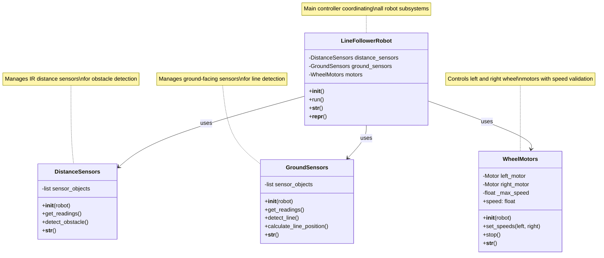

# Session 5: Advanced Class Features & Magic Methods

**Week:** 5  
**Element:** ICTPRG430 Element 2.2  
**Duration:** 4 hours  
**Phase:** Object-Oriented Programming 

---

## Session Introduction

In this session, you'll explore advanced Python class features that make your robotics code more professional and maintainable. You'll learn how to make your robot objects display themselves clearly using magic methods (`__str__` and `__repr__`), understand the fundamentals of data encapsulation through getters and setters (both traditional and decorator approaches), and see how function wrapping works. The session culminates with Lab 2, where you'll implement a line-following robot using object-oriented principles in Webots simulator.

## Learning Objectives

By the end of this session, you will be able to:

- Implement and distinguish between `__str__` and `__repr__` magic methods
- Understand when and why to use each string representation method
- Create getter and setter methods for controlled data access
- Apply the `@property` decorator for Pythonic attribute access
- Understand function wrapping concepts as preparation for decorators
- Design object-oriented solutions for line-following robot behaviors
- Implement sensor fusion and control logic in a robotics context

---

## Session Structure

1. **Theory Session** - Magic methods and string representations
2. **Hands-on Exercise** - Implementing `__str__` and `__repr__` for robot classes
3. **Data Encapsulation** - Traditional getters/setters and property decorators
4. **Function Wrapping** - Understanding decorator foundations
5. **Lab 2** - Line-following robot implementation in Webots

---

## Session Overview

This session builds on the foundational OOP concepts from Session 4, introducing advanced class features that make your robotics code more robust and professional. We'll focus on how objects represent themselves and how to control access to object data.

## Pre-Session Preparation

!!! tip "Setup Check" 
    Ensure your development environment is ready:

    ```
    - Python 3.9+ with Webots integration working
    - VS Code with Python
    - Completed Session 4 robot class exercises
    ```

---

## 1. Magic Methods: Making Objects Talk

Magic methods (also called "dunder methods" because they have **d**ouble **under**scores) are special Python methods that define how objects behave in specific situations. Today we'll focus on the two most important ones for displaying object information: `__str__` and `__repr__`.

### Why Magic Methods Matter in Robotics

When debugging robot behavior, you need clear, informative output about your objects. Without magic methods, Python gives you useless information:

```python
# Without magic methods - unhelpful output
robot = EPuckRobot("Alpha_7", 98.5)
print(robot)
# Output: <__main__.EPuckRobot object at 0x7f8b8c0a1d30>
```

With proper magic methods, you get meaningful information:

```python
# With magic methods - useful output
robot = EPuckRobot("Alpha_7", 98.5)
print(robot)
# Output: EPuckRobot(robot_id='Alpha_7', battery=98.5%, speed=0.0, moving=False)
```

### Understanding `__str__` vs `__repr__`

!!! abstract 
    "Key Differences"

    
    **`__str__`** : For end users - human-readable, friendly format

    - Called by `print()` and `str()`
    - Should be clear and informative for users
    - Think: "What would a robot operator want to see?"

    **`__repr__`**: For developers - precise, unambiguous format

    - Called by `repr()` and when displaying in lists/debugger
    - Should ideally be valid Python code to recreate the object
    - Think: "What would help a programmer debug this?"
    

---

## 2. Implementing String Representations

Let's enhance our EPuckRobot class from Session 4 with proper string representations.

### EPuckRobot Enhanced Class UML Structure


!!! example "Interactive Code Example"
    
    <div markdown="1">

    Try this interactive example to experiment with the concepts:

    <iframe src="https://www.online-python.com/MpavDRKGf2" width="100%" height="1200" frameborder="0" marginwidth="0" marginheight="0" allowfullscreen></iframe>

    </div>


## Hands-on Exercise: Enhanced IR Sensor with String Representations

Building on Session 4's IR Sensor class, you'll now add professional string representations.

### Task: Enhance IRSensor with Magic Methods

#### Enhanced IRSensor Class UML Structure


### Step-by-Step Instructions

1. **Enhance your IRSensor class** from Session 4 with these additions:
    
    - Add a `last_reading` instance variable to store the most recent reading
    - Implement `__str__()` for user-friendly display
    - Implement `__repr__()` for debugging
    - Add a `get_status()` method that returns detailed sensor information
2. **Requirements for string methods:**
    
    - `__str__()`: Should show sensor name and last reading in a friendly format
    - `__repr__()`: Should show exact constructor call needed to recreate the sensor
    - Handle the case when no reading has been taken yet

### Complete Implementation Template

```python
import random

class IRSensor:
    """Enhanced infrared distance sensor with string representations."""
    
    def __init__(self, name: str):
        """
        Initialize the IR sensor with a position name.
        
        Args:
            name (str): Position identifier for the sensor
        """
        pass
    
    def __str__(self):
        """
        Return user-friendly string representation.
        
        Returns:
            str: Human-readable sensor status
        """
        pass

    
    def __repr__(self):
        """
        Return developer-friendly string representation.
        
        Returns:
            str: Precise representation for debugging
        """
        pass
    
    def get_reading(self):
        """
        Simulate getting a distance measurement from the IR sensor.
        
        Returns:
            int: Distance measurement in centimeters (1-100)
        """
        pass

    def get_status(self):
        """
        Get detailed status information about the sensor.
        
        Returns:
            str: Detailed sensor status
        """
        pass
"

if __name__ == "__main__":
    # Create sensor instances
    sensors = [
        IRSensor("Front Left"),
        IRSensor("Front Center"),
        IRSensor("Front Right"),
        IRSensor("Back Left"),
        IRSensor("Back Right")
    ]
    
    print("\n=== Initial Sensor Status ===")
    for sensor in sensors:
        print(sensor)  # Uses __str__
    
    print("\n=== After Taking Readings ===")
    for sensor in sensors:
        sensor.get_reading()
    
    print("\n=== Updated Sensor Display ===")
    for sensor in sensors:
        print(sensor)  # Shows readings now
    
    print("\n=== Debugging View ===")
    print("Sensor list:", sensors)  # Uses __repr__ for each sensor
    
    print("\n=== Detailed Status ===")
    for sensor in sensors:
        print(sensor.get_status())
```

**Expected Output (values will change for yours):**

```
IR Sensor 'Front Left' initialized
IR Sensor 'Front Center' initialized
IR Sensor 'Front Right' initialized
IR Sensor 'Back Left' initialized
IR Sensor 'Back Right' initialized

=== Initial Sensor Status ===
Front Left Sensor: No readings taken
Front Center Sensor: No readings taken
Front Right Sensor: No readings taken
Back Left Sensor: No readings taken
Back Right Sensor: No readings taken

=== After Taking Readings ===
Front Left sensor reading: 42 cm
Front Center sensor reading: 78 cm
Front Right sensor reading: 15 cm
Back Left sensor reading: 91 cm
Back Right sensor reading: 33 cm

=== Updated Sensor Display ===
Front Left Sensor: 42 cm
Front Center Sensor: 78 cm
Front Right Sensor: 15 cm
Back Left Sensor: 91 cm
Back Right Sensor: 33 cm

=== Debugging View ===
Sensor list: [IRSensor(name='Front Left'), IRSensor(name='Front Center'), IRSensor(name='Front Right'), IRSensor(name='Back Left'), IRSensor(name='Back Right')]

=== Detailed Status ===
Sensor 'Front Left': Active (last reading: 42 cm)
Sensor 'Front Center': Active (last reading: 78 cm)
Sensor 'Front Right': Active (last reading: 15 cm)
Sensor 'Back Left': Active (last reading: 91 cm)
Sensor 'Back Right': Active (last reading: 33 cm)
```

!!! tip "Best Practice Tip" Notice how `__str__` provides information useful to robot operators, while `__repr__` shows exactly how to recreate the object. This distinction helps both users and developers.

---

## 3. Data Encapsulation: Controlling Access to Object Data

Data encapsulation is about controlling how external code accesses and modifies object data. In robotics, this prevents dangerous operations like setting invalid motor speeds or battery levels.

### The Problem with Direct Attribute Access

```python
# Direct access can lead to problems
robot = EPuckRobot("Alpha_7", 98.5)
robot.battery_percentage = 150.0  # Invalid! Batteries can't exceed 100%
robot.current_speed = -0.5        # Invalid! Negative speed doesn't make sense
```

### Traditional Getter and Setter Methods

Before we learn the elegant decorator approach, let's understand the traditional method:

#### Battery Management Class UML Structure


```python
class BatteryManager:
    """Manages robot battery with controlled access."""
    
    def __init__(self, initial_level: float):
        """Initialize battery manager with validation."""
        self._battery_level = 0.0  # Private attribute (by convention)
        self.set_battery_level(initial_level)  # Use setter for validation
    
    def get_battery_level(self):
        """
        Get current battery level.
        
        Returns:
            float: Battery level as percentage (0.0-100.0)
        """
        return self._battery_level
    
    def set_battery_level(self, level: float):
        """
        Set battery level with validation.
        
        Args:
            level (float): Battery level percentage
        
        Raises:
            ValueError: If level is outside valid range
        """
        if not isinstance(level, (int, float)):
            raise TypeError("Battery level must be a number")
        
        if level < 0.0:
            raise ValueError("Battery level cannot be negative")
        
        if level > 100.0:
            raise ValueError("Battery level cannot exceed 100%")
        
        self._battery_level = float(level)
        print(f"Battery level set to {self._battery_level}%")
    
    def is_battery_low(self):
        """
        Check if battery is low.
        
        Returns:
            bool: True if battery is below 20%
        """
        return self._battery_level < 20.0
    
    def __str__(self):
        """User-friendly battery status."""
        status = "LOW" if self.is_battery_low() else "OK"
        return f"Battery: {self._battery_level}% ({status})"
    
    def __repr__(self):
        """Developer representation."""
        return f"BatteryManager(initial_level={self._battery_level})"

# Usage example
if __name__ == "__main__":
    # Create battery manager
    battery = BatteryManager(85.0)
    print(battery)
    
    # Safe access through getters/setters
    print(f"Current level: {battery.get_battery_level()}%")
    
    # Validation prevents invalid values
    try:
        battery.set_battery_level(150.0)  # Will raise ValueError
    except ValueError as e:
        print(f"Error: {e}")
    
    # Check battery status
    battery.set_battery_level(15.0)
    print(battery)
    print(f"Battery low: {battery.is_battery_low()}")
```

---

## 4. Function Wrapping: Understanding Decorator Foundations

Before learning the `@property` decorator, let's understand how function wrapping works. This concept is fundamental to understanding decorators.

### Basic Function Wrapping Example

```python
def validate_positive(func):
    """Wrapper that validates function arguments are positive."""
    def wrapper(value):
        print(f"Validating that {value} is positive...")
        if value < 0:
            raise ValueError("Value must be positive")
        result = func(value)
        print(f"Validation passed, result: {result}")
        return result
    return wrapper

def calculate_square_root(number):
    """Calculate square root of a number."""
    return number ** 0.5

# Wrap the function manually
safe_square_root = validate_positive(calculate_square_root)

# Test the wrapped function
try:
    result = safe_square_root(16.0)  # Works fine
    print(f"√16 = {result}")
    
    result = safe_square_root(-4.0)  # Raises error
except ValueError as e:
    print(f"Error: {e}")
```

### How This Relates to Properties

The `@property` decorator works similarly - it wraps your method to make it behave like an attribute. Understanding this concept helps you grasp how decorators work "under the hood."

---

## 5. Property Decorators: The Pythonic Way

Now that you understand function wrapping, let's see how the `@property` decorator provides a cleaner approach to getters and setters.

### Enhanced Motor Controller Class UML Structure


```python
class MotorController:
    """Motor controller with property-based encapsulation."""
    
    def __init__(self, max_speed: float = 1.0):
        """
        Initialize motor controller.
        
        Args:
            max_speed (float): Maximum allowed speed (0.0-1.0)
        """
        self._speed = 0.0
        self._max_speed = max_speed
        self._is_running = False
        print(f"Motor controller initialized (max speed: {max_speed})")
    
    @property
    def speed(self):
        """
        Get current motor speed.
        
        Returns:
            float: Current speed (0.0-1.0)
        """
        return self._speed
    
    @speed.setter
    def speed(self, value):
        """
        Set motor speed with validation.
        
        Args:
            value (float): Desired speed (0.0-max_speed)
        
        Raises:
            ValueError: If speed is outside valid range
            TypeError: If speed is not a number
        """
        if not isinstance(value, (int, float)):
            raise TypeError("Speed must be a number")
        
        if value < 0.0:
            raise ValueError("Speed cannot be negative")
        
        if value > self._max_speed:
            raise ValueError(f"Speed cannot exceed {self._max_speed}")
        
        self._speed = float(value)
        self._is_running = (self._speed > 0.0)
        print(f"Motor speed set to {self._speed}")
    
    @property
    def max_speed(self):
        """Get maximum allowed speed."""
        return self._max_speed
    
    @property
    def is_running(self):
        """Check if motor is currently running."""
        return self._is_running
    
    def start(self):
        """Start motor at current speed setting."""
        if self._speed > 0.0:
            self._is_running = True
            print(f"Motor started at speed {self._speed}")
        else:
            print("Cannot start motor: speed is 0.0")
    
    def stop(self):
        """Stop motor (sets speed to 0)."""
        self._speed = 0.0
        self._is_running = False
        print("Motor stopped")
    
    def __str__(self):
        """User-friendly motor status."""
        status = "RUNNING" if self._is_running else "STOPPED"
        return f"Motor: {status} at {self._speed}/{self._max_speed} speed"
    
    def __repr__(self):
        """Developer representation."""
        return f"MotorController(max_speed={self._max_speed})"

# Usage demonstrating property access
if __name__ == "__main__":
    # Create motor controller
    motor = MotorController(0.8)  # Max speed of 0.8
    print(motor)
    
    # Property access looks like normal attribute access
    print(f"Current speed: {motor.speed}")
    print(f"Max speed: {motor.max_speed}")
    print(f"Is running: {motor.is_running}")
    
    # Set speed using property (calls the setter)
    motor.speed = 0.5
    print(motor)
    
    # Try invalid values
    try:
        motor.speed = 1.2  # Exceeds max_speed
    except ValueError as e:
        print(f"Error: {e}")
    
    try:
        motor.speed = "fast"  # Wrong type
    except TypeError as e:
        print(f"Error: {e}")
    
    # Properties are read-only where no setter is defined
    try:
        motor.max_speed = 1.0  # This will raise AttributeError
    except AttributeError as e:
        print(f"Error: can't set max_speed - {e}")
```

### Comparing Approaches

|Aspect|Traditional Getters/Setters|Property Decorators|
|---|---|---|
|**Syntax**|`robot.get_speed()` / `robot.set_speed(0.5)`|`robot.speed` / `robot.speed = 0.5`|
|**Readability**|More verbose|Clean, attribute-like access|
|**Validation**|✅ Full control|✅ Full control|
|**Pythonic**|Less Pythonic|✅ Highly Pythonic|
|**Learning Curve**|Easier to understand initially|Requires understanding decorators|

!!! tip "When to Use Each Approach" - **Traditional getters/setters**: When you need complex validation logic or multiple parameters - **Property decorators**: For simple attribute access with validation (recommended for most cases)

---

## Check Your Knowledge

Test your understanding of the advanced OOP concepts covered in this session:

!!! question "Question 1: `__str__` vs `__repr__` Purpose" 
    **Question**: You have a `RobotSensor` object. When would Python call `__str__()` vs `__repr__()`? Give specific examples.


    ??? tip "Click to reveal answer"
        **Answer**: : 
    
        **`__str__()` is called when:**
        - You use `print(sensor)`
        - You use `str(sensor)` 
        - String formatting like `f"Sensor data: {sensor}"`
        
        **`__repr__()` is called when:**
        - You use `repr(sensor)`
        - The object appears in a list: `print([sensor1, sensor2])`
        - In the debugger or interactive shell when you just type the variable name
        - When `__str__()` is not defined, Python falls back to `__repr__()`


!!! question "Question 2: Property Decorator Syntax" 
    **Question**: Look at this code. What's wrong with it?


    ```python
    class Robot:
        def __init__(self):
            self._speed = 0.0
        
        @property
        def speed(self, value):
            self._speed = value
    ```

    ??? tip "Click to reveal answer"
        **Answer**: 
        
        The `@property` decorator is used incorrectly. The method decorated with `@property` should be the **getter** (no parameters except `self`). To set values, you need a separate **setter**:
        
        ```python
        class Robot:
            def __init__(self):
                self._speed = 0.0
            
            @property
            def speed(self):  # Getter - no value parameter
                return self._speed
            
            @speed.setter
            def speed(self, value):  # Setter - has value parameter
                self._speed = value
        ```
    ````

??? question "Question 3: When to Use Properties"
    **Question**: Your robot has a `battery_level` that should never go below 0 or above 100. Should you use a property or just a regular attribute? Why?


    ??? tip "Click to reveal answer"
        **Answer**: 
        
        **Use a property** because you need validation. Here's why:
        
        - **Validation needed**: Battery levels have strict limits (0-100%)
        - **Safety critical**: Invalid battery levels could cause unsafe robot behavior
        - **Clean syntax**: `robot.battery_level = 85` is cleaner than `robot.set_battery_level(85)`
        
        Example implementation:
        ```python
        @property
        def battery_level(self):
            return self._battery_level
        
        @battery_level.setter
        def battery_level(self, value):
            if not 0 <= value <= 100:
                raise ValueError("Battery level must be 0-100%")
            self._battery_level = value
        ```


??? question "Question 4: Understanding `self` in Magic Methods" 
    **Question**: In `def __str__(self):`, what does `self` refer to, and why don't you need to pass it when calling `print(robot)`?


    ??? tip "Click to reveal answer"
        **Answer**: 
        
        - **`self` refers to**: The specific robot object that `__str__()` is being called on
        - **Why you don't pass it**: Python automatically passes `self` when you call methods on objects
        
        When you write `print(robot)`:
        1. Python internally calls `robot.__str__()`
        2. Python automatically passes the `robot` object as the `self` parameter
        3. Your `__str__` method can then access `self.robot_id`, `self.battery_percentage`, etc.
        
        This is the same reason you don't write `robot.move_forward(robot, 0.5)` - Python handles the `self` parameter automatically.


??? question "Question 5: Property vs Method Decision"
    **Question**: For each of these robot operations, should it be a property or a method? Explain your reasoning.


    - `robot.current_speed` (just getting the speed)
    - `robot.turn_left()` (making the robot turn)  
    - `robot.battery_percentage` (getting/setting battery level)
    - `robot.emergency_stop()` (immediate stop command)

    ??? tip "Click to reveal answer"
        **Answer**: 
        
        - **`robot.current_speed`** → **Property**: Getting data, no action performed, feels like an attribute
        - **`robot.turn_left()`** → **Method**: Performs an action, changes robot state, side effects
        - **`robot.battery_percentage`** → **Property**: Data that might need validation, attribute-like access
        - **`robot.emergency_stop()`** → **Method**: Critical action, clear that something important happens
        
        **Rule of thumb**: 
        - **Properties**: For data access (getting/setting values) that feels like attribute access
        - **Methods**: For actions, operations, or anything that "does something" to the object


---

## Lab 2: Line-follower Robot Implementation

In this lab, you will implement a line-following robot using object-oriented programming principles in the Webots simulator. This lab builds on the OOP concepts learned in Sessions 4 and 5, applying them to a real robotics problem.

!!! info "Lab Credits" 
    This lab is adapted from the excellent work by Felipe Martins:

    
    **Original Repository:** [Robotics-Simulation-Labs](https://github.com/felipenmartins/Robotics-Simulation-Labs)  
    **Author:** Felipe Nascimento Martins  
    **License:** Available on GitHub

    We acknowledge and appreciate the open-source contribution to robotics education.
    

### Lab Objectives

By the end of this lab, you will be able to:

- Apply object-oriented programming principles to robotics problems
- Implement sensor fusion for line detection
- Design control algorithms using class-based architecture
- Use magic methods for debugging robot behavior
- Create modular, reusable robotics code

### About Line Following

Line following is a fundamental robotics task where a robot uses sensors to detect and follow a path marked on the ground. This requires:

- **Sensor data processing**: Reading and interpreting sensor values
- **Decision making**: Determining robot actions based on sensor data
- **Motor control**: Translating decisions into wheel movements
- **Real-time operation**: Continuously processing sensor data and adjusting behavior

### Lab Setup

Before starting the implementation, ensure you have:

1. **Webots simulator** installed and working (from Session 4)
2. **Python 3.9+** configured with Webots
3. Basic understanding of **OOP concepts** from Sessions 4 and 5

### First - do the Lab !
**Lab 2 - Line-Following** https://felipenmartins.github.io/Robotics-Simulation-Labs/Lab2/ 

### Line-Following Robot Architecture

Our robot will use an **object-oriented architecture** with these main components:

#### System Architecture UML Diagram



### Step 1: Ground Sensors Class Implementation

The ground sensors detect the line by measuring light reflection from the ground. Dark lines reflect less light than the surrounding surface.

```python
class GroundSensors:
    """Manages ground-facing sensors for line detection."""
    
    def __init__(self, robot):
        """
        Initialize ground sensors.
        
        Args:
            robot: Webots robot object
        """
        # Get ground sensor objects from Webots
        self.sensors = []
        sensor_names = ['gs0', 'gs1', 'gs2']  # Ground sensor names in Webots
        
        for name in sensor_names:
            sensor = robot.getDevice(name)
            sensor.enable(robot.timestep)
            self.sensors.append(sensor)
        
        self.num_sensors = len(self.sensors)
        print(f"Ground sensors initialized: {self.num_sensors} sensors")
    
    @property
    def readings(self):
        """
        Get current sensor readings.
        
        Returns:
            list: List of sensor values (higher = lighter surface)
        """
        return [sensor.getValue() for sensor in self.sensors]
    
    def detect_line(self, threshold=500):
        """
        Detect if any sensor sees the line.
        
        Args:
            threshold (float): Value below which we consider line detected
            
        Returns:
            bool: True if line is detected by any sensor
        """
        readings = self.readings
        return any(reading < threshold for reading in readings)
    
    def calculate_line_position(self, threshold=500):
        """
        Calculate line position relative to robot center.
        
        Args:
            threshold (float): Line detection threshold
            
        Returns:
            float: Position from -1.0 (far left) to 1.0 (far right), 0.0 = center
        """
        readings = self.readings
        
        # Convert readings to binary (0 = line, 1 = no line)
        binary_readings = [1 if reading < threshold else 0 for reading in readings]
        
        # Calculate weighted average position
        if sum(binary_readings) == 0:
            return 0.0  # No line detected, assume center
        
        total_weight = 0
        weighted_sum = 0
        
        for i, reading in enumerate(binary_readings):
            if reading == 1:  # Line detected
                position = (i - (self.num_sensors - 1) / 2) / ((self.num_sensors - 1) / 2)
                weighted_sum += position * reading
                total_weight += reading
        
        return weighted_sum / total_weight if total_weight > 0 else 0.0
    
    def __str__(self):
        """User-friendly sensor status."""
        readings = self.readings
        return f"Ground Sensors: {[f'{r:.0f}' for r in readings]} (line detected: {self.detect_line()})"
    
    def __repr__(self):
        """Developer representation."""
        return f"GroundSensors(num_sensors={self.num_sensors})"
```

### Step 2: Distance Sensors Class Implementation

The distance sensors detect obstacles in front of the robot.

```python
class DistanceSensors:
    """Manages IR distance sensors for obstacle detection."""
    
    def __init__(self, robot):
        """
        Initialize distance sensors.
        
        Args:
            robot: Webots robot object
        """
        # Get distance sensor objects from Webots  
        self.sensors = []
        sensor_names = ['ps0', 'ps1', 'ps2', 'ps5', 'ps6', 'ps7']  # Front-facing sensors
        
        for name in sensor_names:
            sensor = robot.getDevice(name)
            sensor.enable(robot.timestep)
            self.sensors.append(sensor)
        
        print(f"Distance sensors initialized: {len(self.sensors)} sensors")
    
    @property  
    def readings(self):
        """
        Get current sensor readings.
        
        Returns:
            list: List of sensor values (higher = closer object)
        """
        return [sensor.getValue() for sensor in self.sensors]
    
    def detect_obstacle(self, threshold=100):
        """
        Detect if obstacle is too close.
        
        Args:
            threshold (float): Distance threshold for obstacle detection
            
        Returns:
            bool: True if obstacle detected
        """
        front_sensors = self.readings[1:5]  # Use middle sensors
        return any(reading > threshold for reading in front_sensors)
    
    def __str__(self):
        """User-friendly sensor status."""
        readings = self.readings
        obstacle = "YES" if self.detect_obstacle() else "NO"
        return f"Distance Sensors: obstacle={obstacle}, readings={[f'{r:.0f}' for r in readings[:3]]}"
    
    def __repr__(self):
        """Developer representation."""
        return f"DistanceSensors(num_sensors={len(self.sensors)})"
```

### Step 3: Motor Controller Class Implementation

The motor controller manages wheel speeds and implements the control algorithm.

```python
class WheelMotors:
    """Controls robot wheel motors with validation."""
    
    def __init__(self, robot, max_speed=6.28):
        """
        Initialize wheel motors.
        
        Args:
            robot: Webots robot object
            max_speed (float): Maximum wheel speed in rad/s
        """
        # Get motor objects from Webots
        self.left_motor = robot.getDevice('left wheel motor')
        self.right_motor = robot.getDevice('right wheel motor')
        
        # Set motors to velocity control mode
        self.left_motor.setPosition(float('inf'))
        self.right_motor.setPosition(float('inf'))
        
        self._max_speed = max_speed
        self._current_left_speed = 0.0
        self._current_right_speed = 0.0
        
        print(f"Motors initialized with max speed: {max_speed} rad/s")
    
    @property
    def max_speed(self):
        """Get maximum motor speed."""
        return self._max_speed
    
    @property  
    def speeds(self):
        """Get current motor speeds as tuple (left, right)."""
        return (self._current_left_speed, self._current_right_speed)
    
    def set_speeds(self, left_speed, right_speed):
        """
        Set motor speeds with validation.
        
        Args:
            left_speed (float): Left wheel speed (-max_speed to +max_speed)
            right_speed (float): Right wheel speed (-max_speed to +max_speed)
        """
        # Validate and clamp speeds
        left_speed = max(-self._max_speed, min(self._max_speed, left_speed))
        right_speed = max(-self._max_speed, min(self._max_speed, right_speed))
        
        # Apply speeds to motors
        self.left_motor.setVelocity(left_speed)
        self.right_motor.setVelocity(right_speed)
        
        # Store current speeds
        self._current_left_speed = left_speed
        self._current_right_speed = right_speed
    
    def stop(self):
        """Stop both motors."""
        self.set_speeds(0.0, 0.0)
        print("Motors stopped")
    
    def __str__(self):
        """User-friendly motor status."""
        left, right = self.speeds
        return f"Motors: L={left:.2f}, R={right:.2f} (max: {self._max_speed:.2f} rad/s)"
    
    def __repr__(self):
        """Developer representation."""
        return f"WheelMotors(max_speed={self._max_speed})"
```

### Step 4: Main Line Follower Robot Class

Now we'll create the main robot class that coordinates all subsystems.

```python
from controller import Robot

class LineFollowerRobot:
    """Main line-following robot controller."""
    
    def __init__(self):
        """Initialize the line follower robot."""
        # Initialize Webots robot
        self.robot = Robot()
        self.timestep = int(self.robot.getBasicTimeStep())
        
        # Initialize subsystems  
        self.ground_sensors = GroundSensors(self.robot)
        self.distance_sensors = DistanceSensors(self.robot)
        self.motors = WheelMotors(self.robot)
        
        # Control parameters
        self.base_speed = 3.0      # Base forward speed
        self.turn_speed = 2.0      # Speed adjustment for turning
        
        print("Line follower robot initialized successfully!")
    
    def calculate_motor_speeds(self, line_position):
        """
        Calculate motor speeds based on line position.
        
        Args:
            line_position (float): Line position from -1.0 to 1.0
            
        Returns:
            tuple: (left_speed, right_speed)
        """
        # PID-like control: stronger turning for larger errors
        error = line_position
        turn_adjustment = error * self.turn_speed
        
        # Calculate individual wheel speeds
        left_speed = self.base_speed - turn_adjustment
        right_speed = self.base_speed + turn_adjustment
        
        return (left_speed, right_speed)
    
    def run(self):
        """Main control loop."""
        print("Starting line following behavior...")
        print("Use Ctrl+C to stop the robot")
        
        try:
            while self.robot.step(self.timestep) != -1:
                # Check for obstacles first
                if self.distance_sensors.detect_obstacle():
                    print("Obstacle detected! Stopping robot.")
                    self.motors.stop()
                    continue
                
                # Get line position
                line_position = self.ground_sensors.calculate_line_position()
                
                # Calculate and apply motor speeds
                left_speed, right_speed = self.calculate_motor_speeds(line_position)
                self.motors.set_speeds(left_speed, right_speed)
                
                # Debug output every 50 steps (reduce console spam)
                if self.robot.getTime() % 1.0 < self.timestep / 1000.0:  # Every ~1 second
                    print(f"Line pos: {line_position:+.2f}, Motors: L={left_speed:.2f} R={right_speed:.2f}")
                    print(f"  {self.ground_sensors}")
                    print(f"  {self.distance_sensors}")
                    print()
                    
        except KeyboardInterrupt:
            print("\nRobot stopped by user")
            self.motors.stop()
    
    def __str__(self):
        """User-friendly robot status."""
        return f"LineFollowerRobot: base_speed={self.base_speed}, turn_speed={self.turn_speed}"
    
    def __repr__(self):
        """Developer representation."""
        return "LineFollowerRobot()"

# Main execution
if __name__ == "__main__":
    # Create and run the robot
    robot = LineFollowerRobot()
    print(robot)
    print(repr(robot))
    robot.run()
```

### Step 5: Complete Implementation

Here's how to put it all together in a single file (`line_follower_robot.py`):

```python
"""
Line Following Robot Implementation
Uses object-oriented programming principles for modular robotics code.
"""

from controller import Robot

# [Include all the class implementations above in order:]
# 1. GroundSensors class
# 2. DistanceSensors class  
# 3. WheelMotors class
# 4. LineFollowerRobot class
# 5. Main execution code

# Run the robot
if __name__ == "__main__":
    robot = LineFollowerRobot()
    robot.run()
```

### Testing Your Implementation

1. **Load the line following world** in Webots
2. **Replace the default controller** with your `line_follower_robot.py`
3. **Run the simulation** and observe the robot behavior
4. **Monitor the console output** to see sensor readings and motor commands

### Expected Behavior

Your robot should:

- **Follow the line** smoothly using sensor feedback
- **Stop when obstacles** are detected
- **Display clear debugging information** using the magic methods
- **Handle edge cases** like losing the line temporarily

### Debugging Tips

!!! tip "Common Issues and Solutions"

```
**Robot doesn't move**: Check that motors are properly initialized and `timestep` is correct

**Erratic behavior**: Adjust the `base_speed` and `turn_speed` parameters

**Line not detected**: Verify the sensor threshold values for your specific world

**Console spam**: The debug output is limited to ~1 second intervals to keep it readable
```

### Extension Challenges

Once you have the basic implementation working, try these enhancements:

1. **Add speed control**: Make the robot slow down in tight turns
2. **Implement PID control**: Use proportional, integral, and derivative control for smoother following
3. **Add line-lost recovery**: Handle situations where the robot completely loses the line
4. **Implement different following modes**: Allow switching between fast/slow/precise modes

---

## Session Summary: Advanced OOP Features in Robotics

In this session, you've learned how to make your robotics code more professional and maintainable through advanced OOP features:

### Key Concepts Mastered


### Design Patterns Used

Throughout this session, we've implemented several important design patterns:

- **Encapsulation**: Hiding internal data and providing controlled access
- **Composition**: Building complex objects from simpler components
- **Single Responsibility**: Each class has one clear purpose
- **Property Pattern**: Clean attribute-like access with validation

!!! success "Professional Development" The techniques learned in this session are used in production robotics software. You're now writing code that follows industry best practices!

---

## Out-of-Class Research Activities

To reinforce your understanding and prepare for advanced topics:

### Research Topics

1. **Python Magic Methods Deep Dive**
    
    - Research other useful magic methods (`__eq__`, `__lt__`, `__len__`)
    - Find examples of magic methods in robotics frameworks
    - Study how magic methods enable operator overloading
2. **Property Decorators Advanced Usage**
    
    - Investigate read-only properties and computed properties
    - Research property caching for expensive calculations
    - Look into property validation patterns
3. **Robotics Control Systems**
    
    - Study PID controllers and their implementation in OOP
    - Research state machines for robot behavior
    - Investigate sensor fusion algorithms and OOP design
4. **Code Quality and Testing**
    
    - Research unit testing for robotics code
    - Study debugging techniques for real-time systems
    - Investigate logging best practices for robotics applications

!!! tip "Recommended Resources" - Python official documentation on data model - Real Python articles on properties and magic methods  
- Open-source robotics projects showing OOP patterns - ROS (Robot Operating System) architectural documentation

---

## Next Session Preview

**Week 6: Inheritance & Polymorphism**

- Creating class hierarchies for different robot types
- Method overriding and super() usage
- Abstract base classes for robotics interfaces
- Polymorphic behavior in sensor and actuator systems
- Advanced UML diagrams and design patterns

---

## Resources

### Downloads

- [:material-download: Enhanced robot classes with magic methods](https://claude.ai/files/enhanced_robot_classes.py)
- [:material-download: Complete line follower implementation](https://claude.ai/files/line_follower_robot.py)
- [:material-download: Property decorator examples](https://claude.ai/files/property_examples.py)
- [:material-download: Function wrapping tutorial](https://claude.ai/files/function_wrapping_examples.py)
- [:material-download: All Week 5 resources](https://claude.ai/downloads.md#week-5-advanced-class-features--magic-methods)

### Lab Files

- [:material-download: Line follower Webots world](https://claude.ai/files/line_following_world.wbt)
- [:material-download: Robot controller template](https://claude.ai/files/line_follower_template.py)

### Further Reading

- Python Data Model Documentation
- Property Decorator Patterns
- Robotics Software Engineering Best Practices
- Object-Oriented Design Patterns in Robotics

---

**Navigation:**  
[← Week 4](https://claude.ai/chat/session-04.md) | [Learning Plan](https://claude.ai/revised-lap.md) | [Week 6 →](https://claude.ai/chat/session-06.md)