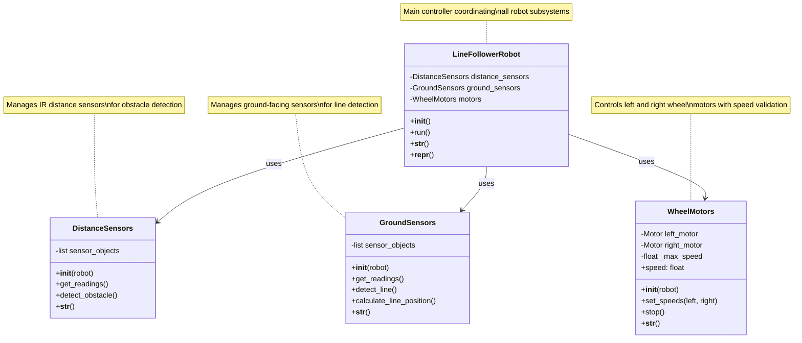

#### System Architecture UML Diagram




### Step 1: Ground Sensors Class Implementation

The ground sensors detect the line by measuring light reflection from the ground. Dark lines reflect less light than the surrounding surface.

```python
class GroundSensors:
    """Manages ground-facing sensors for line detection."""
    
    def __init__(self, robot):
        """
        Initialize ground sensors.
        
        Args:
            robot: Webots robot object
        """
        # Get ground sensor objects from Webots
        self.sensors = []
        sensor_names = ['gs0', 'gs1', 'gs2']  # Ground sensor names in Webots
        
        for name in sensor_names:
            sensor = robot.getDevice(name)
            sensor.enable(robot.timestep)
            self.sensors.append(sensor)
        
        self.num_sensors = len(self.sensors)
        print(f"Ground sensors initialized: {self.num_sensors} sensors")
    
    @property
    def readings(self):
        """
        Get current sensor readings.
        
        Returns:
            list: List of sensor values (higher = lighter surface)
        """
        return [sensor.getValue() for sensor in self.sensors]
    
    def detect_line(self, threshold=500):
        """
        Detect if any sensor sees the line.
        
        Args:
            threshold (float): Value below which we consider line detected
            
        Returns:
            bool: True if line is detected by any sensor
        """
        readings = self.readings
        return any(reading < threshold for reading in readings)
    
    def calculate_line_position(self, threshold=500):
        """
        Calculate line position relative to robot center.
        
        Args:
            threshold (float): Line detection threshold
            
        Returns:
            float: Position from -1.0 (far left) to 1.0 (far right), 0.0 = center
        """
        readings = self.readings
        
        # Convert readings to binary (0 = line, 1 = no line)
        binary_readings = [1 if reading < threshold else 0 for reading in readings]
        
        # Calculate weighted average position
        if sum(binary_readings) == 0:
            return 0.0  # No line detected, assume center
        
        total_weight = 0
        weighted_sum = 0
        
        for i, reading in enumerate(binary_readings):
            if reading == 1:  # Line detected
                position = (i - (self.num_sensors - 1) / 2) / ((self.num_sensors - 1) / 2)
                weighted_sum += position * reading
                total_weight += reading
        
        return weighted_sum / total_weight if total_weight > 0 else 0.0
    
    def __str__(self):
        """User-friendly sensor status."""
        readings = self.readings
        return f"Ground Sensors: {[f'{r:.0f}' for r in readings]} (line detected: {self.detect_line()})"
    
    def __repr__(self):
        """Developer representation."""
        return f"GroundSensors(num_sensors={self.num_sensors})"
```

### Step 2: Distance Sensors Class Implementation

The distance sensors detect obstacles in front of the robot.

```python
class DistanceSensors:
    """Manages IR distance sensors for obstacle detection."""
    
    def __init__(self, robot):
        """
        Initialize distance sensors.
        
        Args:
            robot: Webots robot object
        """
        # Get distance sensor objects from Webots  
        self.sensors = []
        sensor_names = ['ps0', 'ps1', 'ps2', 'ps5', 'ps6', 'ps7']  # Front-facing sensors
        
        for name in sensor_names:
            sensor = robot.getDevice(name)
            sensor.enable(robot.timestep)
            self.sensors.append(sensor)
        
        print(f"Distance sensors initialized: {len(self.sensors)} sensors")
    
    @property  
    def readings(self):
        """
        Get current sensor readings.
        
        Returns:
            list: List of sensor values (higher = closer object)
        """
        return [sensor.getValue() for sensor in self.sensors]
    
    def detect_obstacle(self, threshold=100):
        """
        Detect if obstacle is too close.
        
        Args:
            threshold (float): Distance threshold for obstacle detection
            
        Returns:
            bool: True if obstacle detected
        """
        front_sensors = self.readings[1:5]  # Use middle sensors
        return any(reading > threshold for reading in front_sensors)
    
    def __str__(self):
        """User-friendly sensor status."""
        readings = self.readings
        obstacle = "YES" if self.detect_obstacle() else "NO"
        return f"Distance Sensors: obstacle={obstacle}, readings={[f'{r:.0f}' for r in readings[:3]]}"
    
    def __repr__(self):
        """Developer representation."""
        return f"DistanceSensors(num_sensors={len(self.sensors)})"
```

### Step 3: Motor Controller Class Implementation

The motor controller manages wheel speeds and implements the control algorithm.

```python
class WheelMotors:
    """Controls robot wheel motors with validation."""
    
    def __init__(self, robot, max_speed=6.28):
        """
        Initialize wheel motors.
        
        Args:
            robot: Webots robot object
            max_speed (float): Maximum wheel speed in rad/s
        """
        # Get motor objects from Webots
        self.left_motor = robot.getDevice('left wheel motor')
        self.right_motor = robot.getDevice('right wheel motor')
        
        # Set motors to velocity control mode
        self.left_motor.setPosition(float('inf'))
        self.right_motor.setPosition(float('inf'))
        
        self._max_speed = max_speed
        self._current_left_speed = 0.0
        self._current_right_speed = 0.0
        
        print(f"Motors initialized with max speed: {max_speed} rad/s")
    
    @property
    def max_speed(self):
        """Get maximum motor speed."""
        return self._max_speed
    
    @property  
    def speeds(self):
        """Get current motor speeds as tuple (left, right)."""
        return (self._current_left_speed, self._current_right_speed)
    
    def set_speeds(self, left_speed, right_speed):
        """
        Set motor speeds with validation.
        
        Args:
            left_speed (float): Left wheel speed (-max_speed to +max_speed)
            right_speed (float): Right wheel speed (-max_speed to +max_speed)
        """
        # Validate and clamp speeds
        left_speed = max(-self._max_speed, min(self._max_speed, left_speed))
        right_speed = max(-self._max_speed, min(self._max_speed, right_speed))
        
        # Apply speeds to motors
        self.left_motor.setVelocity(left_speed)
        self.right_motor.setVelocity(right_speed)
        
        # Store current speeds
        self._current_left_speed = left_speed
        self._current_right_speed = right_speed
    
    def stop(self):
        """Stop both motors."""
        self.set_speeds(0.0, 0.0)
        print("Motors stopped")
    
    def __str__(self):
        """User-friendly motor status."""
        left, right = self.speeds
        return f"Motors: L={left:.2f}, R={right:.2f} (max: {self._max_speed:.2f} rad/s)"
    
    def __repr__(self):
        """Developer representation."""
        return f"WheelMotors(max_speed={self._max_speed})"
```

### Step 4: Main Line Follower Robot Class

Now we'll create the main robot class that coordinates all subsystems.

```python
from controller import Robot

class LineFollowerRobot:
    """Main line-following robot controller."""
    
    def __init__(self):
        """Initialize the line follower robot."""
        # Initialize Webots robot
        self.robot = Robot()
        self.timestep = int(self.robot.getBasicTimeStep())
        
        # Initialize subsystems  
        self.ground_sensors = GroundSensors(self.robot)
        self.distance_sensors = DistanceSensors(self.robot)
        self.motors = WheelMotors(self.robot)
        
        # Control parameters
        self.base_speed = 3.0      # Base forward speed
        self.turn_speed = 2.0      # Speed adjustment for turning
        
        print("Line follower robot initialized successfully!")
    
    def calculate_motor_speeds(self, line_position):
        """
        Calculate motor speeds based on line position.
        
        Args:
            line_position (float): Line position from -1.0 to 1.0
            
        Returns:
            tuple: (left_speed, right_speed)
        """
        # PID-like control: stronger turning for larger errors
        error = line_position
        turn_adjustment = error * self.turn_speed
        
        # Calculate individual wheel speeds
        left_speed = self.base_speed - turn_adjustment
        right_speed = self.base_speed + turn_adjustment
        
        return (left_speed, right_speed)
    
    def run(self):
        """Main control loop."""
        print("Starting line following behavior...")
        print("Use Ctrl+C to stop the robot")
        
        try:
            while self.robot.step(self.timestep) != -1:
                # Check for obstacles first
                if self.distance_sensors.detect_obstacle():
                    print("Obstacle detected! Stopping robot.")
                    self.motors.stop()
                    continue
                
                # Get line position
                line_position = self.ground_sensors.calculate_line_position()
                
                # Calculate and apply motor speeds
                left_speed, right_speed = self.calculate_motor_speeds(line_position)
                self.motors.set_speeds(left_speed, right_speed)
                
                # Debug output every 50 steps (reduce console spam)
                if self.robot.getTime() % 1.0 < self.timestep / 1000.0:  # Every ~1 second
                    print(f"Line pos: {line_position:+.2f}, Motors: L={left_speed:.2f} R={right_speed:.2f}")
                    print(f"  {self.ground_sensors}")
                    print(f"  {self.distance_sensors}")
                    print()
                    
        except KeyboardInterrupt:
            print("\nRobot stopped by user")
            self.motors.stop()
    
    def __str__(self):
        """User-friendly robot status."""
        return f"LineFollowerRobot: base_speed={self.base_speed}, turn_speed={self.turn_speed}"
    
    def __repr__(self):
        """Developer representation."""
        return "LineFollowerRobot()"

# Main execution
if __name__ == "__main__":
    # Create and run the robot
    robot = LineFollowerRobot()
    print(robot)
    print(repr(robot))
    robot.run()
```

### Step 5: Complete Implementation

Here's how to put it all together in a single file (`line_follower_robot.py`):

```python
"""
Line Following Robot Implementation
Uses object-oriented programming principles for modular robotics code.
"""

from controller import Robot

# [Include all the class implementations above in order:]
# 1. GroundSensors class
# 2. DistanceSensors class  
# 3. WheelMotors class
# 4. LineFollowerRobot class
# 5. Main execution code

# Run the robot
if __name__ == "__main__":
    robot = LineFollowerRobot()
    robot.run()
```