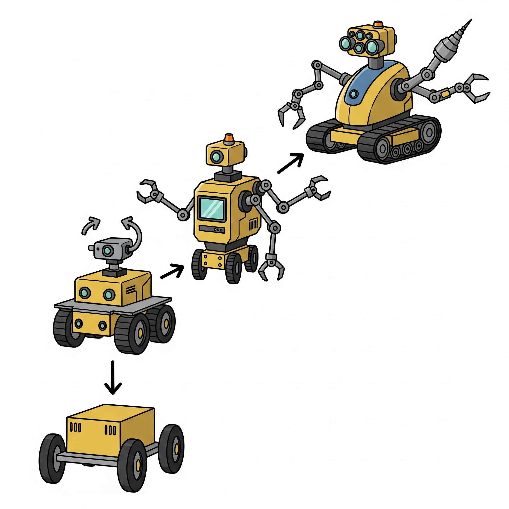
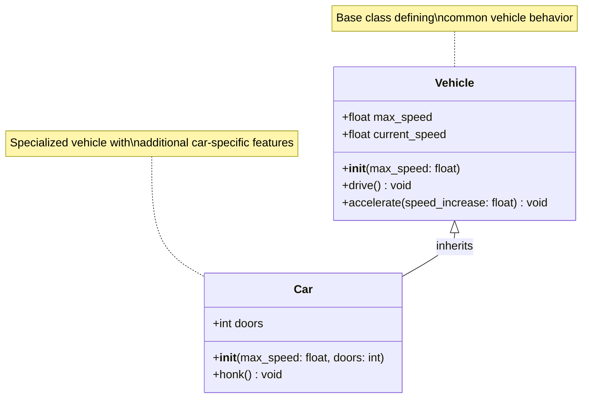
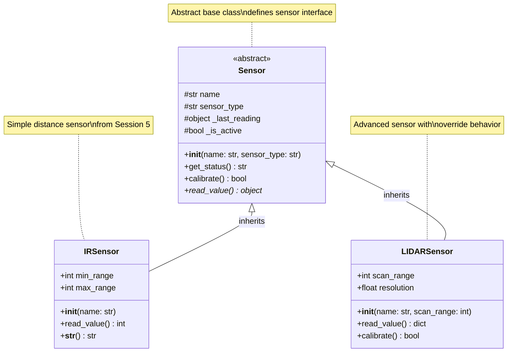
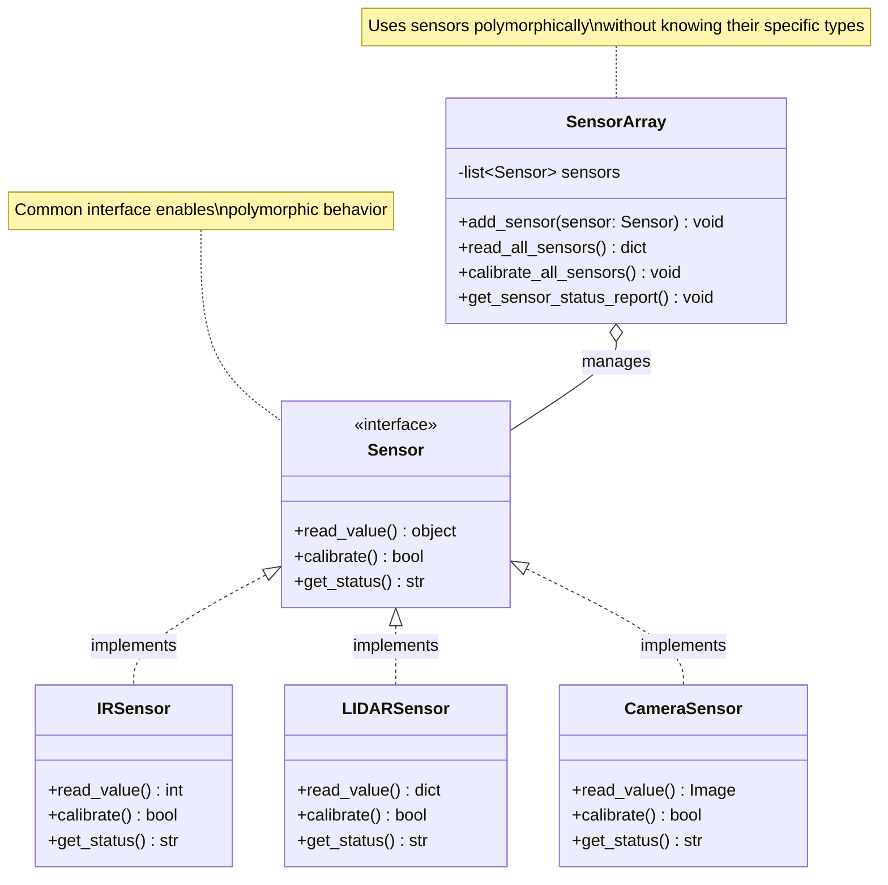
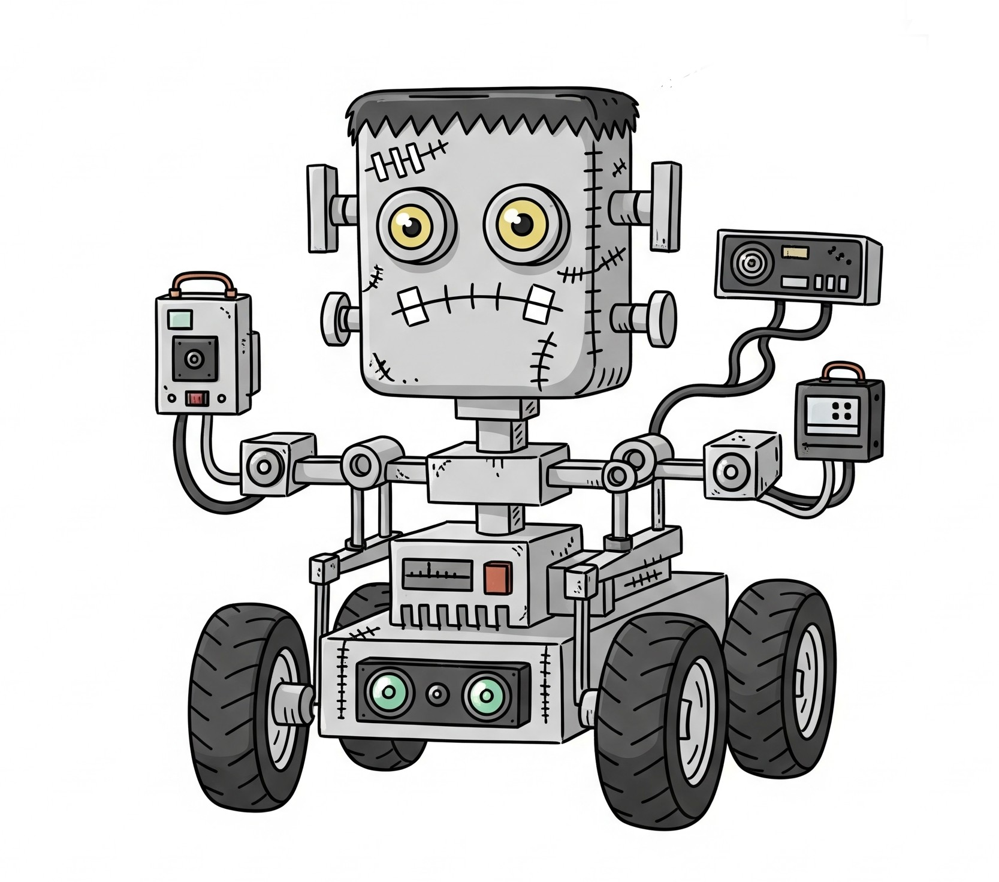
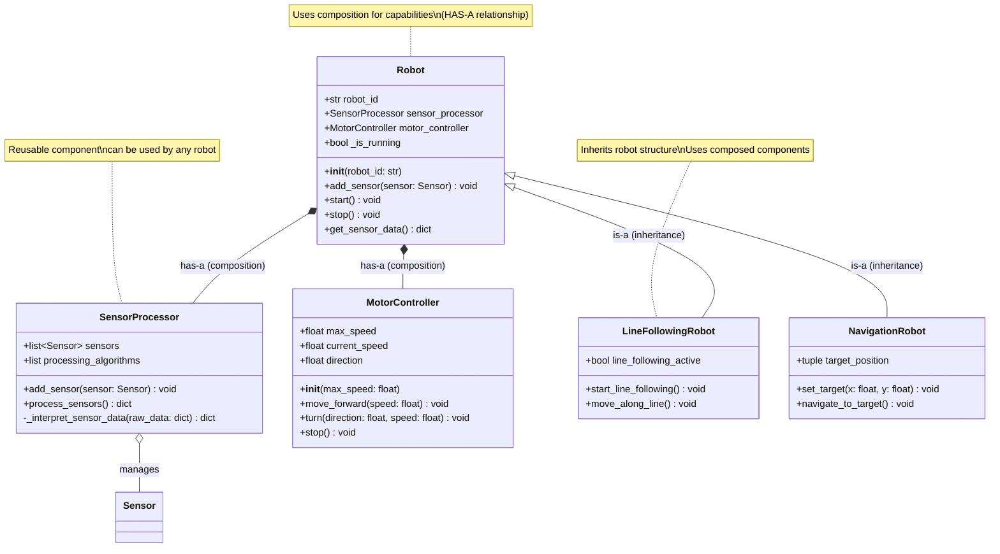
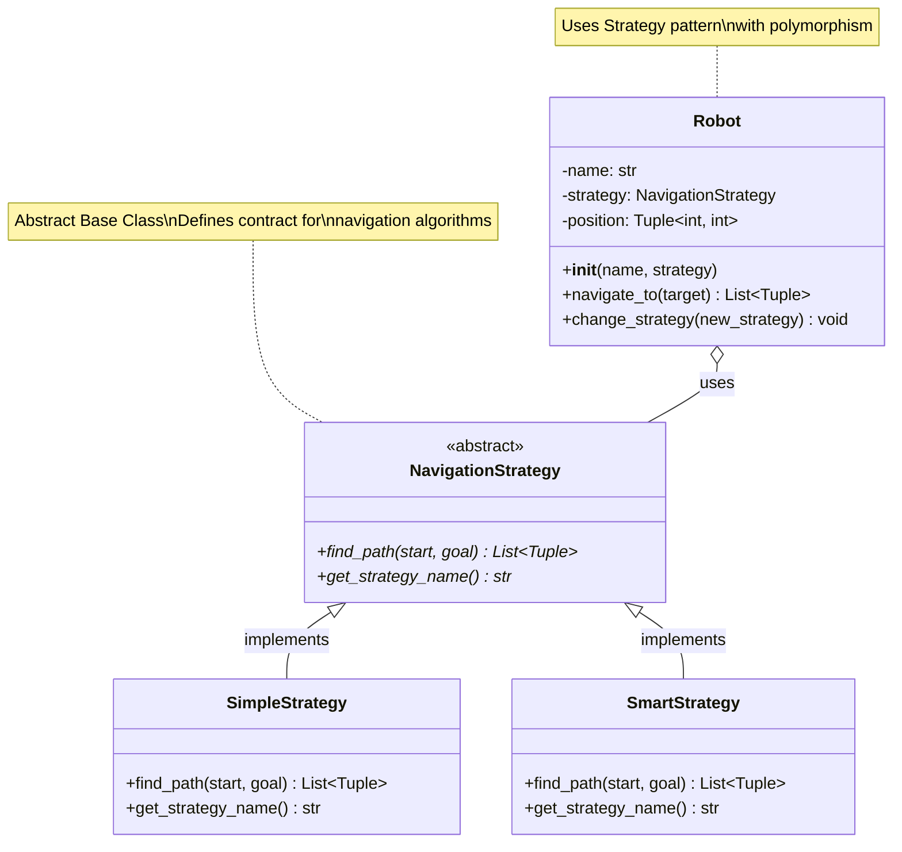

# Session 6: Inheritance & Polymorphism 

**Week:** 6  
**Element:** ICTPRG430 Element 2.1  
**Duration:** 4 hours  
**Phase:** Object-Oriented Programming Theory

---

## Session Introduction

In this session, you will deepen your understanding of Object-Oriented Programming (OOP) by exploring two fundamental tenets: **Inheritance and Polymorphism**. This builds on the foundational concepts from Session 4 and advanced class features from Session 5. You will learn how to structure your robot software to maximize code reuse through inheritance, applying the "is-a" relationship for specialized robot types, and how to define flexible interfaces using polymorphism.

Crucially, we will delve into the powerful design principle of favoring **composition over inheritance** (the "has-a" relationship) to create more robust and adaptable robotics systems. The session includes comprehensive theory, practical exercises to design robot hierarchies and polymorphic interfaces, and a live demonstration of advanced navigation algorithms using abstract base classes.

## Learning Objectives

By the end of this session, you will be able to:

- **Understand and implement class inheritance hierarchies for different robot types**
- **Apply method overriding and the `super()` function appropriately**
- **Implement polymorphic interfaces for code extensibility and flexible robot behaviors**
- **Analyze and apply the "is-a" vs. "has-a" relationships, favoring composition over inheritance in design**
- **Design and utilize abstract base classes to define clear contracts for robot components**

---

## Session Structure

1. **Theory Session** - Inheritance and Polymorphism Fundamentals
2. **Hands-on Exercise** - Designing Robot Hierarchies and Polymorphic Interfaces
3. **Data Encapsulation Deep-dive** - Refactoring for Composition
4. **Live Demonstration** - Polymorphic Navigation Strategies using ABCs
5. **Extension Activity** - Understanding Multiple Inheritance and MRO

---

## Session Overview

This session builds on the foundational OOP concepts from Session 4 and advanced class features introduced in Session 5, focusing on two core tenets of OOP: **Inheritance and Polymorphism**. You will learn how to structure your robot software for reusability and flexibility by applying "is-a" and "has-a" relationships, with a particular emphasis on composition as a design principle.

## Pre-Session Preparation

!!! info "Required Reading" 
    Review the following materials before class:

    ```
    - Review "Object Model & Class Fundamentals" (Session 4)
    - Review "Advanced Class Features & Magic Methods" (Session 5)
    
    ```

!!! tip "Setup Check"
    Ensure your Python development environment and Webots simulator are configured and working from **Session 4**.

---

## 1. Introduction to Inheritance: The "Is-A" Relationship

**Inheritance** is a fundamental principle of OOP that allows a class to acquire attributes (methods and instance variables) from another class. This creates a parent-child relationship between classes, or more formally, a superclass/subclass relationship.

{: style="display:block; margin-left:auto; margin-right:auto; width:500px;" }

The subclass **inherits** from the superclass, meaning it gains access to the superclass's methods and properties, promoting **code reuse** and reducing duplication. Inheritance models the "**is-a**" relationship. For example, a `LineFollowingRobot` **is a** type of `RobotController`.

### Basic Inheritance Syntax

**Python Syntax:** To create a child class, you put the name of the existing parent class in parentheses in the class statement.

```python
class Vehicle:
    def __init__(self, max_speed):
        self.max_speed = max_speed
        self.current_speed = 0.0
    
    def drive(self):
        print(f'I am driving at {self.current_speed} speed.')
    
    def accelerate(self, speed_increase):
        self.current_speed = min(self.current_speed + speed_increase, self.max_speed)
        print(f'Accelerating to {self.current_speed}')

class Car(Vehicle):  # Car inherits from Vehicle
    def __init__(self, max_speed, doors):
        super().__init__(max_speed)  # Call parent constructor
        self.doors = doors
    
    def honk(self):
        print('Beep beep!')

# Usage
car = Car(120, 4)
car.drive()        # Inherited method: I am driving at 0.0 speed.
car.accelerate(50) # Inherited method: Accelerating to 50
car.honk()         # Own method: Beep beep!
```

### Basic Inheritance UML Diagram



This diagram illustrates `Car` inheriting from `Vehicle`, representing an "is-a" relationship where Car **is a** specialized type of Vehicle.

---

## 2. Method Overriding and `super()`

Subclasses can **override** inherited methods to provide new or specialized implementations. Python checks the subclass first for a method; if found, it invokes that method instead of the superclass's version.

```python
class Motorcycle(Vehicle):
    def __init__(self, max_speed, engine_type):
        super().__init__(max_speed)
        self.engine_type = engine_type
    
    def drive(self):  # Overrides Vehicle's drive method
        print(f'I am riding my {self.engine_type} motorcycle at {self.current_speed} speed!')
    
    def wheelie(self):
        if self.current_speed > 20:
            print('Performing a wheelie! 🏍️')
        else:
            print('Need more speed for a wheelie')

# Usage
motorcycle = Motorcycle(180, "V-twin")
motorcycle.accelerate(30)
motorcycle.drive()    # Output: I am riding my V-twin motorcycle at 30 speed!
motorcycle.wheelie()  # Output: Performing a wheelie! 🏍️
```

### The `super()` Function

The `super()` function allows you to call methods from the parent (superclass) within the subclass. This is particularly useful in `__init__` methods to ensure the parent class is properly initialized.

```python
class ElectricCar(Car):
    def __init__(self, max_speed, doors, battery_capacity):
        super().__init__(max_speed, doors)  # Calls Car's __init__
        self.battery_capacity = battery_capacity
        self.charge_level = 100.0
    
    def drive(self):
        if self.charge_level > 0:
            super().drive()  # Call parent's drive method
            self.charge_level -= 1
            print(f'Battery level: {self.charge_level}%')
        else:
            print('Battery empty! Please recharge.')
    
    def charge(self):
        self.charge_level = 100.0
        print('Fully charged!')
```

### Robotics Example: Enhanced Sensor Hierarchy

Building on Session 5's `IRSensor`, let's create a sensor hierarchy:

```python
import random
from abc import ABC, abstractmethod

class Sensor(ABC):
    """Base sensor class with common functionality."""
    
    def __init__(self, name, sensor_type):
        self.name = name
        self.sensor_type = sensor_type
        self._last_reading = None
        self._is_active = True
    
    def get_status(self):
        """Get common sensor status information."""
        status = "ACTIVE" if self._is_active else "INACTIVE"
        reading = self._last_reading if self._last_reading is not None else "No data"
        return f"{self.sensor_type} '{self.name}': {status} (Last: {reading})"
    
    @abstractmethod
    def read_value(self):
        """Abstract method - must be implemented by subclasses."""
        pass
    
    def calibrate(self):
        """Default calibration routine."""
        print(f"Calibrating {self.sensor_type} sensor '{self.name}'...")
        return True

class IRSensor(Sensor):
    """Infrared distance sensor implementation."""
    
    def __init__(self, name):
        super().__init__(name, "IR Distance")  # Call parent constructor
        self.min_range = 1
        self.max_range = 100
    
    def read_value(self):
        """Read IR distance value."""
        if self._is_active:
            self._last_reading = random.randint(self.min_range, self.max_range)
            print(f"{self.name} sensor reading: {self._last_reading} cm")
            return self._last_reading
        return None
    
    def __str__(self):
        reading_str = f"{self._last_reading} cm" if self._last_reading else "No readings"
        return f"{self.name} IR Sensor: {reading_str}"

class LIDARSensor(Sensor):
    """LIDAR sensor implementation with enhanced capabilities."""
    
    def __init__(self, name, scan_range=360):
        super().__init__(name, "LIDAR")
        self.scan_range = scan_range
        self.resolution = 1.0  # degrees per measurement
    
    def read_value(self):
        """Read LIDAR scan data."""
        if self._is_active:
            # Simulate LIDAR returning multiple distance measurements
            num_points = int(self.scan_range / self.resolution)
            scan_data = [random.randint(10, 500) for _ in range(num_points)]
            self._last_reading = {
                'points': len(scan_data),
                'min_distance': min(scan_data),
                'max_distance': max(scan_data),
                'average_distance': sum(scan_data) / len(scan_data)
            }
            print(f"{self.name} LIDAR scan complete: {self._last_reading['points']} points")
            return self._last_reading
        return None
    
    def calibrate(self):
        """Override with LIDAR-specific calibration."""
        super().calibrate()  # Call parent calibration
        print(f"Performing LIDAR-specific calibration for {self.scan_range}° range")
        return True
```

### Sensor Hierarchy UML Diagram



---

## 3. Polymorphism: Responding to a Common Interface

**Polymorphism** (meaning "many forms") is the ability for different objects to respond to the same method call, each in their own way, without the calling code needing to know the specific type of the object.

In Python, polymorphism is often achieved through **duck typing**: "If it walks like a duck and quacks like a duck, it's a duck." This means that as long as objects provide the required methods (interface), they can be used interchangeably.

### Benefits in Robotics

This allows for flexible robot behaviors, where different sensor types (e.g., IR, LIDAR, Camera) can all implement a `read_value()` method, and a `RobotController` can simply call `sensor.read_value()` without knowing the sensor's exact type.

### Polymorphic Example: Sensor Array

```python
class SensorArray:
    """Manages multiple sensors polymorphically."""
    
    def __init__(self):
        self.sensors = []
    
    def add_sensor(self, sensor):
        """Add any type of sensor to the array."""
        if hasattr(sensor, 'read_value'):  # Duck typing check
            self.sensors.append(sensor)
            print(f"Added {sensor.sensor_type} sensor: {sensor.name}")
        else:
            raise ValueError("Object must have a read_value method")
    
    def read_all_sensors(self):
        """Read all sensors polymorphically."""
        readings = {}
        for sensor in self.sensors:
            # Polymorphism in action - same method call, different behavior
            readings[sensor.name] = sensor.read_value()
        return readings
    
    def calibrate_all_sensors(self):
        """Calibrate all sensors."""
        for sensor in self.sensors:
            sensor.calibrate()  # Each sensor may calibrate differently
    
    def get_sensor_status_report(self):
        """Generate comprehensive status report."""
        print("=== SENSOR ARRAY STATUS ===")
        for sensor in self.sensors:
            print(sensor.get_status())

# Usage example demonstrating polymorphism
if __name__ == "__main__":
    # Create sensor array
    robot_sensors = SensorArray()
    
    # Add different types of sensors
    robot_sensors.add_sensor(IRSensor("Front Left"))
    robot_sensors.add_sensor(IRSensor("Front Right"))
    robot_sensors.add_sensor(LIDARSensor("Main LIDAR", 270))
    
    print("\n" + "="*40)
    print("DEMONSTRATING POLYMORPHISM")
    print("="*40)
    
    # Polymorphic behavior - same method call, different implementations
    all_readings = robot_sensors.read_all_sensors()
    print(f"\nCollected readings from {len(all_readings)} sensors")
    
    # Status report
    print()
    robot_sensors.get_sensor_status_report()
    
    print("\n" + "="*40)
    print("CALIBRATION (Polymorphic)")
    print("="*40)
    robot_sensors.calibrate_all_sensors()
```

### Polymorphism UML Diagram



---

## 4. Composition Over Inheritance: The "Has-A" Relationship

While inheritance (the "is-a" relationship) is powerful, it can lead to rigid designs if overused. The principle of **favoring composition over inheritance (COI)** suggests that using a "has-a" relationship is often more flexible and safer.

{: style="display:block; margin-left:auto; margin-right:auto; width:500px;" }


**Composition** means that a class includes one or more objects of other classes as attributes, delegating responsibilities to these "component" objects. For example, a `Robot` **has a** `Motor`, **has a** `Sensor`, or **has a** `NavigationSystem`.

### Benefits of Composition

- **Modularity**: Components can be developed and tested independently
- **Flexibility**: Easy to swap components without changing the main class
- **Loose Coupling**: Changes to components don't break the main system
- **Reusability**: Components can be reused in different contexts

### Refactoring Example: Robot Architecture

Let's refactor a robotics system to use composition effectively:

#### Initial Design (Inheritance-Heavy - Less Flexible)

```python
# PROBLEMATIC APPROACH - Too much inheritance
class SensorProcessor:
    def process_sensors(self):
        pass

class LineFollowingRobot(SensorProcessor):  # Robot "is-a" sensor processor?
    def move_along_line(self):
        self.process_sensors()  # Tight coupling

class NavigationRobot(SensorProcessor):  # Robot "is-a" sensor processor?
    def navigate_to_target(self):
        self.process_sensors()  # Duplicated pattern
```

#### Improved Design (Composition - More Flexible)

```python
class SensorProcessor:
    """Handles sensor data processing and interpretation."""
    
    def __init__(self):
        self.sensors = []
        self.processing_algorithms = []
    
    def add_sensor(self, sensor):
        self.sensors.append(sensor)
    
    def process_sensors(self):
        """Process all sensors and return interpreted data."""
        raw_data = {}
        for sensor in self.sensors:
            raw_data[sensor.name] = sensor.read_value()
        
        # Process raw data into useful information
        processed_data = self._interpret_sensor_data(raw_data)
        return processed_data
    
    def _interpret_sensor_data(self, raw_data):
        """Convert raw sensor data into actionable information."""
        # Placeholder for complex processing algorithms
        return {
            'obstacles_detected': any(reading < 20 for reading in raw_data.values() if isinstance(reading, int)),
            'clear_path_ahead': True,  # Simplified logic
            'sensor_count': len(raw_data)
        }

class MotorController:
    """Controls robot movement."""
    
    def __init__(self, max_speed=1.0):
        self.max_speed = max_speed
        self.current_speed = 0.0
        self.direction = 0.0  # 0 = straight, -1 = left, 1 = right
    
    def move_forward(self, speed=0.5):
        self.current_speed = min(speed, self.max_speed)
        self.direction = 0.0
        print(f"Moving forward at speed {self.current_speed}")
    
    def turn(self, direction, speed=0.3):
        self.current_speed = min(speed, self.max_speed)
        self.direction = direction
        action = "left" if direction < 0 else "right"
        print(f"Turning {action} at speed {self.current_speed}")
    
    def stop(self):
        self.current_speed = 0.0
        self.direction = 0.0
        print("Motors stopped")

class Robot:
    """Base robot using composition - Robot HAS-A sensor processor and motor controller."""
    
    def __init__(self, robot_id):
        self.robot_id = robot_id
        # Composition: Robot HAS-A sensor processor
        self.sensor_processor = SensorProcessor()
        # Composition: Robot HAS-A motor controller
        self.motor_controller = MotorController()
        self._is_running = False
    
    def add_sensor(self, sensor):
        """Add a sensor to the robot's sensor processor."""
        self.sensor_processor.add_sensor(sensor)
    
    def start(self):
        self._is_running = True
        print(f"Robot {self.robot_id} started")
    
    def stop(self):
        self._is_running = False
        self.motor_controller.stop()
        print(f"Robot {self.robot_id} stopped")
    
    def get_sensor_data(self):
        """Delegate sensor processing to the sensor processor component."""
        return self.sensor_processor.process_sensors()

class LineFollowingRobot(Robot):
    """Specialized robot for line following - inherits from Robot, uses composition for capabilities."""
    
    def __init__(self, robot_id):
        super().__init__(robot_id)
        self.line_following_active = False
        # Add appropriate sensors for line following
        self.add_sensor(IRSensor("Left Line Sensor"))
        self.add_sensor(IRSensor("Center Line Sensor"))
        self.add_sensor(IRSensor("Right Line Sensor"))
    
    def start_line_following(self):
        """Start line following behavior."""
        self.line_following_active = True
        self.start()
        print(f"Line following activated for {self.robot_id}")
    
    def move_along_line(self):
        """Use composition to coordinate line following."""
        if not self.line_following_active:
            return
        
        # Get processed sensor data from the sensor processor component
        sensor_data = self.get_sensor_data()
        
        # Make movement decisions based on processed data
        if sensor_data['obstacles_detected']:
            self.motor_controller.stop()
            print("Line following paused - obstacle detected")
        else:
            # Simplified line following logic
            self.motor_controller.move_forward(0.4)
            print("Following line...")

class NavigationRobot(Robot):
    """Specialized robot for navigation - different specialization, same composition benefits."""
    
    def __init__(self, robot_id):
        super().__init__(robot_id)
        self.target_position = None
        # Add appropriate sensors for navigation
        self.add_sensor(LIDARSensor("Navigation LIDAR"))
        self.add_sensor(IRSensor("Front Obstacle Detector"))
    
    def set_target(self, x, y):
        self.target_position = (x, y)
        print(f"Target set to ({x}, {y})")
    
    def navigate_to_target(self):
        """Navigate to target using sensor processor and motor controller components."""
        if not self.target_position:
            print("No target set!")
            return
        
        # Use the same sensor processor component, but for navigation
        sensor_data = self.get_sensor_data()
        
        if sensor_data['clear_path_ahead']:
            self.motor_controller.move_forward(0.6)
            print(f"Navigating to {self.target_position}...")
        else:
            self.motor_controller.turn(-0.5)  # Turn left to avoid obstacle
            print("Avoiding obstacle during navigation")
```

### Composition vs Inheritance UML Diagram



### Composition Benefits Demonstration

```python
# Usage example demonstrating flexibility of composition
if __name__ == "__main__":
    # Create different types of robots
    line_robot = LineFollowingRobot("LineBot-01")
    nav_robot = NavigationRobot("NavBot-02")
    
    print("=== LINE FOLLOWING ROBOT ===")
    line_robot.start_line_following()
    line_robot.move_along_line()
    
    print("\n=== NAVIGATION ROBOT ===")
    nav_robot.set_target(10.5, 7.2)
    nav_robot.start()
    nav_robot.navigate_to_target()
    
    print("\n=== COMPOSITION FLEXIBILITY ===")
    # Easy to add new sensors to existing robots
    line_robot.add_sensor(LIDARSensor("Safety LIDAR"))
    nav_robot.add_sensor(IRSensor("Backup Sensor"))
    
    # Components can be replaced or modified independently
    # For example, upgrading the motor controller:
    print("Upgrading navigation robot motor controller...")
    nav_robot.motor_controller = MotorController(max_speed=1.5)  # Faster motors
    
    print("Both robots benefit from the same sensor processing logic!")
```

!!! success "Key Insight" 
    Notice how both `LineFollowingRobot` and `NavigationRobot` can reuse the same `SensorProcessor` and `MotorController` components, but for different purposes. This is the power of composition - the components are decoupled and reusable!

---

## 5. Abstract Base Classes (ABCs): Defining Contracts

**Abstract classes** are blueprints that cannot be instantiated directly but serve as templates for other classes. They are used to define a common interface (a set of methods that subclasses _must_ implement) without providing a full implementation.

In Python, **Abstract Base Classes (ABCs)** are created using the `abc` module and the `@abc.abstractmethod` decorator for abstract methods.

### Benefits of ABCs

- **Enforce contracts**: Guarantee that subclasses implement required methods
- **Support polymorphism**: Enable different objects to share a common interface
- **Documentation**: Clearly define what methods a class family should provide
- **Early error detection**: Fail fast if required methods are not implemented

### Navigation Strategy Example

A robot navigation system might need different pathfinding algorithms (`DFS`, `BFS`, `A*`). An ABC can define the common interface for these strategies:

```python
from abc import ABC, abstractmethod
from typing import Tuple, List

class NavigationStrategy(ABC):
    """Abstract base class for robot navigation algorithms."""
    
    @abstractmethod
    def find_path(self, start: Tuple[int, int], goal: Tuple[int, int]) -> List[Tuple[int, int]]:
        """Find path from start to goal. Must be implemented by subclasses."""
        pass
    
    @abstractmethod
    def get_strategy_name(self) -> str:
        """Return the name of this navigation strategy."""
        pass

class SimpleStrategy(NavigationStrategy):
    """Direct line navigation - ignores obstacles."""
    
    def find_path(self, start: Tuple[int, int], goal: Tuple[int, int]) -> List[Tuple[int, int]]:
        print(f"Simple: Moving directly from {start} to {goal}")
        return [start, goal]
    
    def get_strategy_name(self) -> str:
        return "Direct Line"

class SmartStrategy(NavigationStrategy):
    """Advanced pathfinding with obstacle avoidance."""
    
    def find_path(self, start: Tuple[int, int], goal: Tuple[int, int]) -> List[Tuple[int, int]]:
        print(f"Smart: Planning optimal route from {start} to {goal}")
        # Simulate pathfinding algorithm
        waypoint = ((start[0] + goal[0]) // 2, (start[1] + goal[1]) // 2)
        return [start, waypoint, goal]
    
    def get_strategy_name(self) -> str:
        return "A* Pathfinding"

class Robot:
    """Robot that uses different navigation strategies polymorphically."""
    
    def __init__(self, name: str, strategy: NavigationStrategy):
        self.name = name
        self.strategy = strategy
        self.position = (0, 0)
    
    def navigate_to(self, target: Tuple[int, int]):
        """Navigate using current strategy - polymorphic behavior."""
        print(f"\n{self.name} using {self.strategy.get_strategy_name()}")
        path = self.strategy.find_path(self.position, target)
        self.position = target
        print(f"Path: {' -> '.join(map(str, path))}")
        return path
    
    def change_strategy(self, new_strategy: NavigationStrategy):
        """Switch navigation algorithm at runtime."""
        self.strategy = new_strategy
        print(f"{self.name} switched to {self.strategy.get_strategy_name()}")

# Demo
if __name__ == "__main__":
    # Create robots with different strategies
    scout = Robot("Scout", SimpleStrategy())
    explorer = Robot("Explorer", SmartStrategy())
    
    # Same interface, different behaviors (polymorphism)
    target = (10, 15)
    scout.navigate_to(target)
    explorer.navigate_to(target)
    
    # Runtime strategy switching
    scout.change_strategy(SmartStrategy())
    scout.navigate_to((20, 25))
```

### Navigation Strategy ABC UML Diagram



!!! abstract "ABC Benefits in Action" 


---


## Uderstanding Multiple Inheritance and MRO

Python supports **multiple inheritance**, where a class can inherit from multiple parent classes. While powerful, this can create complexity, particularly the "diamond problem."

### Multiple Inheritance Example

```python
class Pet:
    def __init__(self, name):
        self.name = name
        print(f"Pet.__init__: {name}")
    
    def play(self):
        print(f'{self.name} is playing as a pet')
    
    def show_affection(self):
        print(f'{self.name} shows affection')

class Predator:
    def __init__(self, hunting_skill):
        self.hunting_skill = hunting_skill
        print(f"Predator.__init__: skill level {hunting_skill}")
    
    def hunt(self):
        print(f'Hunting with skill level {self.hunting_skill}')
    
    def show_aggression(self):
        print('Showing predatory aggression')

class Cat(Pet, Predator):  # Multiple inheritance
    def __init__(self, name, hunting_skill):
        # Need to carefully manage multiple parent constructors
        Pet.__init__(self, name)
        Predator.__init__(self, hunting_skill)
        print(f"Cat.__init__: {name} created")
    
    def purr(self):
        print(f'{self.name} is purring')
    
    def play(self):
        # Override Pet's play method
        super().play()  # Calls Pet.play() due to MRO
        print(f'{self.name} also stalks and pounces')

# Usage
cat = Cat("Whiskers", 8)
print(f"\nMRO: {Cat.__mro__}")
cat.play()
cat.hunt()
cat.purr()
```

### Method Resolution Order (MRO)

Python uses the **C3 linearization algorithm** to determine the order in which methods are searched:

```python
# Check the MRO
print("Cat MRO:", [cls.__name__ for cls in Cat.__mro__])
# Output: Cat MRO: ['Cat', 'Pet', 'Predator', 'object']

# You can also use:
help(Cat)  # Shows detailed MRO information
```

### The Diamond Problem


```python
class Animal:
    def __init__(self, species):
        self.species = species
        print(f"Animal.__init__: {species}")
    
    def move(self):
        print("Animal moves")

class Mammal(Animal):
    def __init__(self, species, fur_color):
        super().__init__(species)
        self.fur_color = fur_color
        print(f"Mammal.__init__: {fur_color} fur")
    
    def move(self):
        print("Mammal walks on land")

class Aquatic(Animal):
    def __init__(self, species, water_type):
        super().__init__(species)
        self.water_type = water_type
        print(f"Aquatic.__init__: lives in {water_type}")
    
    def move(self):
        print("Aquatic swims in water")

class Whale(Mammal, Aquatic):  # Diamond inheritance
    def __init__(self, species, fur_color, water_type, size):
        # This is tricky! Need to handle diamond problem
        Mammal.__init__(self, species, fur_color)
        # Aquatic.__init__ would call Animal.__init__ again!
        # Better approach using super():
        self.water_type = water_type
        self.size = size
        print(f"Whale.__init__: {size} whale created")

# Check MRO to understand method resolution
print("Whale MRO:", [cls.__name__ for cls in Whale.__mro__])
# Output: ['Whale', 'Mammal', 'Aquatic', 'Animal', 'object']

whale = Whale("Orca", "black", "ocean", "large")
whale.move()  # Which move() method gets called?
```

### Better Multiple Inheritance with `super()`

```python
class Animal:
    def __init__(self, species, **kwargs):
        self.species = species
        print(f"Animal.__init__: {species}")
        super().__init__(**kwargs)  # Cooperative inheritance

class Mammal(Animal):
    def __init__(self, fur_color, **kwargs):
        self.fur_color = fur_color
        print(f"Mammal.__init__: {fur_color} fur")
        super().__init__(**kwargs)

class Aquatic(Animal):
    def __init__(self, water_type, **kwargs):
        self.water_type = water_type
        print(f"Aquatic.__init__: lives in {water_type}")
        super().__init__(**kwargs)

class Whale(Mammal, Aquatic):
    def __init__(self, species, fur_color, water_type, size):
        self.size = size
        print(f"Whale.__init__: {size} whale")
        # Using cooperative inheritance
        super().__init__(
            species=species,
            fur_color=fur_color,
            water_type=water_type
        )

# This approach avoids calling Animal.__init__ multiple times
whale = Whale("Blue Whale", "none", "ocean", "massive")
```


## Student Task: Simple Robot Factory System

Create a simple robot factory system that demonstrates fundamental object-oriented programming concepts: inheritance, polymorphism, and basic composition.

### Task Requirements

!!! assignment "Your Challenge" Build a **Robot Factory System** that can create different types of robots and manage their basic operations.

#### What You Need to Create

**Part 1: Basic Robot Classes (Inheritance)**

Create these classes with the exact names and methods shown:

```python
# Base class - you need to implement all methods
class Robot:
    def __init__(self, robot_id, robot_type):
        # Store robot_id and robot_type
        # Set initial position to (0, 0)
        # Set battery_level to 100
        pass
    
    def move(self, distance):
        # Print movement message
        # Reduce battery by distance amount
        pass
    
    def get_info(self):
        # Return string with robot info
        pass
    
    def recharge(self):
        # Set battery back to 100
        pass

# Specialized robot types - inherit from Robot
class CleaningRobot(Robot):
    def __init__(self, robot_id):
        # Call parent constructor with "Cleaning" as robot_type
        # Add cleaning_mode attribute (start with "sweep")
        pass
    
    def move(self, distance):
        # Call parent move method
        # Print additional cleaning message
        pass
    
    def clean(self, area):
        # Print cleaning message for the area
        # Reduce battery by 10
        pass

class DeliveryRobot(Robot):
    def __init__(self, robot_id):
        # Call parent constructor with "Delivery" as robot_type  
        # Add cargo attribute (start empty as None)
        pass
    
    def move(self, distance):
        # Call parent move method
        # If carrying cargo, print cargo transport message
        pass
    
    def load_cargo(self, item):
        # Store item in cargo attribute
        # Print loading message
        pass
    
    def deliver_cargo(self):
        # If cargo exists, print delivery message and clear cargo
        # If no cargo, print "no cargo to deliver"
        pass
```

**Part 2: Robot Factory (Composition & Polymorphism)**

```python
class RobotFactory:
    def __init__(self):
        # Create empty list to store robots
        pass
    
    def create_robot(self, robot_type, robot_id):
        # Create appropriate robot type based on robot_type parameter
        # Add to robots list
        # Return the created robot
        pass
    
    def get_all_robots(self):
        # Return list of all robots
        pass
    
    def move_all_robots(self, distance):
        # Make all robots move the same distance
        # This demonstrates polymorphism - same method, different behavior
        pass
    
    def get_factory_report(self):
        # Return string showing count of each robot type
        pass
```

#### Step-by-Step Instructions

!!! info "Implementation Steps" 1. **Start with the Robot base class** - implement `__init__`, `move`, `get_info`, and `recharge` 2. **Create CleaningRobot class** - inherit from Robot and add cleaning functionality 3. **Create DeliveryRobot class** - inherit from Robot and add delivery functionality  
4. **Build RobotFactory class** - use composition to manage multiple robots 5. **Test your implementation** using the test code provided below

#### Testing Your Code

Use this code to test your implementation:

```python
# Test your classes with this code
def test_robot_system():
    # Create factory
    factory = RobotFactory()
    
    # Create different robots
    cleaner1 = factory.create_robot("cleaning", "Clean-01")
    cleaner2 = factory.create_robot("cleaning", "Clean-02") 
    delivery1 = factory.create_robot("delivery", "Deliver-01")
    
    print("=== INITIAL STATUS ===")
    for robot in factory.get_all_robots():
        print(robot.get_info())
    
    print("\n=== TESTING MOVEMENT (Polymorphism) ===")
    factory.move_all_robots(5)  # All robots move, but differently
    
    print("\n=== TESTING SPECIALIZED METHODS ===")
    cleaner1.clean("Kitchen")
    delivery1.load_cargo("Package A")
    delivery1.move(3)
    delivery1.deliver_cargo()
    
    print("\n=== FINAL STATUS ===")
    for robot in factory.get_all_robots():
        print(robot.get_info())
    
    print(f"\n=== FACTORY REPORT ===")
    print(factory.get_factory_report())

# Run the test
test_robot_system()
```

#### Expected Output

Your program should produce output similar to:

```
=== INITIAL STATUS ===
Robot Clean-01 (Cleaning) at (0, 0), Battery: 100%
Robot Clean-02 (Cleaning) at (0, 0), Battery: 100%
Robot Deliver-01 (Delivery) at (0, 0), Battery: 100%

=== TESTING MOVEMENT (Polymorphism) ===
Robot Clean-01 moved 5 units
Cleaning path as I move
Robot Clean-02 moved 5 units  
Cleaning path as I move
Robot Deliver-01 moved 5 units

=== TESTING SPECIALIZED METHODS ===
Clean-01 cleaning Kitchen area
Deliver-01 loaded: Package A
Robot Deliver-01 moved 3 units
Transporting Package A
Deliver-01 delivered: Package A

=== FINAL STATUS ===
Robot Clean-01 (Cleaning) at (0, 0), Battery: 85%
Robot Clean-02 (Cleaning) at (0, 0), Battery: 95%
Robot Deliver-01 (Delivery) at (0, 0), Battery: 92%

=== FACTORY REPORT ===
Factory contains: 2 Cleaning robots, 1 Delivery robot
```

#### What This Task Demonstrates

- **Inheritance**: `CleaningRobot` and `DeliveryRobot` inherit from `Robot`
- **Polymorphism**: Same `move()` method works differently for each robot type
- **Composition**: `RobotFactory` contains multiple robot objects
- **Method Overriding**: Specialized robots override the base `move()` method

#### Submission Requirements

1. **Python file** with all classes implemented correctly
2. **Test results** showing your code produces the expected output
3. **Brief explanation** (3-4 sentences) of how your code demonstrates inheritance and polymorphism

!!! warning "Important Notes" - Use the **exact class and method names** shown above - Your code will be tested with automated unit tests - Focus on making the basic functionality work correctly - Don't add extra complexity - keep it simple and working

---

## Session Summary

In this comprehensive session, you explored the advanced Object-Oriented Programming concepts that form the backbone of sophisticated robotics software systems.

### Key Concepts Mastered

**Inheritance:**

- Class hierarchies and the "is-a" relationship
- Method overriding and the `super()` function
- Building specialized robot types from base classes

**Polymorphism:**

- Duck typing and common interfaces
- Polymorphic method calls and behavior
- Strategy pattern for flexible algorithms

**Composition over Inheritance:**

- "Has-a" relationships for system modularity
- Component-based architecture design
- Loose coupling and high cohesion

**Abstract Base Classes:**

- Interface definition and enforcement
- Contract specification for subclasses
- Supporting polymorphic behavior

**Multiple Inheritance:**

- Method Resolution Order (MRO)
- The diamond problem and solutions
- Cooperative inheritance with `super()`

### Real-World Applications

These concepts are fundamental to:

- **Robot Operating System (ROS)** architecture
- **Modular robotics platforms** like Boston Dynamics' robots
- **Industrial automation systems** with multiple robot types
- **Autonomous vehicle software** with sensor fusion
- **Swarm robotics** coordination systems

### Next Steps

Building on this session's concepts:

- **Session 7** will explore error handling and debugging strategies
- **Session 8** will cover file I/O and data persistence
- **Session 9** will introduce networking and communication protocols
- **Session 10** will integrate everything into a capstone robotics project

### Additional Resources

!!! resources "Further Learning" - **Python's `abc` module documentation** for advanced ABC usage - **Design Patterns in Python** by Gamma et al. (Gang of Four patterns) - **Effective Python** by Brett Slatkin for advanced Python OOP techniques - **ROS2 architectural patterns** for real-world robotics applications - **UML modeling tools** like PlantUML or Lucidchart for design visualization

!!! success "Session Complete!" You've now mastered the advanced OOP concepts essential for building scalable, maintainable robotics software. The combination of inheritance, polymorphism, and composition provides the foundation for creating sophisticated robot control systems that can adapt and evolve with changing requirements.

---

**Preparation for Next Session:** Review error handling concepts and debugging strategies. Consider how robust error handling would improve the robot systems you've designed in this session.