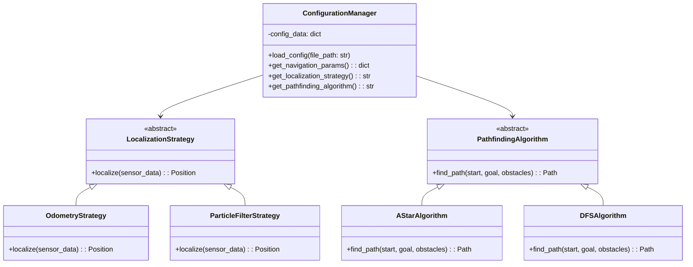

### Session 7: File I/O, Configuration & ROS2 Launch Files

**Week:** 7 **Element:** ICTPRG430 Element 2.2 **Duration:** 4 hours **Phase:** Object-Oriented Programming Theory

---

#### Session Introduction

In this session you will **explore fundamental Python file handling, structured data serialization, and ROS2 launch files** crucial for robust robotics applications. Building on your mastery of inheritance, polymorphism, and composition, you'll learn how configuration files enable dynamic robot behavior changes. The session includes a **lightweight introduction to ROS2 concepts**, followed by **hands-on exercises implementing configuration systems**, and preparation for **refactoring Labs 3-4 with launch file integration**.

#### Learning Objectives

By the end of this session, you will be able to:

- **Understand and implement file handling operations** for robot configuration management.
- **Utilize JSON and XML formats** for structured robot parameter storage.
- **Apply basic ROS2 concepts** including nodes and launch files for robot system configuration.
- **Design configuration systems** that leverage polymorphic interfaces from previous sessions.
- **Prepare launch file configurations** for Labs 3-4 refactoring activities.

---

#### Session Structure

1. **Theory Session** - File I/O Fundamentals & ROS2 Introduction.
2. **Hands-on Exercise** - Building Configuration Systems.
3. **Live Demonstration** - ROS2 Launch Files for Robot Configuration.
4. **Extension Activity** - Advanced Configuration Validation.
5. **Lab Preparation** - Launch File Setup for Labs 3-4 Refactoring.

---

#### Session Overview

This session bridges the gap between **object-oriented programming theory and real-world robotics practice**. You'll learn how robots store and retrieve configuration data, and how industry-standard tools like ROS2 manage complex robotic systems. The focus is on **practical application of your OOP knowledge** to create flexible, configurable robot systems that can adapt behaviour through external configuration files.


!!! tip "**Pre-Session Preparation**"
	Ensure your development environment is ready: * **Python 3.9+** installed and configured. * **Review your Labs 3-4 implementations** - particularly the classes and interfaces you created.

---

#### 1. File I/O Fundamentals for Robotics

Understanding file operations is essential for robotics, as robots must **load configurations, save sensor data, and manage mission parameters**.

##### Basic File Operations

```python
# Reading configuration files
with open('robot_config.json', 'r') as file:
    config_data = json.load(file)

# Writing robot logs
with open('sensor_log.txt', 'a') as file:
    file.write(f"{timestamp}: {sensor_reading}\n")
```

!!! abstract  "Key Concepts"
	- **File Modes**: `'r'` (read), `'w'` (write), `'a'` (append)
	- **Context Managers**: Using `with` statements for automatic resource cleanup
	- **Error Handling**: Managing `FileNotFoundError` and parsing errors

---

#### 2. Structured Data with JSON and XML

For complex robot configurations, structured data formats provide **standardized ways to store hierarchical parameters**.

##### JSON for Robot Configuration

```python
# Example robot configuration structure
{
    "robot_id": "explorer_001",
    "navigation": {
        "max_speed": 2.0,
        "localization_strategy": "odometry",
        "pathfinding_algorithm": "a_star"
    },
    "sensors": {
        "lidar_enabled": true,
        "camera_resolution": [640, 480]
    }
}
```

##### XML for ROS2 Launch Files

```xml
<!-- Basic launch file structure -->
<launch>
    <node pkg="robot_navigation" exec="localization_node" name="localization">
        <param name="strategy" value="odometry"/>
        <param name="max_speed" value="2.0"/>
    </node>
</launch>
```

---

#### 3. Introduction to ROS2 Concepts

**ROS2 (Robot Operating System 2)** is the industry standard for building modular, distributed robotic systems. We'll focus on the basics relevant to configuration management.

##### Core ROS2 Concepts

- **Nodes**: Independent processes that perform specific robot functions
- **Parameters**: Configuration values that nodes use to modify behavior
- **Launch Files**: XML files that start multiple nodes with specific configurations

##### Why ROS2 Matters for Your Projects

 

- **Modularity**: Separate localization, navigation, and control into different nodes
- **Configurability**: Change robot behavior without recompiling code
- **Industry Standard**: Used in commercial robots worldwide

```python
# Pseudocode: ROS2 node structure
class LocalizationNode:
    def __init__(self):
        # Get parameters from launch file
        self.strategy = self.get_parameter('localization_strategy')
        self.max_speed = self.get_parameter('max_speed')
        
        # Create strategy using polymorphism
        self.localization = LocalizationFactory.create(self.strategy)
```

---

#### Hands-on Exercise: Configuration Manager for Labs 3-4

You'll create a configuration system that prepares for your Labs 3-4 refactoring, leveraging the polymorphic interfaces you've already mastered.
See: [Lab 3 →](../../Robotics-Simulation-Labs-main/Lab3/ReadMe/) and [Lab 4 →](../../Robotics-Simulation-Labs-main/Lab4/ReadMe/)

##### System Architecture



##### Task: Create a Configuration System

**Step 1: Configuration Manager Class**

```python
class ConfigurationManager:
    def __init__(self, config_path: str):
        # TODO: Initialize with config file path
        # TODO: Create empty config_data dictionary
        pass
    
    def load_config(self) -> None:
        """Load configuration from JSON file."""
        # TODO: Open and parse JSON file
        # TODO: Handle FileNotFoundError
        # TODO: Validate required configuration keys
        pass
    
    def get_localization_strategy(self) -> str:
        """Return the configured localization strategy name."""
        # TODO: Extract from config_data["navigation"]["localization_strategy"]
        pass
    
    def get_pathfinding_algorithm(self) -> str:
        """Return the configured pathfinding algorithm name."""
        # TODO: Extract from config_data["navigation"]["pathfinding_algorithm"]
        pass
    
    def get_pid_parameters(self) -> dict:
        """Return PID controller parameters."""
        # TODO: Extract PID gains (kp, ki, kd) from configuration
        pass
```

**Step 2: Factory Classes**

```python
class LocalizationFactory:
    @staticmethod
    def create(strategy_name: str) -> LocalizationStrategy:
        """Create localization strategy based on configuration."""
        # TODO: Use strategy_name to return appropriate strategy instance
        # TODO: Support "odometry", "particle_filter", etc.
        pass

class PathfindingFactory:
    @staticmethod
    def create(algorithm_name: str) -> PathfindingAlgorithm:
        """Create pathfinding algorithm based on configuration."""
        # TODO: Use algorithm_name to return appropriate algorithm instance
        # TODO: Support "a_star", "dfs", "bfs", etc.
        pass
```

**Step 3: Sample Configuration File** Create a `robot_config.json` file with the structure needed for Labs 3-4:

```json
{
    "robot_id": "lab_robot",
    "navigation": {
        "max_speed": 1.5,
        "localization_strategy": "odometry",
        "pathfinding_algorithm": "a_star"
    },
    "control": {
        "pid_gains": {
            "kp": 1.0,
            "ki": 0.1,
            "kd": 0.05
        }
    },
    "simulation": {
        "world_size": [10, 10],
        "obstacles": [[2, 3], [7, 8]]
    }
}
```

---

#### Live Demonstration: ROS2 Launch Files

The instructor will demonstrate how **ROS2 launch files configure multiple robot nodes** and how this relates to your Labs 3-4 refactoring.

##### Basic Launch File Structure

```xml
<?xml version="1.0"?>
<launch>
    <!-- Localization Node -->
    <node pkg="lab_robot" exec="localization_node" name="localization">
        <param name="strategy" value="odometry"/>
        <param name="max_speed" value="1.5"/>
    </node>
    
    <!-- Navigation Node -->
    <node pkg="lab_robot" exec="navigation_node" name="navigation">
        <param name="pathfinding" value="a_star"/>
        <param name="pid_kp" value="1.0"/>
        <param name="pid_ki" value="0.1"/>
        <param name="pid_kd" value="0.05"/>
    </node>
</launch>
```

!!! note "Live Coding Session" 
	The instructor will demonstrate: * **Creating launch files** that configure different strategies for Labs 3-4 * **Parameter passing** from launch files to Python nodes * **Running multiple configurations** without changing code

---

#### Extension Activity: Configuration Validation

Advanced configuration systems include **validation to prevent runtime errors**.

##### Schema Validation Example

```python
# Configuration schema definition
ROBOT_CONFIG_SCHEMA = {
    "type": "object",
    "required": ["robot_id", "navigation", "control"],
    "properties": {
        "navigation": {
            "type": "object",
            "properties": {
                "localization_strategy": {
                    "type": "string",
                    "enum": ["odometry", "particle_filter"]
                }
            }
        }
    }
}

class ConfigurationValidator:
    def validate(self, config_data: dict) -> bool:
        """Validate configuration against schema."""
        # TODO: Implement schema validation
        # TODO: Check required fields exist
        # TODO: Verify enum values are valid
        pass
```

---

#### Lab Preparation: Launch Files for Labs 3-4

Prepare for next week's refactoring by creating launch file templates:

##### Lab 3: Odometry Localization Launch

```xml
<?xml version="1.0"?>
<launch>
    <!-- TODO: Create node for odometry-based localization -->
    <!-- TODO: Add parameters for localization strategy -->
    <!-- TODO: Configure sensor parameters -->
</launch>
```

##### Lab 4: Go-to-Goal Navigation Launch

```xml
<?xml version="1.0"?>
<launch>
    <!-- TODO: Create node for PID controller -->
    <!-- TODO: Add parameters for PID gains -->
    <!-- TODO: Configure pathfinding algorithm -->
</launch>
```

---

#### Portfolio Assessment Preparation

**Portfolio 1 Assessment: AT Task 1 - OOP Fundamentals** is due at the end of this session.

Your configuration system work directly supports this assessment by demonstrating:

- **Class Design**: Configuration manager with proper encapsulation
- **Factory Patterns**: Creating objects based on configuration
- **File I/O Integration**: Loading external configuration data

---

#### Key Takeaways

!!! success "Session Summary" 
	* **Configuration Management**: External files enable dynamic robot behavior without code changes * **ROS2 Fundamentals**: Industry-standard approach to modular robot systems * **Factory Patterns**: Configuration-driven object creation supports polymorphism * **Launch Files**: XML-based system configuration for complex robot applications

---

#### Check Your Knowledge

!!! question "Question 1: Configuration vs Hard-coding" 
		**Question:** Why is loading robot parameters from a configuration file better than hard-coding them in your classes?
		
	??? tip "Click to reveal answer"
		**Answer**:
		 
		

!!! question "Question 2: Polymorphism + Configuration" 
	**Question**: How does a configuration file enable you to switch between different localization strategies without changing your main robot code?
	
	??? tip "Click to reveal answer"
		**Answer**:

!!! question "Question 3: ROS2 Benefits" 
	**Question**: What advantages does using ROS2 nodes provide compared to running everything in a single Python script?
	??? tip "Click to reveal answer"
		**Answer**:

---


##### Further Reading

- **ROS2 Documentation**: Launch file syntax and node parameters
- **Python JSON Module**: Official documentation and examples
- **Factory Pattern**: Design patterns in Python for robotics

---

**Navigation:** ← Week 6 | Learning Plan | Week 8 →