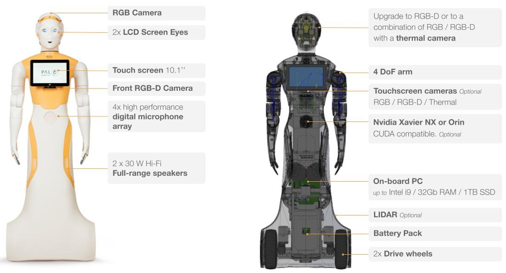
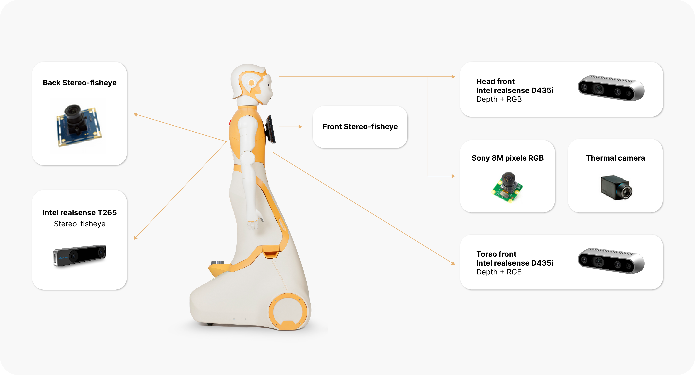
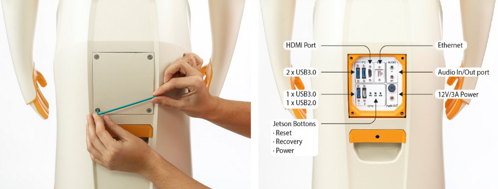

# Session 9: ARI Robot Hardware & Component Reuse Analysis

**Week:** 9  
**Element:** ICTPRG430 Applied Practice + ICTPRG439 Preview  
**Duration:** 4 hours  
**Phase:** Lab Work + Industry Insight

---

## Session Introduction

This session provides **dedicated lab time** for students to continue their work on Labs 3-4 while introducing **real-world component reuse** through hands-on exploration of the PAL Robotics ARI humanoid robot. With the robot's covers removed, students will examine both hardware and software component reuse strategies that directly connect to next term's ICTPRG439 component integration work.

---

!!! success "Key Takeaways"

    By the end of this session, students will understand:

    1. **Hardware component reuse** reduces development time and cost
    2. **Software libraries and frameworks** provide tested, reliable functionality  
    3. **Standardized interfaces** (like ROS) enable component interchangeability
    4. **Configuration systems** allow behavior changes without code modification
    5. **Commercial robots** extensively use both open-source and proprietary components

    This foundation will be essential for next term's focus on evaluating, selecting, and integrating pre-existing components into robotics projects.

---

## Session Structure

### Part 1: Lab Work Time (120 minutes)
- **Individual/Group Lab Progress** - Continue Labs 3-4 with instructor support
- **OOP Implementation Review** - Apply Sessions 6-7 concepts to current work
- **Configuration Integration** - Implement file I/O and parameter management

### Part 2: ARI Hardware Analysis (90 minutes)
- **Physical Component Examination** - Explore sensors, actuators, computing units
- **Integration Architecture** - Understand how components connect and communicate
- **Component Reuse Identification** - Spot standardized vs. custom components

### Part 3: Software Component Analysis (30 minutes)
- **ROS Package Exploration** - Examine ARI's open-source components
- **Dependency Analysis** - Understanding component relationships
- **Industry Standards** - Component selection criteria in commercial systems

---

## ARI Robot Component Analysis

### Hardware Components to Examine

**Computing Systems:**
- Intel i7 and NVIDIA Jetson TX2 GPU combination for AI processing
- Multiple processing units for different tasks (perception, control, navigation)

**Sensor Array:**
- Head Camera Sony 8MegaPixel (RGB), Head Intel Realsense D435i (RGB-D)
- Array of four microphones located on the circular gap of the torso
- IMU, force/torque sensors, joint encoders
- Touch sensors and proximity detection

**Actuator Systems:**
- Joint motors and servo controllers
- Gripper mechanisms
- Mobile base drive system
- 40 Ah Li-ion battery system with docking station capability

**Communication & I/O:**
- Expansion panel at the back providing access to additional connectors
- Network interfaces, USB ports, power connections
- Internal bus systems connecting components

### Software Component Reuse Examples

**ROS Integration:**
- Joint trajectory motions sent to the joint_trajectory_controller ROS package, an open source ROS package
- Standard ROS navigation stack components
- Perception pipeline using established computer vision libraries

**Open Source Components:**
- PAL Robotics champions open-source robotics from ROS to ROS 2
- ArUco marker detection library integration
- Standard algorithms for SLAM, path planning, object recognition

!!! info "Component Selection Criteria Discussion"
    Analyze the following:
    
    1. Why use Intel RealSense and a custom camera?
    2. How do standardized ROS packages reduce development time?
    3. What trade-offs exist between custom vs. off-the-shelf components?
    4. How does component modularity affect maintenance and upgrades?

---

## Hands-On Activities

### Activity 1: Component Mapping Exercise
- **Physical Inspection:** Identify and catalog visible components
- **Function Analysis:** Determine what each component does
- **Reuse Classification:** Standard component vs. custom implementation
- **Integration Points:** How components connect and communicate

### Activity 2: Software Architecture Exploration
- **ROS Node Structure:** Examine running processes on ARI
- **Package Dependencies:** Understand component relationships
- **Configuration Files:** See how parameters customize behavior
- **Version Management:** How updates and compatibility are handled

### Activity 3: Design Decision Analysis
**Students discuss in groups:**

- Why might PAL Robotics choose certain components over alternatives?
- How do hardware choices affect software architecture?
- What would happen if you wanted to upgrade a specific component?
- How does this relate to your current lab implementations?

---

## **Connection to Current Learning**

### OOP Concepts in Hardware
- **Inheritance:** Base motor controller with specialized implementations
- **Composition:** Robot "has-a" camera, "has-a" gripper, "has-a" mobile base
- **Polymorphism:** Same interface for different sensor types
- **Abstraction:** Hardware abstraction layers hiding complexity

### Configuration Management
- **Parameter Files:** How ARI loads different behavior configurations
- **Launch Files:** Starting multiple components with coordinated parameters
- **Runtime Reconfiguration:** Changing behavior without restarting system

### Integration Patterns
- **Interface Standardization:** How ROS messages enable component swapping
- **Dependency Management:** Managing component versions and compatibility
- **Testing Strategies:** How to validate component integration

---

## Preview: Component Reuse Next Term

This session introduces concepts that will be central to ICTPRG439:

### Component Evaluation Criteria
- **Functionality:** Does it meet our requirements?
- **Compatibility:** Will it integrate with our system?
- **Licensing:** Can we legally use it in our project?
- **Support:** Is there active development and community?
- **Performance:** Does it meet our timing/resource constraints?

### Integration Challenges
- **Version Conflicts:** Managing different component requirements
- **Interface Mismatches:** Adapting between different APIs
- **Documentation Quality:** Understanding how to use components effectively
- **Testing Integration:** Validating that components work together

---

## Lab Time 

- **Continue Lab 3-4 implementations** 

---

## Resources for Further Exploration

- **PAL Robotics ARI Documentation:** Hardware specifications and software architecture
- **ROS.org:** Standard robotics components and packages  
- **Intel RealSense SDK:** Example of hardware-software component integration
- **GitHub PAL Robotics:** Open-source components used in commercial robots