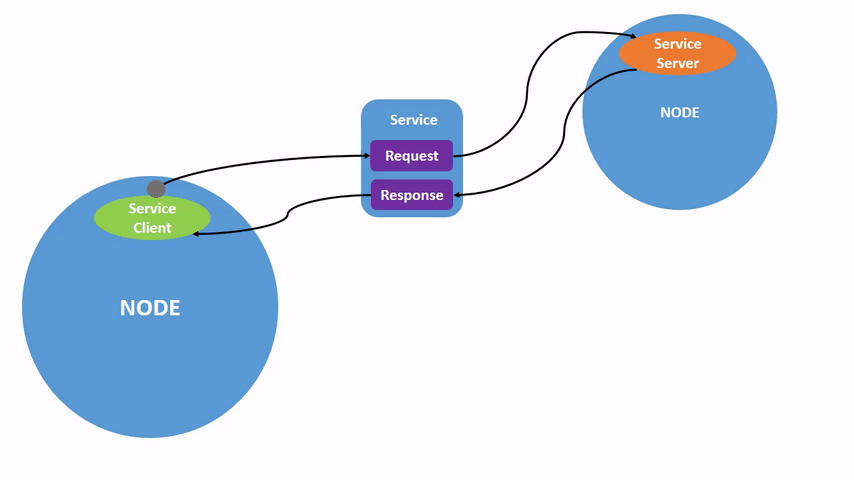

# **Session 12:** ROS2 Services, Parameters & Actions

 **Phase:** ROS2 Advanced Communication

---

## Session Introduction

This session extends your ROS2 knowledge beyond **asynchronous topic-based communication** to explore **synchronous services**, **runtime parameters**, and **goal-oriented actions**. Building on the publisher/subscriber patterns from Session 11, you'll learn when and how to use different communication paradigms in robotics systems.

**Services** provide **request-response communication** for operations that need immediate feedback, like querying sensor status or triggering specific behaviors. **Parameters** enable **runtime configuration** of node behavior without recompilation. **Actions** enable **long-running, goal-oriented tasks** with continuous feedback, such as navigation to a waypoint or executing a complex manipulation sequence.

Through hands-on tutorials with turtlesim and practical exercises, you'll master the **CLI tools** for interacting with services, parameters, and actions, understand their **architectural patterns**, and recognize when to use each communication method in real-world robotics applications.

## Learning Objectives

By the end of this session, you will have:

- **Understood service request-response patterns** and their use cases
- **Mastered ROS2 service CLI tools** for calling and inspecting services
- **Learned parameter management** for runtime node configuration
- **Used parameter CLI tools** to get, set, and persist configuration
- **Explored action goal-feedback-result patterns** for long-running tasks
- **Used ROS2 action CLI tools** to send goals and monitor feedback
- **Compared communication paradigms** (topics vs services vs parameters vs actions)
- **Recognized appropriate use cases** for each communication method

---

## Session Structure

1. **Communication Paradigms Overview** - Topics vs Services vs Parameters vs Actions
2. **ROS2 Services Tutorial** - Interactive service exploration
3. **ROS2 Parameters Tutorial** - Runtime configuration management
4. **ROS2 Actions Tutorial** - Goal-oriented task management
6. **Integration and Practice** - Applying concepts and troubleshooting
7. **Webots ROS2 Instalation** Not completed in session 5

---

## Part 1: Communication Paradigms Overview

### 1.1 The Four Communication Methods


## **Parameters:**
{: style="display:block; margin-left:right; margin-right:auto; width:700px;" }

*image source: https://foxglove.dev/blog/how-to-use-ros2-parameters*

- **Pattern:** Configuration value storage
- **Direction:** Node-specific settings
- **Timing:** Get/set operations
- **Use Case:** Runtime configuration without restart
- **Example:** Background color, speed limits, sensor calibration

## **Services:**

{: style="display:block; margin-left:right; margin-right:auto; width:700px;" }
*image source: https://docs.ros.org/*

- **Pattern:** Synchronous request/response
- **Direction:** One-to-one (client-server)
- **Timing:** Blocking call, waits for response
- **Use Case:** Short operations requiring confirmation
- **Example:** Spawn new entity, change settings, query state


## **Actions:**
{: style="display:block; margin-left:right; margin-right:auto; width:700px;" }
*image source: https://docs.ros.org/*

- **Pattern:** Goal-feedback-result with cancellation
- **Direction:** One-to-one with continuous updates
- **Timing:** Non-blocking goal submission, periodic feedback
- **Use Case:** Long-running tasks needing progress monitoring
- **Example:** Navigation to goal, pick-and-place, trajectory execution

!!! success "Key Insight" 
   
    ### 1.2 Choosing the Right Method

    **Decision Tree:**

    ```
        Need to communicate?
        │
        ├─ Continuous data stream? → Use TOPIC
        │
        ├─ Configure node behavior? → Use PARAMETER
        │
        ├─ Quick request/response? → Use SERVICE
        │
        └─ Long-running task with feedback? → Use ACTION
    ```

**Comparison Table:**

| Feature | Topics | Services | Parameters | Actions |
|---------|--------|----------|------------|---------|
| **Communication** | Asynchronous | Synchronous | Get/Set | Asynchronous |
| **Response** | None | Immediate | Immediate | Goal + Feedback + Result |
| **Blocking** | No | Yes | No | No (for goal submission) |
| **Cancellation** | N/A | No | N/A | Yes |
| **Feedback** | N/A | No | N/A | Yes (continuous) |
| **Persistence** | N/A | N/A | Can save/load | N/A |
| **Typical Duration** | Continuous | < 1 second | Instant | Seconds to minutes |

### 1.3 Real-World Robotics Examples

**Topic Use Cases:**
- Streaming camera images at 30 Hz
- Publishing laser scan data continuously
- Broadcasting robot joint states
- Sending velocity commands to mobile base

**Service Use Cases:**
- Spawning a new object in simulation
- Querying current robot mode/state
- Changing LED color or display text
- Clearing costmap in navigation
- Saving/loading configuration

**Parameter Use Cases:**
- Setting maximum velocity limits
- Configuring PID controller gains
- Adjusting sensor calibration values
- Changing logging verbosity level
- Setting algorithm thresholds

**Action Use Cases:**
- Navigating to a goal position
- Following a complex trajectory
- Executing pick-and-place sequence
- Docking with charging station
- Performing calibration routine

!!! info "Architectural Insight"
    Understanding when to use each method is crucial for **efficient system design**. Using topics for everything creates unnecessary complexity, while overusing services can cause blocking issues. Parameters provide clean configuration management, and actions provide the perfect middle ground for goal-oriented behaviors.

---

## Part 2: ROS2 Services Tutorial

### 2.1 Understanding ROS2 Services

**Tutorial Reference:** [Understanding ROS2 Services](https://docs.ros.org/en/foxy/Tutorials/Beginner-CLI-Tools/Understanding-ROS2-Services/Understanding-ROS2-Services.html)

**Core Concept:**
Services implement **client-server communication** where a client sends a **request** and waits for a **response** from the server. This is a **synchronous, blocking** operation.

**Service Structure:**
```
Service Definition (*.srv file):
---REQUEST---
int32 x
int32 y
---RESPONSE---
int32 sum
```

### 2.2 Hands-On Service Exploration

**Setup Environment:**
```bash
# Source ROS2 (if not in ~/.bashrc)
source /opt/ros/foxy/setup.bash

# Set your domain ID
export ROS_DOMAIN_ID=<your_student_id_last_two_digits>

# Launch turtlesim
ros2 run turtlesim turtlesim_node
```

**Discover Available Services:**
```bash
# List all services
ros2 service list

# List with service types
ros2 service list -t
```

**Expected Output:**
```
/clear
/kill
/reset
/spawn
/turtle1/set_pen
/turtle1/teleport_absolute
/turtle1/teleport_relative
/turtlesim/describe_parameters
/turtlesim/get_parameter_types
/turtlesim/get_parameters
/turtlesim/list_parameters
/turtlesim/set_parameters
/turtlesim/set_parameters_atomically
```

### 2.3 Service Type Inspection

**Check Service Type:**
```bash
# Get type of specific service
ros2 service type /clear
# Output: std_srvs/srv/Empty

ros2 service type /spawn
# Output: turtlesim/srv/Spawn
```

**Find Services by Type:**
```bash
# Find all services of a specific type
ros2 service find std_srvs/srv/Empty
# Output: /clear, /reset
```

### 2.4 Examining Service Definitions

**View Service Interface:**
```bash
# See service request/response structure
ros2 interface show std_srvs/srv/Empty
ros2 interface show turtlesim/srv/Spawn
```

**Spawn Service Structure:**
```
float32 x
float32 y
float32 theta
string name
---
string name
```

!!! tip "Understanding Service Definitions"
    The `---` separator divides **request** (top) from **response** (bottom). The client provides request fields, the server returns response fields.

### 2.5 Calling Services from Command Line

**Empty Service (No Arguments):**
```bash
# Clear the turtlesim drawing
ros2 service call /clear std_srvs/srv/Empty
```

**Service with Arguments:**
```bash
# Spawn a new turtle at position (2, 2) with rotation 0.2
ros2 service call /spawn turtlesim/srv/Spawn "{x: 2, y: 2, theta: 0.2, name: 'turtle2'}"
```

**Practical Exercise 1: Spawning Multiple Turtles**
```bash
# Spawn turtle at different positions
ros2 service call /spawn turtlesim/srv/Spawn "{x: 1, y: 1, theta: 0, name: 'turtle3'}"
ros2 service call /spawn turtlesim/srv/Spawn "{x: 9, y: 9, theta: 3.14, name: 'turtle4'}"

# Verify new turtles exist by listing topics
ros2 topic list
# Should see /turtle3/... and /turtle4/... topics
```

### 2.6 Modifying Turtle Behavior with Services

**Change Pen Settings:**
```bash
# Set pen to red, width 5
ros2 service call /turtle1/set_pen turtlesim/srv/SetPen "{r: 255, g: 0, b: 0, width: 5, off: 0}"

# Now drive the turtle (new terminal)
ros2 run turtlesim turtle_teleop_key

# Turn off pen (no drawing)
ros2 service call /turtle1/set_pen turtlesim/srv/SetPen "{r: 255, g: 0, b: 0, width: 5, off: 1}"
```

**Teleport Services:**
```bash
# Absolute teleport (go to specific position)
ros2 service call /turtle1/teleport_absolute turtlesim/srv/TeleportAbsolute "{x: 5, y: 5, theta: 0}"

# Relative teleport (move relative to current position)
ros2 service call /turtle1/teleport_relative turtlesim/srv/TeleportRelative "{linear: 2.0, angular: 1.57}"
```

### 2.7 Practical Service Exercises

**Exercise 1: Create a Turtle Formation**
```bash
# Goal: Spawn 4 turtles in a square pattern
ros2 service call /spawn turtlesim/srv/Spawn "{x: 2, y: 2, theta: 0, name: 'corner1'}"
ros2 service call /spawn turtlesim/srv/Spawn "{x: 9, y: 2, theta: 0, name: 'corner2'}"
ros2 service call /spawn turtlesim/srv/Spawn "{x: 2, y: 9, theta: 0, name: 'corner3'}"
ros2 service call /spawn turtlesim/srv/Spawn "{x: 9, y: 9, theta: 0, name: 'corner4'}"
```

**Exercise 2: Draw with Different Colors**
```bash
# Clear screen
ros2 service call /clear std_srvs/srv/Empty

# Set blue pen
ros2 service call /turtle1/set_pen turtlesim/srv/SetPen "{r: 0, g: 0, b: 255, width: 3, off: 0}"

# Drive and draw
ros2 run turtlesim turtle_teleop_key

# Change to green without clearing
ros2 service call /turtle1/set_pen turtlesim/srv/SetPen "{r: 0, g: 255, b: 0, width: 3, off: 0}"
```

**Exercise 3: Service Inspection**
```bash
# List all available services
ros2 service list

# Find services you haven't explored yet
ros2 service type /turtle1/teleport_absolute

# Check what the service needs
ros2 interface show turtlesim/srv/TeleportAbsolute

# Try calling it
ros2 service call /turtle1/teleport_absolute turtlesim/srv/TeleportAbsolute "{x: 5.5, y: 5.5, theta: 0}"
```

### 2.8 Key Service Commands Reference

```bash
# Discovery
ros2 service list                          # List all services
ros2 service list -t                       # List with types
ros2 service find <type>                   # Find services by type

# Inspection
ros2 service type <service_name>           # Get service type
ros2 interface show <service_type>         # Show service definition

# Interaction
ros2 service call <service_name> <type> <args>  # Call a service
```

---

## Part 3: ROS2 Parameters Tutorial (45 mins)

### 3.1 Understanding ROS2 Parameters

**Tutorial Reference:** [Understanding ROS2 Parameters](https://docs.ros.org/en/foxy/Tutorials/Beginner-CLI-Tools/Understanding-ROS2-Parameters/Understanding-ROS2-Parameters.html)

**Core Concept:**
Parameters are **configuration values** for nodes that can be read and modified at runtime. Think of them as settings or variables that control node behavior without requiring code changes or restarts.

**Parameter Characteristics:**
- **Node-specific** - Each node has its own parameter set
- **Runtime modifiable** - Change values while node is running
- **Persistent** - Can save to/load from YAML files
- **Typed** - Parameters have specific types (int, float, string, bool, etc.)

### 3.2 Hands-On Parameter Exploration

**Setup:**
```bash
# Turtlesim should still be running from Part 2
# If not: ros2 run turtlesim turtlesim_node
```

**Discover Available Parameters:**
```bash
# List all parameters for turtlesim node
ros2 param list
```

**Expected Output:**
```
/turtlesim:
  background_b
  background_g
  background_r
  use_sim_time
```

### 3.3 Getting Parameter Values

**Read Current Parameter Values:**
```bash
# Get individual parameter values
ros2 param get /turtlesim background_r
ros2 param get /turtlesim background_g
ros2 param get /turtlesim background_b

# Get simulation time parameter
ros2 param get /turtlesim use_sim_time
```

**Expected Output:**
```
Integer value is: 69
Integer value is: 86
Integer value is: 255
Boolean value is: False
```

!!! info "Default Background Color"
    The default turtlesim background is a light blue color (RGB: 69, 86, 255). We can change these values to customize the appearance.

### 3.4 Setting Parameter Values

**Modify Parameters at Runtime:**
```bash
# Change background to purple
ros2 param set /turtlesim background_r 150
ros2 param set /turtlesim background_g 50
ros2 param set /turtlesim background_b 200

# Clear screen to see the change
ros2 service call /clear std_srvs/srv/Empty
```

**Practical Exercise 1: Color Exploration**
```bash
# Try different color combinations

# Dark background (almost black)
ros2 param set /turtlesim background_r 10
ros2 param set /turtlesim background_g 10
ros2 param set /turtlesim background_b 10
ros2 service call /clear std_srvs/srv/Empty

# Green background
ros2 param set /turtlesim background_r 0
ros2 param set /turtlesim background_g 200
ros2 param set /turtlesim background_b 0
ros2 service call /clear std_srvs/srv/Empty

# Restore to default
ros2 param set /turtlesim background_r 69
ros2 param set /turtlesim background_g 86
ros2 param set /turtlesim background_b 255
ros2 service call /clear std_srvs/srv/Empty
```

### 3.5 Saving Parameters to File

**Dump Parameters to YAML:**
```bash
# Save current parameters to file
ros2 param dump /turtlesim > turtlesim.yaml

# View the saved file
cat turtlesim.yaml
```

**Expected File Content:**
```yaml
/turtlesim:
  ros__parameters:
    background_b: 255
    background_g: 86
    background_r: 69
    use_sim_time: false
```

**Edit Parameter File:**
```bash
# Open file in text editor
nano turtlesim.yaml

# Modify values, for example:
/turtlesim:
  ros__parameters:
    background_b: 100
    background_g: 150
    background_r: 200
    use_sim_time: false

# Save and exit (Ctrl+O, Enter, Ctrl+X)
```

### 3.6 Loading Parameters from File

**Apply Parameters from YAML:**
```bash
# Load parameters from file
ros2 param load /turtlesim turtlesim.yaml

# Clear screen to see changes
ros2 service call /clear std_srvs/srv/Empty
```

**Practical Exercise 2: Parameter Profiles**
```bash
# Create different parameter profiles

# Create "dark_mode.yaml"
echo '/turtlesim:
  ros__parameters:
    background_b: 20
    background_g: 20
    background_r: 20
    use_sim_time: false' > dark_mode.yaml

# Create "ocean_mode.yaml"
echo '/turtlesim:
  ros__parameters:
    background_b: 180
    background_g: 100
    background_r: 0
    use_sim_time: false' > ocean_mode.yaml

# Switch between profiles
ros2 param load /turtlesim dark_mode.yaml
ros2 service call /clear std_srvs/srv/Empty

ros2 param load /turtlesim ocean_mode.yaml
ros2 service call /clear std_srvs/srv/Empty
```

### 3.7 Starting Nodes with Parameters

**Launch with Parameter File:**
```bash
# Start turtlesim with custom parameters
ros2 run turtlesim turtlesim_node --ros-args --params-file turtlesim.yaml
```

**Set Parameters at Launch:**
```bash
# Start with specific parameter values
ros2 run turtlesim turtlesim_node --ros-args -p background_r:=200 -p background_g:=100 -p background_b:=50
```

!!! tip "Parameter Best Practices"
    - Use **parameter files** for configuration management
    - Create **different profiles** for different scenarios (testing, production)
    - **Document parameters** and their valid ranges
    - Use **descriptive parameter names**
    - Consider **parameter validation** in your nodes

### 3.8 Key Parameter Commands Reference

```bash
# Discovery
ros2 param list                            # List all parameters for all nodes
ros2 param list /node_name                 # List parameters for specific node

# Getting Values
ros2 param get /node_name parameter_name   # Get single parameter value

# Setting Values
ros2 param set /node_name parameter_name value  # Set parameter value

# File Operations
ros2 param dump /node_name > file.yaml     # Save parameters to file
ros2 param load /node_name file.yaml       # Load parameters from file

# Launch with Parameters
ros2 run package node --ros-args --params-file file.yaml
ros2 run package node --ros-args -p param:=value
```

---

## Part 4: ROS2 Actions Tutorial

### 4.1 Understanding ROS2 Actions

**Tutorial Reference:** [Understanding ROS2 Actions](https://docs.ros.org/en/foxy/Tutorials/Beginner-CLI-Tools/Understanding-ROS2-Actions/Understanding-ROS2-Actions.html)

**Core Concept:**
Actions enable **long-running, goal-oriented tasks** with three components:
1. **Goal** - What you want to achieve
2. **Feedback** - Periodic progress updates while executing
3. **Result** - Final outcome when complete

**Why Actions vs Services?**
- Services **block** until complete (bad for long tasks)
- Actions are **non-blocking** and provide progress updates
- Actions support **cancellation** mid-execution
- Actions show **continuous feedback** during operation

**Action Structure:**
```
Action Definition (*.action file):
---GOAL---
float32 target_angle
---RESULT---
float32 delta
---FEEDBACK---
float32 remaining
```

### 4.2 Hands-On Action Exploration

**Setup:**
```bash
# Turtlesim should still be running
# If not: ros2 run turtlesim turtlesim_node

# Open new terminal for teleop
ros2 run turtlesim turtle_teleop_key
```

**Discover Available Actions:**
```bash
# List all actions
ros2 action list

# List with action types
ros2 action list -t
```

**Expected Output:**
```
/turtle1/rotate_absolute [turtlesim/action/RotateAbsolute]
```

### 4.3 Action Information and Types

**Inspect Action Details:**
```bash
# Get information about action
ros2 action info /turtle1/rotate_absolute
```

**Expected Output:**
```
Action: /turtle1/rotate_absolute
Action clients: 0
Action servers: 1
    /turtlesim
```

**View Action Definition:**
```bash
# See action goal/result/feedback structure
ros2 interface show turtlesim/action/RotateAbsolute
```

**RotateAbsolute Action Structure:**
```
# Goal
float32 theta
---
# Result
float32 delta
---
# Feedback
float32 remaining
```

!!! info "Action Components Explained"
    - **Goal (theta):** Target angle in radians to rotate to
    - **Result (delta):** Angular difference achieved
    - **Feedback (remaining):** How much rotation is left during execution

### 4.4 Sending Action Goals

**Basic Action Goal:**
```bash
# Rotate turtle to 1.57 radians (90 degrees)
ros2 action send_goal /turtle1/rotate_absolute turtlesim/action/RotateAbsolute "{theta: 1.57}"
```

**Observe:**
- Turtle rotates to target angle
- Command returns immediately with goal ID
- Result shown when complete

**Action Goal with Feedback:**
```bash
# Rotate to -1.57 radians while showing feedback
ros2 action send_goal --feedback /turtle1/rotate_absolute turtlesim/action/RotateAbsolute "{theta: -1.57}"
```

**Observe:**
- Continuous feedback messages during rotation
- Shows remaining rotation angle
- Final result displayed when complete

### 4.5 Practical Action Exercises

**Exercise 1: Rotation Sequence**
```bash
# Rotate through different angles and observe feedback
ros2 action send_goal --feedback /turtle1/rotate_absolute turtlesim/action/RotateAbsolute "{theta: 0}"
ros2 action send_goal --feedback /turtle1/rotate_absolute turtlesim/action/RotateAbsolute "{theta: 1.57}"
ros2 action send_goal --feedback /turtle1/rotate_absolute turtlesim/action/RotateAbsolute "{theta: 3.14}"
ros2 action send_goal --feedback /turtle1/rotate_absolute turtlesim/action/RotateAbsolute "{theta: -1.57}"
```

**Exercise 2: Compare With and Without Feedback**
```bash
# Without feedback (less verbose)
ros2 action send_goal /turtle1/rotate_absolute turtlesim/action/RotateAbsolute "{theta: 0}"

# With feedback (see progress)
ros2 action send_goal --feedback /turtle1/rotate_absolute turtlesim/action/RotateAbsolute "{theta: 3.14}"
```

**Exercise 3: Full Circle Rotation**
```bash
# Rotate 360 degrees (2*pi radians ≈ 6.28)
ros2 action send_goal --feedback /turtle1/rotate_absolute turtlesim/action/RotateAbsolute "{theta: 6.28}"

# Watch the feedback showing remaining angle decrease
```

### 4.6 Understanding Action Feedback

**What Feedback Provides:**
- **Progress monitoring** - See how far along task is
- **Status updates** - Know task is still executing
- **Debugging information** - Identify if task is stuck
- **User feedback** - Show progress in UI

**Feedback vs Result:**
- **Feedback:** Published **continuously during** execution
- **Result:** Published **once when** task completes

**Practical Demonstration:**
```bash
# Start action with feedback
ros2 action send_goal --feedback /turtle1/rotate_absolute turtlesim/action/RotateAbsolute "{theta: 4.71}"

# Observe output format:
# Feedback: remaining: 4.5...
# Feedback: remaining: 3.2...
# Feedback: remaining: 1.8...
# Feedback: remaining: 0.5...
# Result: delta: 4.71
```

### 4.7 Key Action Commands Reference

```bash
# Discovery
ros2 action list                           # List all actions
ros2 action list -t                        # List with types

# Inspection
ros2 action info <action_name>             # Get action details
ros2 interface show <action_type>          # Show action definition

# Interaction
ros2 action send_goal <action_name> <type> <goal>           # Send goal
ros2 action send_goal --feedback <action_name> <type> <goal> # With feedback
```

---

## Part 5: Integration and Practice

### 5.1 Comparing All Communication Methods

**Hands-On Comparison Exercise:**

**1. Using Topics (Asynchronous):**
```bash
# Publish velocity commands (continuous stream)
ros2 topic pub --rate 1 /turtle1/cmd_vel geometry_msgs/msg/Twist \
  "{linear: {x: 2.0, y: 0.0, z: 0.0}, angular: {x: 0.0, y: 0.0, z: 1.8}}"

# No response, no feedback, continuous publishing
# Stop with Ctrl+C
```

**2. Using Parameters (Configuration):**
```bash
# Change background color (immediate setting change)
ros2 param set /turtlesim background_r 200
ros2 service call /clear std_srvs/srv/Empty

# Immediate effect, configuration persists
# Can save to file for later use
```

**3. Using Services (Synchronous):**
```bash
# Teleport turtle (immediate one-time operation)
ros2 service call /turtle1/teleport_absolute turtlesim/srv/TeleportAbsolute \
  "{x: 5.5, y: 5.5, theta: 0}"

# Immediate response with result
# Single request-response transaction
```

**4. Using Actions (Goal-Oriented):**
```bash
# Rotate to angle (long-running with feedback)
ros2 action send_goal --feedback /turtle1/rotate_absolute \
  turtlesim/action/RotateAbsolute "{theta: 3.14}"

# Non-blocking goal submission
# Continuous feedback during execution
# Final result when complete
```

### 5.2 Best Practices Summary

**When to Use Each Method:**

**Use Topics When:**

- ✅ Data needs continuous streaming
- ✅ Multiple subscribers need same data
- ✅ Low-latency communication critical
- ✅ Fire-and-forget acceptable
- ❌ Don't need confirmation of receipt

**Use Parameters When:**

- ✅ Need to configure node behavior
- ✅ Settings may change at runtime
- ✅ Want to save/load configurations
- ✅ Need node-specific settings
- ❌ Need real-time data streaming

**Use Services When:**

- ✅ Need immediate response
- ✅ Operation completes quickly (< 1 second)
- ✅ Request-response pattern appropriate
- ✅ Need confirmation of success/failure
- ❌ Operation might take significant time

**Use Actions When:**

- ✅ Task takes significant time (> 1 second)
- ✅ Need progress feedback during execution
- ✅ May need to cancel mid-operation
- ✅ Want to monitor task status
- ❌ Need continuous data stream

---

!!! example "**TASK** - Webots-ROS2 Integration"
 

    ## **Webots ROS2 Package Installation**
    Reference Documentation: https://github.com/cyberbotics/webots_ros2/wiki/Getting-Started

    Installation Process
    Workspace Setup:

    Create ROS2 workspace directory structure
    Clone webots_ros2 repository
    Install package dependencies
    Build using colcon build system
    Key Steps Overview: 1. Workspace Creation - Establish src/ directory structure 2. Repository Cloning - Download webots_ros2 source code 3. Dependency Resolution - Install required packages 4. Colcon Build - Compile and install packages 5. Environment Sourcing - Update ROS2 environment

    Verification and Testing
    Installation Verification: - Check package installation success - Verify Webots can launch ROS2 nodes - Test basic robot simulation with ROS2 integration


## Session Summary

This session provided comprehensive coverage of ROS2 communication methods:

1. **Understood four communication paradigms** and their appropriate use cases
2. **Mastered ROS2 service tools** for synchronous request-response interactions
3. **Learned parameter management** for runtime node configuration
4. **Explored action mechanisms** for long-running goal-oriented tasks
5. **Practiced with turtlesim** to see all methods in operation
6. **Recognized architectural patterns** for choosing the right communication method

**Key Takeaways:**
- **Topics** provide asynchronous data streaming for continuous information
- **Parameters** enable runtime configuration without code changes
- **Services** provide synchronous request-response for quick operations
- **Actions** enable goal-oriented tasks with feedback and cancellation
- **Choose communication method** based on task characteristics and requirements
- **CLI tools** are essential for testing and debugging all communication types

---


## Preparation for Next Session

For Session 13 on custom interfaces and package development:

- **Practice all four communication methods** with different arguments
- **Experiment with combining** topics, services, parameters, and actions
- **Create parameter files** for different turtlesim configurations
- **Review interface definitions** using `ros2 interface show`
- **Consider scenarios** where each method would be most appropriate

---

!!! question "Question 1: When should you use a service instead of a topic for communication?"
        
    ??? tip "Click to reveal answer"
        **Answer**: 
        
        Use a **service** when you need:
        - **Immediate response** confirming the operation succeeded or failed
        - **Quick operation** that completes in less than 1 second
        - **Request-response pattern** (client asks, server responds)
        - **One-time interaction** rather than continuous data stream
        
        Example: Spawning a turtle, changing settings, or querying current state.

---

!!! question "Question 2: What is the difference between setting a parameter and calling a service?"
        
    ??? tip "Click to reveal answer"
        **Answer**: 
        
        **Parameters** are for **configuration values** that control node behavior (like settings). You get/set them to change how a node operates.
        
        **Services** are for **operations or actions** that a node can perform (like spawning a turtle or clearing the screen). You call them to trigger specific behaviors.
        
        Example: `ros2 param set /turtlesim background_r 200` changes a setting, while `ros2 service call /clear std_srvs/srv/Empty` triggers an action.

---

!!! question "Question 3: What are the three components of a ROS2 action and why is this useful for long-running tasks?"
        
    ??? tip "Click to reveal answer"
        **Answer**: 
        
        1. **Goal** - Specifies what you want to achieve (e.g., target angle)
        2. **Feedback** - Provides continuous progress updates during execution (e.g., remaining rotation)
        3. **Result** - Returns final outcome when complete (e.g., total rotation achieved)
        
        This is useful because:
        - You can **monitor progress** instead of waiting blindly
        - You can **cancel** if needed before completion
        - It's **non-blocking** so your program can do other things
        - You get **confirmation** when the task finishes

---

**Navigation:** ← Week 11 | Learning Plan | Week 13 →